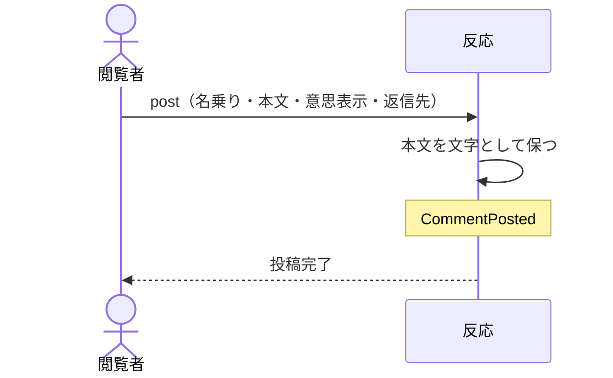

# 閲覧者が名乗って反応を残す：uc-post-comment

## 概要

- 合鍵を持つ閲覧者が、表示物に反応を残す操作。名乗るだけでよく、あらかじめ登録されている必要はない。
- ただの意見か、この方向でよいか、直してほしいか、という意思表示を添えられる。他の反応への返信としても残せる。

---

## 存在意義

- これが無いと、見てもらった相手の反応を別の手立てで集めることになり、どの指摘がどの表示物に対するものかが散らばる。
- 登録を求めると、その手間だけで反応を返さない人が出る。名乗るだけで残せることが、反応が実際に集まるかどうかを分ける。
- 意思表示を添えられることで、単なる感想の列ではなく、合意がどこまで進んだかを後から読み取れる記録になる。

---

## 主アクターと意図

### 主アクター

閲覧者

### 意図

見た表示物について、その場で意見や判断を残す

---

## 事前条件

- 対象の表示物が開ける状態にあること
- 閲覧者が、その表示物を開ける合鍵を持っていること

---

## 基本フロー



---

## 事後条件

- 反応が1件残っている
- その反応が対象の表示物に結び付いている
- 本文が文字としてそのまま保たれている
- CommentPosted が発行されている

---

## 受け入れ基準

- 閲覧者が名乗りと本文を与えたとき、反応を残すこと
- 閲覧者があらかじめ登録されていなくても、反応を残せること
- 意思表示が与えられないとき、ただの意見として扱うこと
- 本文を示すとき、常に文字として示し、書かれた内容を組み立ての指示として解釈しないこと
- 同じ表示物に付いた反応を返信先として指せること
- 別の表示物に付いた反応を返信先として指したとき、拒むこと
- 停止している表示物へ反応を残そうとしたとき、拒むこと
- 反応が並びに現れるまで時間がかかりうることを閲覧者に伝え、即座に現れるとは伝えないこと

---

## 操作保証

- 残された反応が、後からどの操作によっても書き換えられないこと
- 同時に複数の閲覧者が反応を残したとき、いずれの反応も失われないこと

---

## エラー

| コード | 条件 |
|---|---|
| `ARTIFACT_NOT_VIEWABLE` | - 対象の表示物が停止している<br>- 合鍵を持っていない |
| `AUTHOR_REQUIRED` | - 名乗りが与えられていない |
| `BODY_REQUIRED` | - 本文が空である |
| `INVALID_PARENT` | - 返信先として指された反応が、別の表示物に付いている |
| `BODY_TOO_LARGE` | - 本文が受け入れられる大きさを超えている |

---

## 受け入れシナリオ

### 背景

表示物Aが公開されており、閲覧者はその合鍵を持っている。

### 名乗るだけで反応を残せる

| 分類 | 観点 |
|---|---|
| 正常系 | 事前条件: 登録なしで残せることを確かめる |

```gherkin
Given 閲覧者はあらかじめ登録されていない
When 名乗りと本文を与えて反応を残す
Then 反応が1件残る
And その反応は表示物Aに結び付いている
```

### 意思表示を添えられる

| 分類 | 観点 |
|---|---|
| 正常系 | 計算整合: 合意の状態が記録として残ることを確かめる |

```gherkin
When この方向でよいという意思表示を添えて反応を残す
Then その意思表示とともに反応が残る
And 後から読んだ人が、合意が示されたことを読み取れる
```

### 意思表示が無ければただの意見として扱う

| 分類 | 観点 |
|---|---|
| 境界値 | 事前条件: 既定の解釈が定まっていることを確かめる |

```gherkin
When 意思表示を添えずに反応を残す
Then ただの意見として残る
```

### 本文は文字として示される

| 分類 | 観点 |
|---|---|
| 異常系 | 事前条件: 投稿された本文が指示として解釈されないことを確かめる |

```gherkin
When 組み立ての指示に見える文字列を本文に含めて反応を残す
Then 他の閲覧者にはその文字列がそのまま文字として見える
And 指示として実行されることはない
```

### 同じ表示物の反応へ返信できる

| 分類 | 観点 |
|---|---|
| 正常系 | 計算整合: やり取りの筋道が成立することを確かめる |

```gherkin
Given 表示物Aに反応が1件ある
When その反応を返信先に指して新しい反応を残す
Then 返信として結び付いて残る
```

### 別の表示物の反応へは返信できない

| 分類 | 観点 |
|---|---|
| 異常系 | 事前条件: 筋道が1つの表示物の中で閉じることを確かめる |

```gherkin
Given 表示物Bに反応が1件ある
When 表示物Aへの反応として、表示物Bの反応を返信先に指す
Then INVALID_PARENT として拒まれる
```

### 停止している表示物には残せない

| 分類 | 観点 |
|---|---|
| 異常系 | 事前条件: 停止が投稿も止めることを確かめる |

```gherkin
Given 表示物Aが停止している
When 反応を残そうとする
Then ARTIFACT_NOT_VIEWABLE として拒まれる
```

### 大きすぎる本文は拒む

| 分類 | 観点 |
|---|---|
| 境界値 | 事前条件: 受け入れられる大きさに上限があることを確かめる |

```gherkin
When 受け入れられる大きさを超える本文で反応を残そうとする
Then BODY_TOO_LARGE として拒まれる
And 拒まれた理由が閲覧者に伝わる
```

---

## 操作保証シナリオ

### 残した反応は書き換えられない

| 分類 | 観点 |
|---|---|
| 異常系 | 一貫性: 記録としての不変性を確かめる |

```gherkin
Given 閲覧者が反応を1件残している
When 同じ符丁で別の内容を送る
Then 元の反応は変わらない
```

### 同時に残しても失われない

| 分類 | 観点 |
|---|---|
| 境界値 | 一貫性: 反応どうしが互いを打ち消さないことを確かめる |

```gherkin
Given 2人の閲覧者が同じ表示物を見ている
When 2人がほぼ同時に反応を残す
Then 2件とも残っている
```
