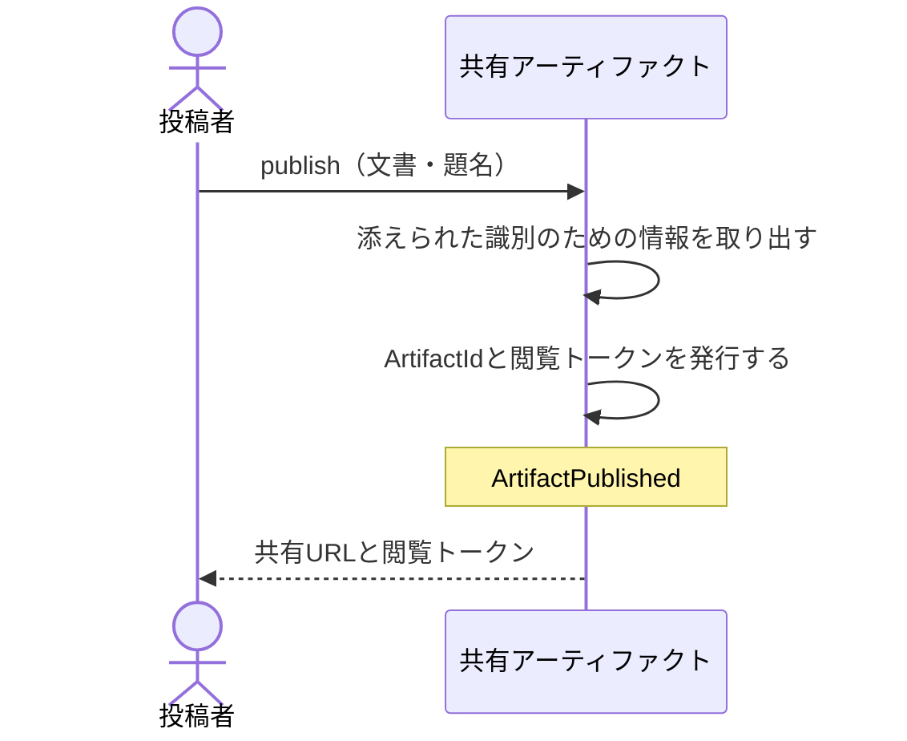

# 手元の文書を公開して共有URLと閲覧トークンを受け取る：uc-publish-artifact

## 概要

- 招かれた投稿者が手元の文書を渡し、それを見てもらうための共有URLと閲覧トークンを受け取る操作。
- 文書に識別のための情報が添えられていれば取り出して控え、添えられていなければ題名だけを人に尋ねる。

---

## 存在意義

- これが無いと、見せたい相手ごとに文書を送りつけるしかなく、後から見せる相手を絞り直すことも、コメントを1か所に集めることもできない。
- 誰でも公開できる状態を許すと、共有URLと閲覧トークンの発行が濫用され、費用の負担も、置かれた内容の責任も、環境を用意した者が負うことになる。招かれた者に限ることでこれを防ぐ。

---

## 主アクターと意図

### 主アクター

投稿者

### 意図

手元の文書を、渡した相手に見てもらえる状態にする

---

## 事前条件

- 操作する者が、あらかじめ招かれた投稿者であること
- 渡された文書が1つの完結したものであること

---

## 基本フロー



---

## 事後条件

- 共有アーティファクトが公開されている状態になっている
- その共有アーティファクトを指すArtifactIdと、開くための閲覧トークンが発行されている
- 渡された文書が、書き換えられずそのまま保持されている
- ArtifactPublished が発行されている

---

## 受け入れ基準

- 投稿者が文書を渡したとき、共有URLと閲覧トークンを返すこと
- 文書に識別のための情報が添えられているとき、題名・要約・種別・分類の目印を取り出して控え、投稿者に尋ねないこと
- 文書に識別のための情報が添えられていないとき、題名だけを投稿者に尋ねること
- 閲覧トークンを返すとき、それが一度しか示されないことを投稿者に伝えること
- 招かれていない者が公開しようとしたとき、公開せず拒むこと
- 文書が外部の場所にあるものを参照しているとき、その件数を投稿者に伝えたうえで公開すること
- If 渡された文書が空であるとき、公開しないこと

---

## 操作保証

- トークンを返すとき、そのトークンはこの一度しか示されず、以後どの操作でも取り出せないこと
- 公開に失敗したとき、開ける状態のものが一切残らないこと。トークンを最後に発行することで保証する（到達できないファイルは残りうる。その片付けは権限を持つ責任者の運用として行い、公開の受け口には削除の権限を与えない）

---

## エラー

| コード | 条件 |
|---|---|
| `NOT_INVITED` | - 操作する者が招かれた投稿者でない |
| `EMPTY_CONTENT` | - 渡された文書が空である |
| `NAME_REQUIRED` | - 識別のための情報が添えられておらず、題名も与えられていない |

---

## 受け入れシナリオ

### 背景

操作する者は招かれた投稿者である。

### 識別のための情報が添えられた文書を公開する

| 分類 | 観点 |
|---|---|
| 正常系 | 計算整合: 添えられた情報を取り出すことで、投稿者への問いかけが不要になることを確かめる |

```gherkin
Scenario: 識別のための情報が添えられた文書を公開する
  Given 文書に題名・要約・種別・分類の目印が添えられている
  When 投稿者がその文書を渡して公開する
  Then 共有URLと閲覧トークンが返る
  And 添えられていた情報が控えられている
  And 投稿者は何も尋ねられない
```

### 識別のための情報が無い文書には題名だけを尋ねる

| 分類 | 観点 |
|---|---|
| 正常系 | 事前条件: 尋ねる項目が題名に限られることを確かめる |

```gherkin
Scenario: 識別のための情報が無い文書には題名だけを尋ねる
  Given 文書に識別のための情報が添えられていない
  When 投稿者がその文書を渡して公開しようとする
  Then 題名を尋ねられる
  And 題名を与えると共有URLと閲覧トークンが返る
```

### 渡した文書がそのまま保たれる

| 分類 | 観点 |
|---|---|
| 正常系 | 計算整合: 公開が中身を書き換えないことを確かめる |

```gherkin
Scenario: 渡した文書がそのまま保たれる
  Given 投稿者が文書を渡している
  When 公開する
  Then 公開された中身は、渡した文書と完全に一致する
```

### 招かれていない者は公開できない

| 分類 | 観点 |
|---|---|
| 異常系 | 事前条件: 公開できる者が招かれた者に限られることを確かめる |

```gherkin
Scenario: 招かれていない者は公開できない
  Given 操作する者が招かれた投稿者でない
  When 文書を渡して公開しようとする
  Then NOT_INVITED として拒まれる
  And 共有URLも閲覧トークンも発行されない
```

### 外部の場所を参照していれば件数を伝える

| 分類 | 観点 |
|---|---|
| 境界値 | 事前条件: 見た目が変わりうることを公開前に伝えることを確かめる |

```gherkin
Scenario: 外部の場所を参照していれば件数を伝える
  Given 文書が外部の場所にあるものを2件参照している
  When 投稿者がその文書を渡して公開する
  Then 参照が2件あることが投稿者に伝えられる
  And 公開そのものは行われる
```

### 空の文書は公開できない

| 分類 | 観点 |
|---|---|
| 異常系 | 事前条件: 中身のないものが公開されないことを確かめる |

```gherkin
Scenario: 空の文書は公開できない
  Given 渡された文書が空である
  When 公開しようとする
  Then EMPTY_CONTENT として拒まれる
```

---

## 操作保証シナリオ

### トークンは後から取り出せない

| 分類 | 観点 |
|---|---|
| 境界値 | 一貫性: トークンが一度しか示されないことを確かめる |

```gherkin
Scenario: トークンは後から取り出せない
  Given アーティファクトが公開され、トークンが示されている
  When 一覧や記録からトークンを取り出そうとする
  Then トークンは得られない
  And 新しく発行する以外に手立てが無い
```

### 失敗したら誰も開けない

| 分類 | 観点 |
|---|---|
| 異常系 | 一貫性: 中途半端に開ける状態が残らないことを確かめる |

```gherkin
Scenario: 失敗したら誰も開けない
  Given 公開の途中で拒まれる条件が成立している
  When 公開しようとする
  Then トークンは発行されない
  And その共有URLを開こうとしても拒まれる
```
