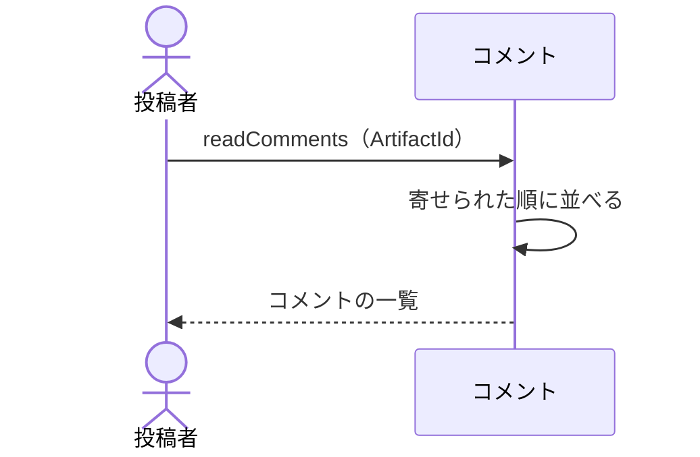

# 寄せられたコメントを投稿者が読む：uc-read-comments

## 概要

- 投稿者が、自分の共有アーティファクトに寄せられたコメントを、自分の画面で読む操作。
- 閲覧者は閲覧トークンで開いた画面からコメントを読み書きする。投稿者はその閲覧トークンを持たないため、別の経路が要る。

---

## 存在意義

- これが無いと、公開した本人が反応を読めない。見てもらってコメントをもらうことがこの文脈の目的であるため、読めないなら公開する意味が無い。
- 閲覧の経路を使い回せないのは、閲覧トークンが一度しか示されず、投稿者の手元に残らないため。自分のものを読むために、自分で発行したトークンを控えておく必要がある作りにはしない。

---

## 主アクターと意図

### 主アクター

投稿者

### 意図

自分が渡したものにどんな反応が来たかを知り、次に何を直すかを決める

---

## 事前条件

- 操作する者が、対象の共有アーティファクトの投稿者であるか、管理者であること

---

## 基本フロー



---

## 事後条件

- 寄せられたコメントが、古いものから順に並んで返っている
- 差し替えの区切りが、コメントと同じ並びに現れている
- コメントは何も変わっていない

---

## 受け入れ基準

- 投稿者が求めたとき、寄せられたコメントを古いものから順に返すこと
- それぞれについて、誰が・いつ・何を言い・どういう判定だったかを返すこと
- 他のコメントへの返信は、どれへの返信かが分かる形で返すこと
- 差し替えの区切りを、コメントと同じ並びに含めること
- 対象の投稿者でも管理者でもない者が求めたとき、対象が見つからないものとして拒むこと
- 読んでもコメントを変えないこと
- 公開が止まっている共有アーティファクトのコメントも読めること

---

## 操作保証

- 読み出しが、コメントを一切書き換えないこと
- 投稿者に閲覧トークンを持たせずに読めること

---

## エラー

| コード | 条件 |
|---|---|
| `ARTIFACT_NOT_FOUND` | - 対象の共有アーティファクトが存在しない<br>- 操作する者が対象の投稿者でも管理者でもない |

---

## 受け入れシナリオ

### 背景

投稿者Xが共有アーティファクトAを公開しており、閲覧者からコメントが寄せられている。

### 寄せられた順に読める

| 分類 | 観点 |
|---|---|
| 正常系 | 一貫性: やり取りの流れが読み取れる並びで返ることを確かめる。順が崩れると、どの指摘に対する返答かが分からなくなる |

```gherkin
Scenario: 寄せられた順に読める
  Given Aに3件のコメントが順に寄せられている
  When Xが読み出しを求める
  Then 3件が古いものから順に返る
  And それぞれに、誰が・いつ・何を言い・どういう判定だったかが含まれている
```

### 返信がどれへの返信か分かる

| 分類 | 観点 |
|---|---|
| 正常系 | 一貫性: 筋道が1つの共有アーティファクトの中で閉じることを確かめる |

```gherkin
Scenario: 返信がどれへの返信か分かる
  Given あるコメントへの返信が寄せられている
  When Xが読み出しを求める
  Then その返信が、どのコメントへの返信かが分かる形で返る
```

### 差し替えの区切りが並びに現れる

| 分類 | 観点 |
|---|---|
| 境界値 | 一貫性: どの指摘が差し替え前のものかを読み取れることを確かめる |

```gherkin
Scenario: 差し替えの区切りが並びに現れる
  Given Aが一度差し替えられており、その前後にコメントがある
  When Xが読み出しを求める
  Then 差し替えの区切りが、その時点の位置に現れる
```

### 他人のものは読めない

| 分類 | 観点 |
|---|---|
| 異常系 | 事前条件: 読める範囲が自分の公開したものに限られることを確かめる。寄せられたコメントには、渡した相手しか知らない内容が含まれうる |

```gherkin
Scenario: 他人のものは読めない
  Given Aの投稿者はXである
  When 管理者でない投稿者YがAのコメントを読もうとする
  Then ARTIFACT_NOT_FOUND として拒まれる
```

### 公開が止まっていても読める

| 分類 | 観点 |
|---|---|
| 境界値 | 事前条件: 止めたあとでも寄せられた反応を確かめられることを確かめる |

```gherkin
Scenario: 公開が止まっていても読める
  Given Aが公開停止されている
  When Xが読み出しを求める
  Then それまでに寄せられたコメントが返る
```

### 読んでも何も変わらない

| 分類 | 観点 |
|---|---|
| 正常系 | べき等性: 読み出しが読むだけの操作であることを確かめる |

```gherkin
Scenario: 読んでも何も変わらない
  Given Aに3件のコメントがある
  When 続けて2回読み出しを求める
  Then 2回とも同じ3件が返る
  And コメントは何も変わっていない
```

---

## 操作保証シナリオ

### 背景

投稿者Xが共有アーティファクトAを公開している。

### 閲覧トークンを控えていなくても読める

| 分類 | 観点 |
|---|---|
| 境界値 | 一貫性: 閲覧トークンが一度しか示されない決めごとと、投稿者が反応を読めることが両立するのを確かめる |

```gherkin
Scenario: 閲覧トークンを控えていなくても読める
  Given Xは公開時に示された閲覧トークンを控えていない
  When XがAのコメントを読もうとする
  Then 読める
  And 閲覧トークンの入力は求められない
```
