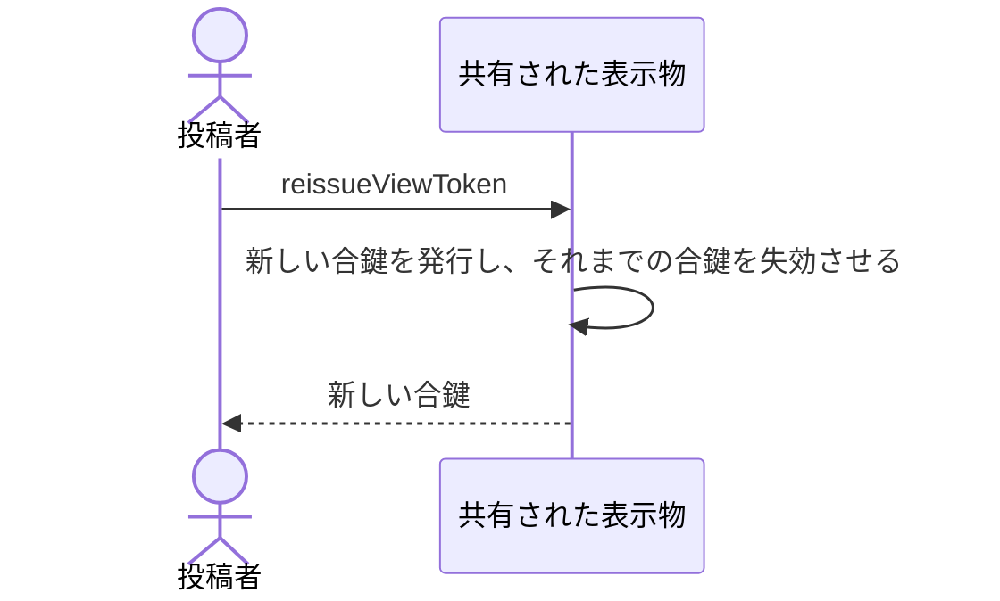

# 合鍵を新しくして、それまでの合鍵を使えなくする：uc-reissue-view-token

## 概要

- 渡した合鍵を失効させ、新しい合鍵を発行する操作。見せる相手を絞り直したいときと、合鍵を紛失したときに使う。
- 居場所は変わらないため、相手には新しい合鍵だけを伝えればよい。

---

## 存在意義

- 合鍵は一度しか示されないため、紛失したときに取り戻す手立てがこれしか無い。これが無いと、紛失は公開のやり直しを意味してしまう。
- 渡した相手から見せる相手を外す手立てでもある。合鍵を回収できない以上、失効させる操作が無ければ、一度渡した相手を外せない。

---

## 主アクターと意図

### 主アクター

投稿者

### 意図

それまでの合鍵を使えなくして、見せる相手を絞り直す

---

## 事前条件

- 対象の表示物が公開されていること
- 操作する者が、あらかじめ招かれた投稿者であること

---

## 基本フロー



---

## 事後条件

- 新しい合鍵が発行されている
- それまでの合鍵では開けなくなっている
- 符丁が変わっていない
- それまでに集まった反応が残っている

---

## 受け入れ基準

- 投稿者が合鍵の再発行を求めたとき、新しい合鍵を返すこと
- 新しい合鍵を発行したとき、それまでの合鍵で開けなくすること
- 新しい合鍵を発行したとき、居場所を変えないこと
- 新しい合鍵を返すとき、それが一度しか示されないことを投稿者に伝えること
- 切り替えが行き渡るまで時間がかかりうることを投稿者に伝え、即座に切り替わるとは伝えないこと

---

## 操作保証

- 同じ表示物に対して繰り返し再発行したとき、そのたびに異なる合鍵が発行され、直前のものを含め過去の合鍵がいずれも使えなくなること

---

## エラー

| コード | 条件 |
|---|---|
| `NOT_INVITED` | - 操作する者が招かれた投稿者でない |

---

## 受け入れシナリオ

### 背景

表示物Aが公開されており、合鍵が閲覧者へ渡されている。操作する者は招かれた投稿者である。

### 新しい合鍵で開け、古い合鍵では開けない

| 分類 | 観点 |
|---|---|
| 正常系 | 状態遷移: 置き換えが失効を伴うことを確かめる |

```gherkin
When 合鍵を再発行する
Then 新しい合鍵で表示物Aを開ける
And それまでの合鍵では開けない
```

### 居場所は変わらない

| 分類 | 観点 |
|---|---|
| 正常系 | 事前条件: 相手へ伝え直すのが合鍵だけで済むことを確かめる |

```gherkin
When 合鍵を再発行する
Then 居場所は変わらない
```

### 反応は失われない

| 分類 | 観点 |
|---|---|
| 境界値 | 計算整合: 合鍵の切り替えが反応に影響しないことを確かめる |

```gherkin
Given 表示物Aに反応が集まっている
When 合鍵を再発行する
Then 反応はすべて残っている
```

---

## 操作保証シナリオ

### 続けて再発行すると過去の合鍵はすべて失効する

| 分類 | 観点 |
|---|---|
| 境界値 | 一貫性: 失効が最後の1つだけに留まらないことを確かめる |

```gherkin
Given 合鍵を1度再発行している
When もう一度再発行する
Then 最新の合鍵だけが使える
And 1回目の再発行で得た合鍵も、最初の合鍵も使えない
```
