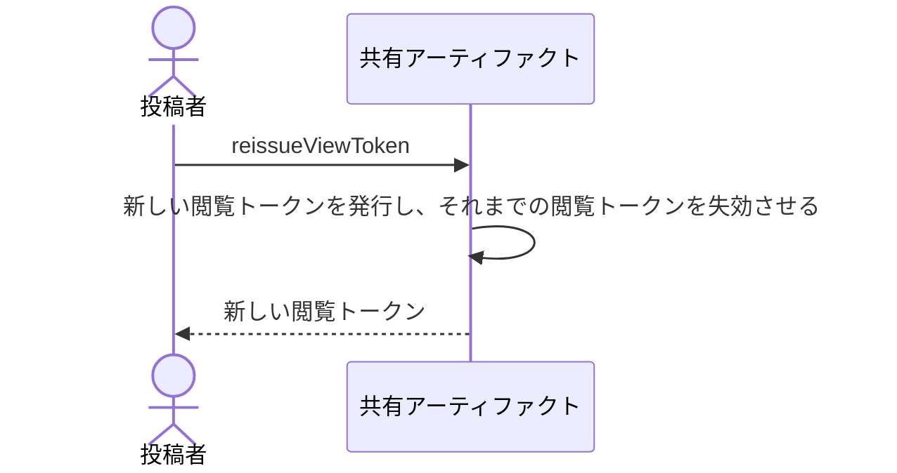

# 閲覧トークンを新しくして、それまでの閲覧トークンを使えなくする：uc-reissue-view-token

## 概要

- 渡した閲覧トークンを失効させ、新しい閲覧トークンを発行する操作。見せる相手を絞り直したいときと、閲覧トークンを紛失したときに使う。
- 共有URLは変わらないため、相手には新しい閲覧トークンだけを伝えればよい。

---

## 存在意義

- 閲覧トークンは一度しか示されないため、紛失したときに取り戻す手立てがこれしか無い。これが無いと、紛失は公開のやり直しを意味してしまう。
- 渡した相手から見せる相手を外す手立てでもある。閲覧トークンを回収できない以上、失効させる操作が無ければ、一度渡した相手を外せない。

---

## 主アクターと意図

### 主アクター

投稿者

### 意図

それまでの閲覧トークンを使えなくして、見せる相手を絞り直す

---

## 事前条件

- 対象の共有アーティファクトが公開されていること
- 操作する者が、あらかじめ招かれた投稿者であること

---

## 基本フロー



---

## 事後条件

- 新しい閲覧トークンが発行されている
- それまでの閲覧トークンでは開けなくなっている
- ArtifactIdが変わっていない
- それまでに集まった反応が残っている

---

## 受け入れ基準

- 投稿者が閲覧トークンの再発行を求めたとき、新しい閲覧トークンを返すこと
- 新しい閲覧トークンを発行したとき、それまでの閲覧トークンで開けなくすること
- 新しい閲覧トークンを発行したとき、共有URLを変えないこと
- 新しい閲覧トークンを返すとき、それが一度しか示されないことを投稿者に伝えること
- 切り替えが行き渡るまで時間がかかりうることを投稿者に伝え、即座に切り替わるとは伝えないこと

---

## 操作保証

- 同じ共有アーティファクトに対して繰り返し再発行したとき、そのたびに異なる閲覧トークンが発行され、直前のものを含め過去の閲覧トークンがいずれも使えなくなること

---

## エラー

| コード | 条件 |
|---|---|
| `NOT_INVITED` | - 操作する者が招かれた投稿者でない |

---

## 受け入れシナリオ

### 背景

共有アーティファクトAが公開されており、閲覧トークンが閲覧者へ渡されている。操作する者は招かれた投稿者である。

### 新しい閲覧トークンで開け、古い閲覧トークンでは開けない

| 分類 | 観点 |
|---|---|
| 正常系 | 状態遷移: 置き換えが失効を伴うことを確かめる |

```gherkin
When 閲覧トークンを再発行する
Then 新しい閲覧トークンで共有アーティファクトAを開ける
And それまでの閲覧トークンでは開けない
```

### 共有URLは変わらない

| 分類 | 観点 |
|---|---|
| 正常系 | 事前条件: 相手へ伝え直すのが閲覧トークンだけで済むことを確かめる |

```gherkin
When 閲覧トークンを再発行する
Then 共有URLは変わらない
```

### 反応は失われない

| 分類 | 観点 |
|---|---|
| 境界値 | 計算整合: 閲覧トークンの切り替えが反応に影響しないことを確かめる |

```gherkin
Given 共有アーティファクトAに反応が集まっている
When 閲覧トークンを再発行する
Then 反応はすべて残っている
```

---

## 操作保証シナリオ

### 続けて再発行すると過去の閲覧トークンはすべて失効する

| 分類 | 観点 |
|---|---|
| 境界値 | 一貫性: 失効が最後の1つだけに留まらないことを確かめる |

```gherkin
Given 閲覧トークンを1度再発行している
When もう一度再発行する
Then 最新の閲覧トークンだけが使える
And 1回目の再発行で得た閲覧トークンも、最初の閲覧トークンも使えない
```
