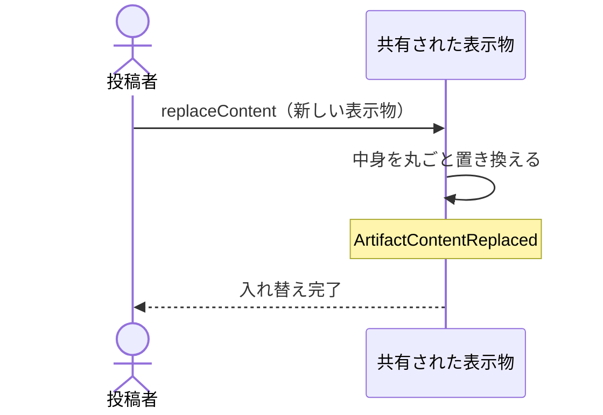

# 居場所と合鍵と反応を保ったまま中身だけを入れ替える：uc-replace-content

## 概要

- 指摘を受けて直した表示物を、同じ居場所のまま新しいものへ入れ替える操作。
- 入れ替えた時点が区切りとして反応の並びに残り、それより前の指摘が古いものだと読み取れるようになる。

---

## 存在意義

- これが無いと、直すたびに新しく公開することになり、居場所も合鍵も渡し直しになる。それまでに集まった反応も切り離され、指摘と修正の往復が続かない。
- 反応が積み上がり続けることが、この文脈で最も守りたいものである。直すことが反応を捨てることと引き換えになってはならない。

---

## 主アクターと意図

### 主アクター

投稿者

### 意図

指摘を受けて直したものを、同じ相手に同じ居場所で見てもらう

---

## 事前条件

- 対象の表示物が公開されていること
- 操作する者が、あらかじめ招かれた投稿者であること

---

## 基本フロー



---

## 事後条件

- 中身が新しいものへ丸ごと置き換わっている
- 符丁と合鍵が入れ替え前と同じである
- それまでに集まった反応がすべて残っている
- 入れ替えの時点が区切りとして反応の並びに現れている
- ArtifactContentReplaced が発行されている

---

## 受け入れ基準

- 投稿者が新しい表示物を渡したとき、中身を丸ごと置き換えること
- 中身を置き換えたとき、符丁と合鍵を変えないこと
- 中身を置き換えたとき、それまでの反応をすべて残すこと
- 中身を置き換えたとき、その時点を区切りとして反応の並びに残すこと
- 公開が止まっている表示物に対して置き換えようとしたとき、置き換えず拒むこと

---

## 操作保証

- 入れ替えに失敗したとき、それまでの中身がそのまま残ること

---

## エラー

| コード | 条件 |
|---|---|
| `NOT_PUBLISHED` | - 対象の表示物が公開されていない |
| `NOT_INVITED` | - 操作する者が招かれた投稿者でない |
| `EMPTY_CONTENT` | - 渡された新しい表示物が空である |

---

## 受け入れシナリオ

### 背景

表示物Aが公開されており、3件の反応が集まっている。操作する者は招かれた投稿者である。

### 居場所と合鍵を保ったまま入れ替わる

| 分類 | 観点 |
|---|---|
| 正常系 | 状態遷移: 渡し直しが不要であることを確かめる |

```gherkin
When 新しい表示物で中身を入れ替える
Then 中身は新しいものと一致する
And 居場所は変わらない
And 合鍵も変わらない
```

### 反応が残り、区切りが現れる

| 分類 | 観点 |
|---|---|
| 正常系 | 計算整合: 往復が続き、かつ古い指摘が判別できることを確かめる |

```gherkin
When 新しい表示物で中身を入れ替える
Then 3件の反応はいずれも残っている
And 入れ替えの時点が区切りとして反応の並びに現れる
And 区切りより前の3件は入れ替え前への指摘だと読み取れる
```

### 止まっているものは入れ替えられない

| 分類 | 観点 |
|---|---|
| 異常系 | 事前条件: 公開が止まっている間の変更を防ぐことを確かめる |

```gherkin
Given 表示物Aの公開が止まっている
When 中身を入れ替えようとする
Then NOT_PUBLISHED として拒まれる
And 中身は変わらない
```

### 部分的な書き換えは起きない

| 分類 | 観点 |
|---|---|
| 境界値 | 計算整合: 置き換えが丸ごとであることを確かめる |

```gherkin
When 新しい表示物で中身を入れ替える
Then 入れ替え前の中身の一部が残ることはない
```

---

## 操作保証シナリオ

### 失敗しても元の中身が生きている

| 分類 | 観点 |
|---|---|
| 異常系 | 一貫性: 中途半端な入れ替えが起きないことを確かめる |

```gherkin
Given 入れ替えの途中で拒まれる条件が成立している
When 中身を入れ替えようとする
Then 元の中身がそのまま見られる
And 反応も失われていない
```
