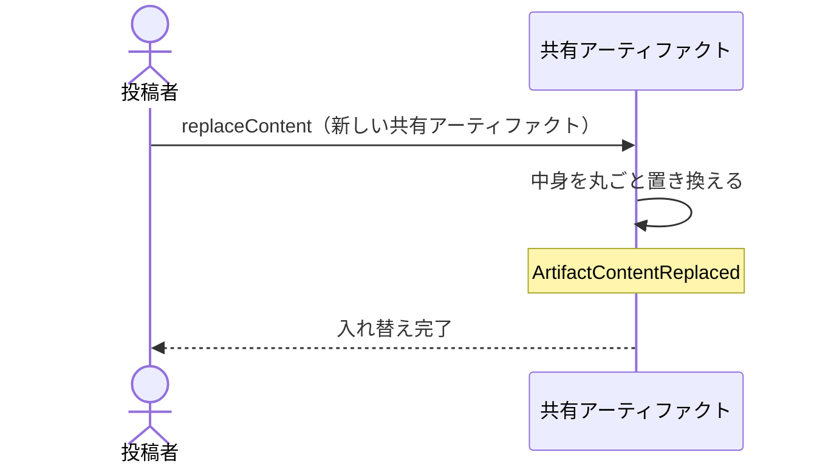

# 共有URLと閲覧トークンとコメントを保ったまま中身だけを入れ替える：uc-replace-content

## 概要

- 指摘を受けて直した文書を、同じ共有URLのまま新しいものへ入れ替える操作。
- 入れ替えた時点が区切りとしてコメントの並びに残り、それより前の指摘が古いものだと読み取れるようになる。

---

## 存在意義

- これが無いと、直すたびに新しく公開することになり、共有URLも閲覧トークンも渡し直しになる。それまでに集まったコメントも切り離され、指摘と修正の往復が続かない。
- コメントが積み上がり続けることが、この文脈で最も守りたいものである。直すことがコメントを捨てることと引き換えになってはならない。

---

## 主アクターと意図

### 主アクター

投稿者

### 意図

指摘を受けて直したものを、同じ相手に同じ共有URLで見てもらう

---

## 事前条件

- 対象の共有アーティファクトが公開されていること
- 操作する者が、対象の共有アーティファクトの投稿者であること（管理者であっても、自分が投稿者でないものの中身は差し替えられない）

---

## 基本フロー



---

## 事後条件

- 中身が新しいものへ丸ごと置き換わっている
- ArtifactIdと閲覧トークンが入れ替え前と同じである
- それまでに集まったコメントがすべて残っている
- 入れ替えの時点が区切りとしてコメントの並びに現れている
- ArtifactContentReplaced が発行されている

---

## 受け入れ基準

- 投稿者が新しい文書を渡したとき、中身を丸ごと置き換えること
- 中身を置き換えたとき、ArtifactIdと閲覧トークンを変えないこと
- 中身を置き換えたとき、それまでのコメントをすべて残すこと
- 中身を置き換えたとき、その時点を区切りとしてコメントの並びに残すこと
- 公開が止まっている共有アーティファクトに対して置き換えようとしたとき、置き換えず拒むこと
- 対象の投稿者でない者が差し替えを求めたとき、管理者であっても差し替えないこと

---

## 操作保証

- 入れ替えに失敗したとき、それまでの中身がそのまま残ること

---

## エラー

| コード | 条件 |
|---|---|
| `NOT_PUBLISHED` | - 対象の共有アーティファクトが公開されていない |
| `EMPTY_CONTENT` | - 渡された新しい文書が空である |
| `ARTIFACT_NOT_FOUND` | - 対象の共有アーティファクトが存在しない<br>- 操作する者が対象の投稿者でも管理者でもない |
| `NOT_THE_PUBLISHER` | - 操作する者が対象の投稿者でない（管理者であっても差し替えはできない） |

---

## 受け入れシナリオ

### 背景

共有アーティファクトAが公開されており、3件のコメントが集まっている。操作する者は招かれた投稿者である。

### 共有URLと閲覧トークンを保ったまま入れ替わる

| 分類 | 観点 |
|---|---|
| 正常系 | 状態遷移: 渡し直しが不要であることを確かめる |

```gherkin
Scenario: 共有URLと閲覧トークンを保ったまま入れ替わる
  When 新しい文書で中身を入れ替える
  Then 中身は新しいものと一致する
  And 共有URLは変わらない
  And 閲覧トークンも変わらない
```

### コメントが残り、区切りが現れる

| 分類 | 観点 |
|---|---|
| 正常系 | 計算整合: 往復が続き、かつ古い指摘が判別できることを確かめる |

```gherkin
Scenario: コメントが残り、区切りが現れる
  When 新しい文書で中身を入れ替える
  Then 3件のコメントはいずれも残っている
  And 入れ替えの時点が区切りとしてコメントの並びに現れる
  And 区切りより前の3件は入れ替え前への指摘だと読み取れる
```

### 止まっているものは入れ替えられない

| 分類 | 観点 |
|---|---|
| 異常系 | 事前条件: 公開が止まっている間の変更を防ぐことを確かめる |

```gherkin
Scenario: 止まっているものは入れ替えられない
  Given 共有アーティファクトAの公開が止まっている
  When 中身を入れ替えようとする
  Then NOT_PUBLISHED として拒まれる
  And 中身は変わらない
```

### 部分的な書き換えは起きない

| 分類 | 観点 |
|---|---|
| 境界値 | 計算整合: 置き換えが丸ごとであることを確かめる |

```gherkin
Scenario: 部分的な書き換えは起きない
  When 新しい文書で中身を入れ替える
  Then 入れ替え前の中身の一部が残ることはない
```

### 管理者でも他人の中身は差し替えられない

| 分類 | 観点 |
|---|---|
| 異常系 | 事前条件: 管理者の権限が中身に及ばないことを確かめる。集まったコメントが何に対する反応かを、投稿者の知らないうちに変えられてはならない |

```gherkin
Scenario: 管理者でも他人の中身は差し替えられない
  Given 共有アーティファクトAの投稿者がXである
  When 管理者がAの中身を差し替えようとする
  Then NOT_THE_PUBLISHER として拒まれる
  And Aの中身とコメントは変わっていない
```

---

## 操作保証シナリオ

### 失敗しても元の中身が生きている

| 分類 | 観点 |
|---|---|
| 異常系 | 一貫性: 中途半端な入れ替えが起きないことを確かめる |

```gherkin
Scenario: 失敗しても元の中身が生きている
  Given 入れ替えの途中で拒まれる条件が成立している
  When 中身を入れ替えようとする
  Then 元の中身がそのまま見られる
  And コメントも失われていない
```
