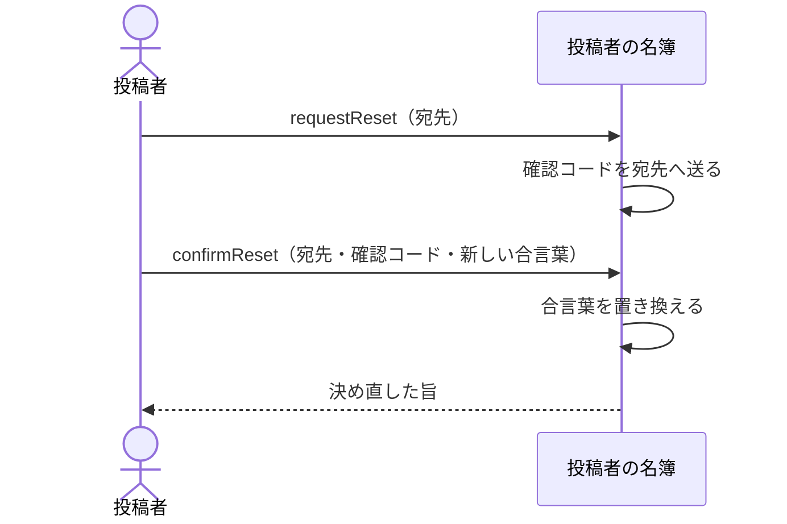

# 合言葉を忘れた人が自分で決め直す：uc-reset-password

## 概要

- 合言葉を忘れた投稿者が、登録されている宛先へ届く確認コードを頼りに、新しい合言葉を自分で決める操作。
- 招待に応じていない人はこれを使えない。仮の合言葉を無くした場合は、管理者が招き直す。

---

## 存在意義

- これが無いと、合言葉を忘れるたびに管理者の手が要る。管理者が不在のあいだ、その人は公開したものを止めることも差し替えることもできない。
- 管理者が合言葉を決め直せる形にすると、管理者がいつでも他人になりすませることになる。本人の宛先へ届く確認コードを条件にすることで、決め直せるのを本人だけに保つ。

---

## 主アクターと意図

### 主アクター

投稿者

### 意図

合言葉を忘れても、人に頼まずに入れる状態へ戻る

---

## 関与する外部

- 投稿者の名簿（合言葉を持ち、確認コードを宛先へ送る、この文脈の外にある仕組み）

---

## 操作一覧

| 操作 | 概要 |
|---|---|
| `request` | 登録されている宛先へ確認コードを送るよう求める。 |
| `confirm` | 確認コードを添えて、新しい合言葉を決める。 |

---

## 事前条件

- 対象の人が招かれており、かつ既に一度入っていること（招待に応じていない人は使えない）

---

## 基本フロー



---

## 事後条件

- 新しい合言葉で入れる状態になっている
- それまでの合言葉では入れなくなっている
- 使った確認コードが二度は使えなくなっている

---

## 受け入れ基準

- 登録されている宛先が示されたとき、その宛先へ確認コードを送ること
- 招かれていない宛先が示されたときも、送ったときと同じ内容を返すこと
- 確認コードと新しい合言葉が揃ったとき、合言葉を置き換えること
- 合言葉を置き換えたとき、それまでの合言葉で入れなくすること
- 確認コードが違うとき、期限が切れているとき、既に使われているときは、置き換えないこと
- 決められた強さを満たさない合言葉は受け付けないこと
- 招待に応じていない人には、この経路を使わせないこと
- 確認コードを、この文脈の側に残さないこと

---

## 操作保証

- 確認コードと合言葉を、この文脈の側にどの形でも残さないこと
- 決め直しが、その人が公開した共有アーティファクトに一切影響しないこと

---

## エラー

| コード | 条件 |
|---|---|
| `CODE_REJECTED` | - 確認コードが違う<br>- 確認コードの期限が切れている<br>- 確認コードが既に使われている<br>- （これらを区別して返さない） |
| `PASSWORD_REJECTED` | - 新しい合言葉が決められた強さを満たさない |
| `RESET_NOT_AVAILABLE` | - 対象の人が招待に応じておらず、仮の合言葉のままである |

---

## 受け入れシナリオ

### 背景

ある人が招かれ、既に一度入って自分の合言葉を決めている。

### 確認コードで決め直せる

| 分類 | 観点 |
|---|---|
| 正常系 | 状態遷移: 本人の宛先へ届くものを条件にすることで、決め直せるのが本人に限られることを確かめる |

```gherkin
Given その人が合言葉を忘れている
When 宛先を示して確認コードを求める
And 届いた確認コードと新しい合言葉を示す
Then 新しい合言葉で入れる
```

### それまでの合言葉では入れなくなる

| 分類 | 観点 |
|---|---|
| 正常系 | 状態遷移: 置き換えが追加ではなく差し替えであることを確かめる |

```gherkin
Given その人が新しい合言葉を決めている
When それまでの合言葉で入ろうとする
Then 拒まれる
```

### 招かれていない宛先でも同じ返事をする

| 分類 | 観点 |
|---|---|
| 異常系 | 事前条件: 返事の違いから、誰が招かれているかを外から探れないことを確かめる。ここを分けると、宛先を並べるだけで名簿を作れてしまう |

```gherkin
Given 宛先Aは招かれておらず、宛先Bは招かれている
When Aで確認コードを求める
And Bで確認コードを求める
Then どちらも同じ内容が返る
And Aへは何も送られない
```

### 違う確認コードでは決め直せない

| 分類 | 観点 |
|---|---|
| 異常系 | 事前条件: 宛先を知っているだけでは決め直せないことを確かめる |

```gherkin
Given 確認コードが送られている
When 違う確認コードと新しい合言葉を示す
Then CODE_REJECTED として拒まれる
And 合言葉は変わっていない
```

### 使った確認コードは二度使えない

| 分類 | 観点 |
|---|---|
| 境界値 | 一貫性: 確認コードが一度きりであることを確かめる。残ると、それを見た者があとから決め直せる |

```gherkin
Given 確認コードを使って合言葉を決め直している
When 同じ確認コードでもう一度決め直そうとする
Then CODE_REJECTED として拒まれる
```

### 弱い合言葉は決められない

| 分類 | 観点 |
|---|---|
| 異常系 | 事前条件: 決められた強さが、この経路でも効くことを確かめる。ここが緩いと、決め直しが強さを迂回する抜け道になる |

```gherkin
Given 正しい確認コードが届いている
When 決められた強さを満たさない合言葉を示す
Then PASSWORD_REJECTED として拒まれる
And 合言葉は変わっていない
```

### 招待に応じていない人は使えない

| 分類 | 観点 |
|---|---|
| 境界値 | 事前条件: この経路が塞がる場合があることを確かめる。仮の合言葉を無くした人はここでは戻れず、管理者に招き直してもらう |

```gherkin
Given ある人が招かれ、まだ一度も入っていない
When その宛先で確認コードを求めて決め直そうとする
Then RESET_NOT_AVAILABLE として拒まれる
And 管理者が招き直すほかに手立てが無い
```

---

## 操作保証シナリオ

### 背景

ある人が共有アーティファクトを公開しており、合言葉を決め直す。

### 決め直しても公開したものは変わらない

| 分類 | 観点 |
|---|---|
| 境界値 | 一貫性: 入るための合言葉と、渡した相手が使う閲覧トークンが無関係であることを確かめる |

```gherkin
Given ある人が共有アーティファクトAを公開している
When その人が合言葉を決め直す
Then Aは公開されたまま残っている
And 閲覧トークンを持つ閲覧者はAを開ける
```
