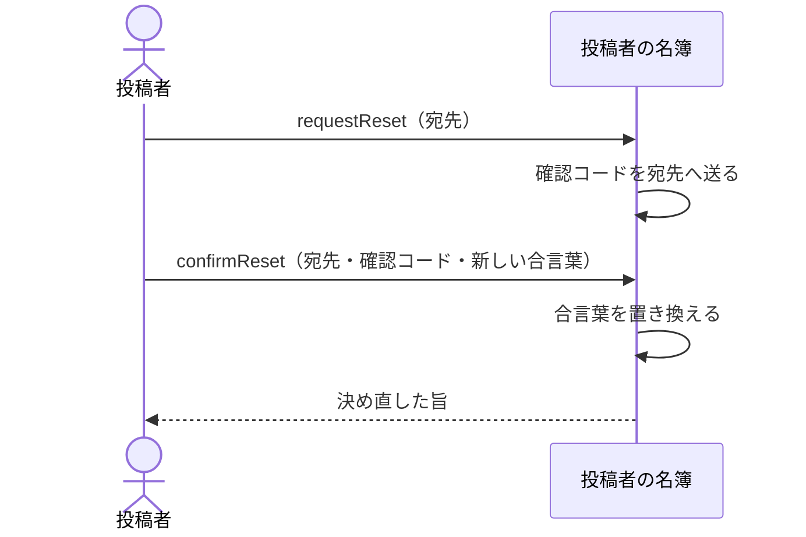

# 合言葉を忘れた人が自分で決め直す：uc-reset-password

## 概要

- 合言葉を忘れた投稿者が、登録されている宛先へ届く確認コードを頼りに、新しい合言葉を自分で決める操作。
- 招待に応じていない人はこれを使えない。仮の合言葉を無くした場合は、管理者が招き直す。

---

## 存在意義

- これが無いと、合言葉を忘れるたびに管理者の手が要る。管理者が不在のあいだ、その人は公開したものを止めることも差し替えることもできない。
- 管理者が合言葉を決め直せる形にすると、管理者がいつでも他人になりすませることになる。本人の宛先へ届く確認コードを条件にすることで、決め直せるのを本人だけに保つ。

---

## 主アクターと意図

### 主アクター

投稿者

### 意図

合言葉を忘れても、人に頼まずに入れる状態へ戻る

---

## 関与する外部

- 投稿者の名簿（合言葉を持ち、確認コードを宛先へ送る、この文脈の外にある仕組み）

---

## 操作一覧

| 操作 | 概要 |
|---|---|
| `request` | 登録されている宛先へ確認コードを送るよう求める。 |
| `confirm` | 確認コードを添えて、新しい合言葉を決める。 |

---

## 事前条件

- 対象の人が招かれており、かつ既に一度入っていること（招待に応じていない人は使えない）
- 確認コードの発行・宛先への送付・照合・期限・一度使ったものを二度使わせないことは、投稿者の名簿（この文脈の外にある仕組み）が行う。合言葉の置き換えも名簿が行い、この文脈は結果だけを受け取る

---

## 基本フロー



---

## 事後条件

- 新しい合言葉で入れる状態になっている
- それまでの合言葉では入れなくなっている
- 使った確認コードが二度は使えなくなっている

---

## 受け入れ基準

- 招かれていない宛先が示されたときも、送ったときと同じ内容を返すこと
- 招待に応じていない人には、この経路を使えないことを伝え、招き直す以外の手立てを示さないこと
- 名簿へ渡す設定として、決められた合言葉の強さを出荷すること
- 画面も同じ強さで、名簿へ送る前に止めること
- 確認コードを、この文脈の側にどの形でも残さないこと

---

## 操作保証

- 確認コードと合言葉を、この文脈の側にどの形でも残さないこと
- 決め直しが、その人が公開した共有アーティファクトに一切影響しないこと

---

## エラー

| コード | 条件 |
|---|---|
| `CODE_REJECTED` | - 確認コードが違う<br>- 確認コードの期限が切れている<br>- 確認コードが既に使われている<br>- （これらを区別して返さない） |
| `PASSWORD_REJECTED` | - 新しい合言葉が決められた強さを満たさない |
| `RESET_NOT_AVAILABLE` | - 対象の人が招待に応じておらず、仮の合言葉のままである |

---

## 受け入れシナリオ

### 背景

ある人が招かれ、既に一度入って自分の合言葉を決めている。

### 招かれていない宛先でも同じ返事をする

| 分類 | 観点 |
|---|---|
| 正常系 | 探索の防止：送れたかどうかの違いを外へ出さない |

```gherkin
Scenario: 招かれていない宛先でも同じ返事をする
  Given 宛先Aは招かれておらず、宛先Bは招かれている
  When Aで確認コードを求める
  And Bで確認コードを求める
  Then どちらも同じ内容が返る
  And Aへは何も送られない
```

### 招待に応じていない人は使えない

| 分類 | 観点 |
|---|---|
| 異常系 | 経路の限定：名簿が返す拒みを、この製品の案内へ写す |

```gherkin
Scenario: 招待に応じていない人は使えない
  Given ある人が招かれ、まだ一度も入っていない
  When その宛先で確認コードを求めて決め直そうとする
  Then RESET_NOT_AVAILABLE として拒まれる
  And 管理者が招き直すほかに手立てが無い
```

### 弱い合言葉は名簿へ送る前に止める

| 分類 | 観点 |
|---|---|
| 異常系 | 二重の守り：設定を出荷し、画面も同じ基準で先に止める |

```gherkin
Scenario: 弱い合言葉は名簿へ送る前に止める
  Given 正しい確認コードが届いている
  When 決められた強さを満たさない合言葉を示す
  Then 名簿へ送られる前に、その場で拒まれる
  And 出荷する設定にも同じ強さが含まれている
```

---

## 操作保証シナリオ

### 背景

ある人が共有アーティファクトを公開しており、合言葉を決め直す。

### 確認コードはどこにも残らない

| 分類 | 観点 |
|---|---|
| 正常系 | 秘匿：こちら側に残らないことを、持ち物を調べて確かめる |

```gherkin
Scenario: 確認コードはどこにも残らない
  Given ある人が確認コードを示して決め直している
  When この文脈が持つものを調べる
  Then 確認コードも、そこから確認コードを導けるものも見つからない
```

### 決め直しても公開したものは変わらない

| 分類 | 観点 |
|---|---|
| 正常系 | 分離：合言葉の入れ替えが、渡した相手へ波及しないことを確かめる |

```gherkin
Scenario: 決め直しても公開したものは変わらない
  Given ある人が共有アーティファクトAを公開している
  When その人が合言葉を決め直す
  Then Aは公開されたまま残っている
  And 閲覧トークンを持つ閲覧者はAを開ける
```
