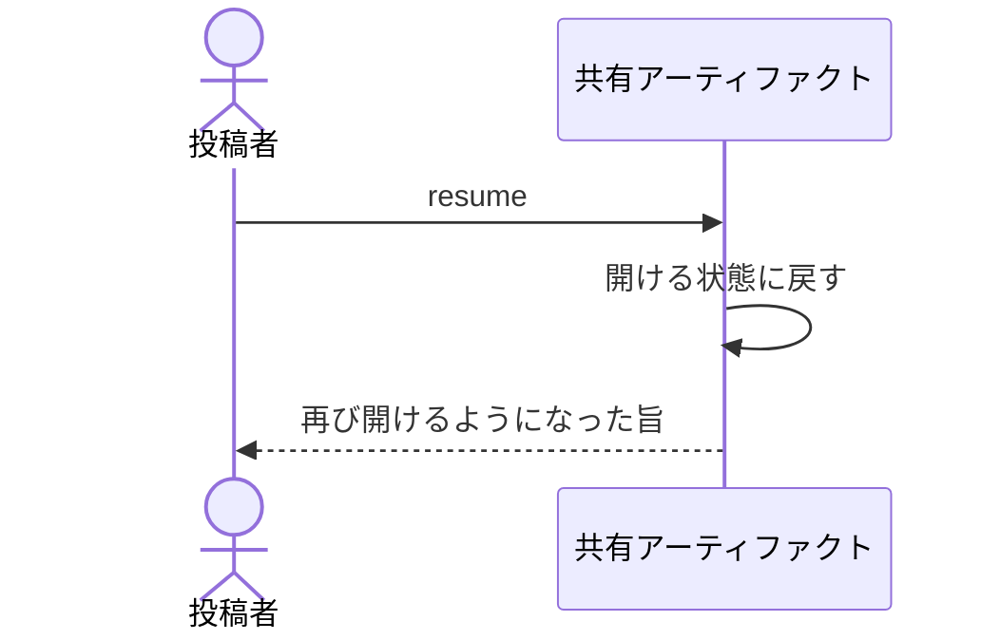

# 止めていたものを再び見せる：uc-resume-artifact

## 概要

- 停止していた共有アーティファクトを再び開ける状態にする操作。共有URLも中身もコメントもそのまま戻る。
- 止める前の閲覧トークンは、期限内で無効にされていなければそのまま使える。渡した相手を外したいときは、この操作ではなく閲覧トークンの無効化を使う。

---

## 存在意義

- 止めることが取り消せないと、止める判断そのものが重くなる。戻せることで、迷ったらまず止めるという運用ができる。
- 止めることと、渡した相手を外すことは別の判断である。再開のたびに閲覧トークンを切り替えると、戻したいだけの場面でも、外す必要の無い相手まで渡し直しが要る。相手を絞り直したいときは閲覧トークンの無効化を使い、この操作は戻すことだけを担う。

---

## 主アクターと意図

### 主アクター

投稿者

### 意図

止めていたものを、もう一度見てもらえる状態に戻す

---

## 事前条件

- 対象の共有アーティファクトが公開停止されていること
- 操作する者が、対象の共有アーティファクトの投稿者であるか、管理者であること

---

## 基本フロー



---

## 事後条件

- 共有アーティファクトが開ける状態になっている
- 共有URL・中身・コメントが停止前と同じである
- 止める前の閲覧トークンのうち、期限内で無効にされていないものはそのまま使える

---

## 受け入れ基準

- 再開したとき、共有URL・中身・コメントを停止前と同じにすること
- 公開されている共有アーティファクトに対して再開しようとしたとき、拒むこと
- 対象の投稿者でも管理者でもない者が再公開を求めたとき、対象が見つからないものとして拒むこと
- 管理者が再公開を求めたとき、自分が公開したものでなくても受け付けること
- When 公開を再開したとき、再開は 止める前の閲覧トークンのうち期限内で無効にされていないものを、そのまま使える状態にする shall
- While 再開を行う間、再開は どの閲覧トークンも無効にしない shall

---

## 操作保証

- 再開に失敗したとき、停止したままの状態が保たれ、閲覧トークンも変わらないこと

---

## エラー

| コード | 条件 |
|---|---|
| `NOT_SUSPENDED` | - 対象の共有アーティファクトが公開停止されていない |
| `ARTIFACT_NOT_FOUND` | - 対象の共有アーティファクトが存在しない<br>- 操作する者が対象の投稿者でも管理者でもない |

---

## 受け入れシナリオ

### 背景

共有アーティファクトAが停止しており、停止前の閲覧トークンが閲覧者の手元にある。操作する者は招かれた投稿者である。

### 再開しても止める前の閲覧トークンで開ける

| 分類 | 観点 |
|---|---|
| 正常系 | 状態遷移：再開が閲覧トークンを作り直さないことを確かめる |

```gherkin
Scenario: 再開しても止める前の閲覧トークンで開ける
  Given 公開を止めた共有アーティファクトと、期限内で無効にされていない閲覧トークン
  When 公開を再開する
  Then その閲覧トークンで開ける
```

### 止める前に無効にした閲覧トークンは再開しても戻らない

| 分類 | 観点 |
|---|---|
| 正常系 | 状態遷移：無効化と一時閉鎖が別の手段であることを確かめる |

```gherkin
Scenario: 止める前に無効にした閲覧トークンは再開しても戻らない
  Given 公開を止める前に無効にした閲覧トークン
  When 公開を再開する
  Then その閲覧トークンでは開けない
```

### 止めている間に期限が切れた閲覧トークンは再開しても使えない

| 分類 | 観点 |
|---|---|
| 境界値 | 状態遷移：止めている間も時間は進むことを確かめる |

```gherkin
Scenario: 止めている間に期限が切れた閲覧トークンは再開しても使えない
  Given 公開を止めている間に期限が切れた閲覧トークン
  When 公開を再開する
  Then その閲覧トークンでは開けない
```

### 共有URLと中身とコメントは戻る

| 分類 | 観点 |
|---|---|
| 正常系 | 計算整合: 閲覧トークン以外は元どおりであることを確かめる |

```gherkin
Scenario: 共有URLと中身とコメントは戻る
  When 共有アーティファクトAの公開を再開する
  Then 共有URLは停止前と同じである
  And 中身も停止前と同じである
  And コメントもすべて残っている
```

### 止まっていないものは再開できない

| 分類 | 観点 |
|---|---|
| 異常系 | 事前条件: 状態の前提を確かめる |

```gherkin
Scenario: 止まっていないものは再開できない
  Given 共有アーティファクトBが公開されている
  When 共有アーティファクトBを再開しようとする
  Then NOT_SUSPENDED として拒まれる
  And 閲覧トークンは変わらない
```

### 他人のものは見つからないものとして拒む

| 分類 | 観点 |
|---|---|
| 異常系 | 事前条件: 扱える範囲が自分の公開したものに限られることを確かめる。拒み方を「見つからない」に揃えるのは、拒否と不在の違いからそこに何かがあること自体を読み取らせないため |

```gherkin
Scenario: 他人のものは見つからないものとして拒む
  Given 共有アーティファクトAの投稿者がXである
  When 管理者でない投稿者YがAの再公開を求める
  Then ARTIFACT_NOT_FOUND として拒まれる
  And Aの状態は変わっていない
```

### 管理者は自分のものでなくても扱える

| 分類 | 観点 |
|---|---|
| 正常系 | 事前条件: 投稿者が抜けたあとや連絡がつかないときに、誰も手入れできない共有アーティファクトが残らないことを確かめる |

```gherkin
Scenario: 管理者は自分のものでなくても扱える
  Given 共有アーティファクトAの投稿者がXである
  When 管理者がAの再公開を求める
  Then Aは開ける状態に戻る
  And 止める前の閲覧トークンのうち、期限内で無効にされていないものはそのまま使える
```

---

## 操作保証シナリオ

### 失敗しても閲覧トークンは変わらない

| 分類 | 観点 |
|---|---|
| 異常系 | 一貫性: 失敗が閲覧トークンの失効だけを引き起こさないことを確かめる |

```gherkin
Scenario: 失敗しても閲覧トークンは変わらない
  Given 再開の途中で拒まれる条件が成立している
  When 再開しようとする
  Then 共有アーティファクトAは停止したままである
  And 新しい閲覧トークンは発行されていない
```
