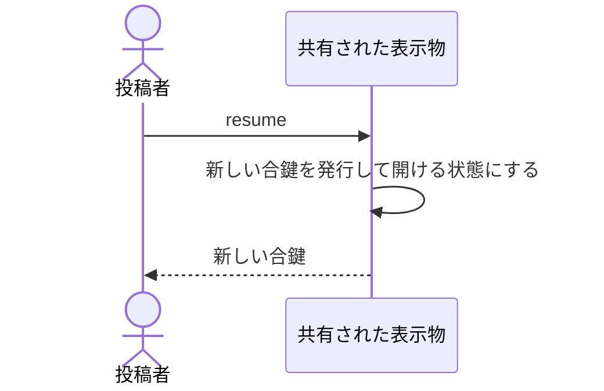

# 止めていたものを再び見せる（合鍵は必ず新しくなる）：uc-resume-artifact

## 概要

- 停止していた表示物を再び開ける状態にする操作。居場所も中身も反応もそのまま戻るが、合鍵だけは必ず新しくなる。
- 止めた理由の多くが見せる相手を絞り直すことにあるため、止める前の合鍵は復活させない。

---

## 存在意義

- 止めることが取り消せないと、止める判断そのものが重くなる。戻せることで、迷ったらまず止めるという運用ができる。
- 止める前の合鍵をそのまま復活させると、止めた意図が失われる。戻すことと、見せる相手を絞り直すことを同時に成立させるために、合鍵の切り替えを伴わせる。

---

## 主アクターと意図

### 主アクター

投稿者

### 意図

止めていたものを、もう一度見てもらえる状態に戻す

---

## 事前条件

- 対象の表示物が停止していること
- 操作する者が、あらかじめ招かれた投稿者であること

---

## 基本フロー



---

## 事後条件

- 表示物が開ける状態になっている
- 新しい合鍵が発行されている
- 停止前の合鍵では開けない
- 居場所・中身・反応が停止前と同じである

---

## 受け入れ基準

- 投稿者が再開を求めたとき、開ける状態に戻し、新しい合鍵を返すこと
- 再開したとき、停止前の合鍵で開けなくすること
- 再開したとき、居場所・中身・反応を停止前と同じにすること
- 再開すると合鍵が必ず新しくなることを、実行する前に投稿者に伝えること
- 公開されている表示物に対して再開しようとしたとき、拒むこと

---

## 操作保証

- 再開に失敗したとき、停止したままの状態が保たれ、合鍵も変わらないこと

---

## エラー

| コード | 条件 |
|---|---|
| `NOT_SUSPENDED` | - 対象の表示物が停止していない |
| `NOT_INVITED` | - 操作する者が招かれた投稿者でない |

---

## 受け入れシナリオ

### 背景

表示物Aが停止しており、停止前の合鍵が閲覧者の手元にある。操作する者は招かれた投稿者である。

### 再開すると合鍵が変わる

| 分類 | 観点 |
|---|---|
| 境界値 | 状態遷移: 止めた意図が復活によって失われないことを確かめる |

```gherkin
When 表示物Aの公開を再開する
Then 新しい合鍵が返る
And 停止前の合鍵では開けない
And 新しい合鍵では開ける
```

### 居場所と中身と反応は戻る

| 分類 | 観点 |
|---|---|
| 正常系 | 計算整合: 合鍵以外は元どおりであることを確かめる |

```gherkin
When 表示物Aの公開を再開する
Then 居場所は停止前と同じである
And 中身も停止前と同じである
And 反応もすべて残っている
```

### 合鍵が変わることを事前に伝える

| 分類 | 観点 |
|---|---|
| 正常系 | 事前条件: 渡し直しが必要になることを、実行前に知らせることを確かめる |

```gherkin
When 投稿者が再開を求める
Then 合鍵が必ず新しくなることが実行前に伝えられる
```

### 止まっていないものは再開できない

| 分類 | 観点 |
|---|---|
| 異常系 | 事前条件: 状態の前提を確かめる |

```gherkin
Given 表示物Bが公開されている
When 表示物Bを再開しようとする
Then NOT_SUSPENDED として拒まれる
And 合鍵は変わらない
```

---

## 操作保証シナリオ

### 失敗しても合鍵は変わらない

| 分類 | 観点 |
|---|---|
| 異常系 | 一貫性: 失敗が合鍵の失効だけを引き起こさないことを確かめる |

```gherkin
Given 再開の途中で拒まれる条件が成立している
When 再開しようとする
Then 表示物Aは停止したままである
And 新しい合鍵は発行されていない
```
