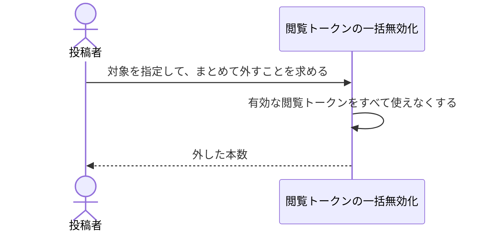

# 渡した相手を一度に全て外す：uc-revoke-all-view-tokens

## 概要

- 対象の有効な閲覧トークンをすべて使えなくする操作。渡した相手を一度に全て外したいときに使う。
- 対象の公開は止まらないため、新しい閲覧トークンを発行すれば再び見せられる。

---

## 存在意義

- 配布先ごとに外せるようにした結果、全員を外すには1つずつ辿る必要が生じた。急いで閉じたいときに、渡した相手を数え上げてからでないと閉じられないのでは間に合わない。
- 公開を止める操作では代われない。公開を止めるのは一時的に閉じることであり、再開すれば止める前の相手が戻ってくる。渡した相手を外すこととは別の操作になる。

---

## 主アクターと意図

### 主アクター

投稿者

### 意図

渡した相手を一度に全て外したい。誰に渡したかを思い出さずに、まとめて閉じたい

---

## 事前条件

- 対象が存在する

---

## 基本フロー



---

## 事後条件

- 対象の閲覧トークンでは、どれでも開けなくなっている
- 対象の公開は止まっていない
- 共有アーティファクトが対象の場合、まとめの側の閲覧トークンからは引き続き開ける

---

## 受け入れ基準

- When 一括の無効化を求めたとき、一括無効化は 対象の有効な閲覧トークンをすべて使えなくする shall
- While 一括無効化を行う間、一括無効化は 対象の公開を止めない shall
- While 一括無効化を行う間、一括無効化は 対象が入っているまとめの閲覧トークンを使えなくしない shall
- If 有効な閲覧トークンが1本も無いならば、一括無効化は 何も変えずに成功する shall

---

## 操作保証

- When 対象が存在しない、または操作する者に権限が無いとき、システムは TARGET_NOT_FOUND エラーを返す shall（対象を特定し権限を確かめる解決プロセス自体の契約であり、複数のusecaseに共通する）。

---

## エラー

| コード | 条件 |
|---|---|
| `TARGET_NOT_FOUND` | - 対象の共有アーティファクトまたはプロジェクトが存在しない<br>- 操作する者が対象の投稿者・持ち主でも管理者でもない |

---

## 受け入れシナリオ

### すべての閲覧トークンが一度に使えなくなる

| 分類 | 観点 |
|---|---|
| 正常系 | 一括：渡した相手を数え上げずに閉じられることを確かめる |

```gherkin
Scenario: すべての閲覧トークンが一度に使えなくなる
  Given 閲覧トークンが3本ある共有アーティファクト
  When まとめて外すことを求める
  Then 3本のいずれでも開けない
```

### まとめて外しても公開は止まらない

| 分類 | 観点 |
|---|---|
| 正常系 | 境界：一括無効化と公開停止が別の手段であることを確かめる |

```gherkin
Scenario: まとめて外しても公開は止まらない
  Given 閲覧トークンが2本ある共有アーティファクト
  When まとめて外すことを求める
  Then 対象の公開は止まっていない
  And 新しい閲覧トークンを発行すれば再び見せられる
```

### まとめの側の閲覧トークンからは引き続き開ける

| 分類 | 観点 |
|---|---|
| 正常系 | 範囲：外す範囲が対象自身の閲覧トークンに限られることを確かめる |

```gherkin
Scenario: まとめの側の閲覧トークンからは引き続き開ける
  Given 共有アーティファクトAがプロジェクトPに入っている
  When Aの閲覧トークンをまとめて外す
  Then Pの閲覧トークンでAを開ける
```

### 1本も無い状態でまとめて外しても変わらない

| 分類 | 観点 |
|---|---|
| 境界値 | 冪等：外す対象が無くても失敗しないことを確かめる |

```gherkin
Scenario: 1本も無い状態でまとめて外しても変わらない
  Given 有効な閲覧トークンが1本も無い共有アーティファクト
  When まとめて外すことを求める
  Then 成功し、対象の公開は止まっていない
```

---

## 操作保証シナリオ

### 権限の無い者にはTARGET_NOT_FOUND

| 分類 | 観点 |
|---|---|
| 異常系 | エラー：対象の存在と権限の欠如を区別しない |

```gherkin
Scenario: 権限の無い者にはTARGET_NOT_FOUND
  When 対象の投稿者でも管理者でもない者がこの操作を求める
  Then TARGET_NOT_FOUNDエラーが返る
```
