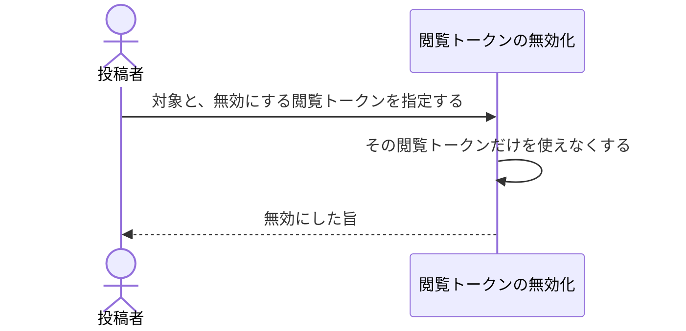

# 配布先を1つだけ外す：uc-revoke-view-token

## 概要

- 閲覧トークンを1本だけ使えなくする操作。ある配布先にだけ見せるのをやめたいときに使う。
- 他の配布先はそのまま見られる。対象の公開も止まらない。

---

## 存在意義

- これが無いと、ある相手を外すために全員を外すことになる。巻き添えを避けるために外すこと自体をためらうようになり、結局渡したままになる。
- 期限を待たずに外したい場面がある。渡す相手を間違えた、その相手が担当を離れた、といったとき、期限が来るまで開けたままにはしておけない。

---

## 主アクターと意図

### 主アクター

投稿者

### 意図

ある相手にだけ見せるのをやめたい。他の相手はそのまま見られるようにしておきたい

---

## 事前条件

- 対象に、無効にしたい閲覧トークンが存在する

---

## 基本フロー



---

## 事後条件

- 指定した閲覧トークンでは開けなくなっている
- 他の閲覧トークンはすべて使えたまま残っている
- 対象の公開は止まっていない

---

## 受け入れ基準

- When 閲覧トークンを指定して無効化を求めたとき、閲覧トークンの無効化は その閲覧トークンだけを使えなくする shall
- While 無効化を行う間、閲覧トークンの無効化は 他の閲覧トークンをどれも使えなくしない shall
- While 無効化を行う間、閲覧トークンの無効化は 対象の公開を止めない shall
- If 指定した閲覧トークンが既に無効であるならば、閲覧トークンの無効化は 何も変えずに成功する shall

---

## 操作保証

- When 対象が存在しない、または操作する者に権限が無いとき、システムは TARGET_NOT_FOUND エラーを返す shall（対象を特定し権限を確かめる解決プロセス自体の契約であり、複数のusecaseに共通する）。

---

## エラー

| コード | 条件 |
|---|---|
| `TARGET_NOT_FOUND` | - 対象の共有アーティファクトまたはプロジェクトが存在しない<br>- 操作する者が対象の投稿者・持ち主でも管理者でもない |
| `TOKEN_NOT_FOUND` | - 指定した閲覧トークンが対象に存在しない |

---

## 受け入れシナリオ

### 指定した閲覧トークンだけが使えなくなる

| 分類 | 観点 |
|---|---|
| 正常系 | 巻き添えの回避：外す範囲が1つの配布先に限られることを確かめる |

```gherkin
Scenario: 指定した閲覧トークンだけが使えなくなる
  Given 閲覧トークンが3本ある対象
  When そのうち1本を無効にする
  Then その閲覧トークンでは開けない
  And 残る2本ではどちらも開ける
```

### 無効にしても公開は止まらない

| 分類 | 観点 |
|---|---|
| 正常系 | 境界：無効化と公開停止が別の手段であることを確かめる |

```gherkin
Scenario: 無効にしても公開は止まらない
  Given 閲覧トークンが2本ある共有アーティファクト
  When 1本を無効にする
  Then 対象の公開は止まっていない
```

### すべて無効にしても公開は止まらない

| 分類 | 観点 |
|---|---|
| 境界値 | 境界：誰にも渡していないことと、公開を止めたことを区別する |

```gherkin
Scenario: すべて無効にしても公開は止まらない
  Given 閲覧トークンが2本ある共有アーティファクト
  When 2本とも無効にする
  Then どの閲覧トークンでも開けない
  And 対象の公開は止まっていない
```

### 既に無効な閲覧トークンをもう一度無効にしても変わらない

| 分類 | 観点 |
|---|---|
| 境界値 | 冪等：繰り返しても結果が変わらないことを確かめる |

```gherkin
Scenario: 既に無効な閲覧トークンをもう一度無効にしても変わらない
  Given 既に無効にした閲覧トークン
  When もう一度その閲覧トークンを無効にする
  Then 成功し、他の閲覧トークンも変わっていない
```

### 存在しない閲覧トークンの無効化は拒まれる

| 分類 | 観点 |
|---|---|
| 異常系 | 事前条件：対象に無い閲覧トークンを指定した場合 |

```gherkin
Scenario: 存在しない閲覧トークンの無効化は拒まれる
  Given 公開されている対象
  When その対象に存在しない閲覧トークンを指定して無効化を求める
  Then TOKEN_NOT_FOUND として拒まれる
```

---

## 操作保証シナリオ

### 権限の無い者にはTARGET_NOT_FOUND

| 分類 | 観点 |
|---|---|
| 異常系 | エラー：対象の存在と権限の欠如を区別しない |

```gherkin
Scenario: 権限の無い者にはTARGET_NOT_FOUND
  When 対象の投稿者でも管理者でもない者がこの操作を求める
  Then TARGET_NOT_FOUNDエラーが返る
```

### 管理者は他人の対象でも操作できる

| 分類 | 観点 |
|---|---|
| 正常系 | 権限：投稿者でなくても管理者は通ることを確かめる（TARGET_NOT_FOUNDの裏側） |

```gherkin
Scenario: 管理者は他人の対象でも操作できる
  When 対象の投稿者ではない管理者がこの操作を求める
  Then 拒まれずに操作できる
```
