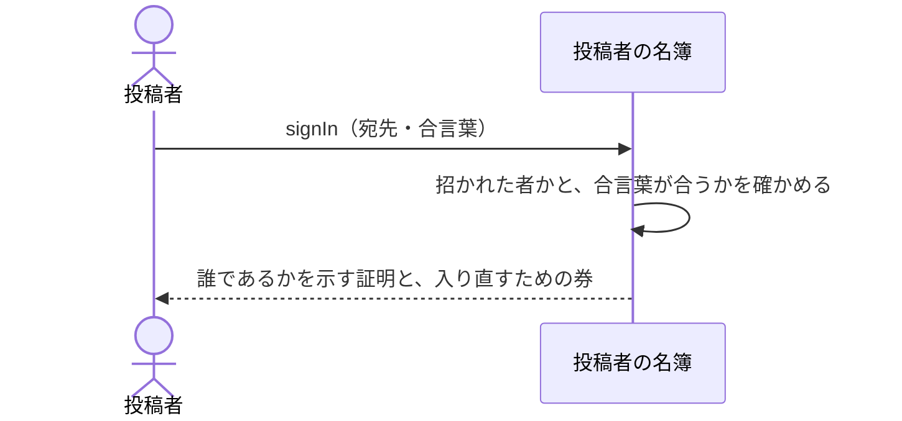

# 招かれた人が合言葉で入る：uc-sign-in

## 概要

- 招かれた投稿者が、宛先と合言葉を示して本人であることを確かめてもらう操作。以後の公開と管理は、すべてこれを通ってから行う。
- 初めて入るときは、招待で届いた仮の合言葉を自分だけが知るものへ決め直すまで、公開も管理もできない。

---

## 存在意義

- これが無いと、公開も管理も誰が行ったのか分からなくなる。自分が公開したものだけを扱えるという制限も、管理者だけが投稿者を出し入れできるという制限も、すべて『いま操作しているのが誰か』が分かって初めて成り立つ。
- 仮の合言葉のまま使い続けられると、招待のメールを見た者は誰でもその人になりすませる。初回に決め直させることで、招待が届く経路と、入るための合言葉を切り離す。

---

## 主アクターと意図

### 主アクター

投稿者

### 意図

自分であることを確かめてもらい、公開と管理ができる状態になる

---

## 関与する外部

- 投稿者の名簿（誰が招かれているかと、その合言葉を持つ、この文脈の外にある仕組み）

---

## 操作一覧

| 操作 | 概要 |
|---|---|
| `sign-in` | 宛先と合言葉を示して、誰であるかを示す証明を受け取る。 |
| `renew-password` | 初めて入るときに、仮の合言葉を自分だけが知るものへ決め直す。 |

---

## 事前条件

- 操作する者があらかじめ招かれていること

---

## 基本フロー



---

## 事後条件

- 誰であるかを示す証明が渡されている
- その証明に、管理者かどうかが含まれている
- しばらくのあいだ、合言葉を入れ直さずに入り直せる状態になっている
- 初めて入ったときは、仮の合言葉が使えなくなっている

---

## 受け入れ基準

- 招かれた人が正しい合言葉を示したとき、誰であるかを示す証明を返すこと
- その証明に、管理者かどうかを含めること
- 宛先が招かれていないときと、合言葉が合わないときで、返す内容を変えないこと
- 初めて入るとき、新しい合言葉を決めるまで証明を返さないこと
- 新しい合言葉を決めたとき、仮の合言葉で入れなくすること
- 決められた強さを満たさない合言葉は受け付けないこと
- 一度入ったあとは、しばらくのあいだ合言葉を入れ直さずに入り直せること
- 合言葉を、この文脈の側に残さないこと

---

## 操作保証

- 合言葉を、この文脈の側にどの形でも残さないこと
- 誰であるかを示す証明を、この文脈が自分で作り出さないこと

---

## エラー

| コード | 条件 |
|---|---|
| `SIGN_IN_FAILED` | - 宛先が招かれていない<br>- 合言葉が合わない<br>- （この2つを区別して返さない） |
| `PASSWORD_REJECTED` | - 新しい合言葉が決められた強さを満たさない |

---

## 受け入れシナリオ

### 背景

ある人が招かれている。

### 招かれた人が入れる

| 分類 | 観点 |
|---|---|
| 正常系 | 事前条件: 招かれていることが、入れることの条件であると確かめる |

```gherkin
Given ある人が招かれており、自分の合言葉を決め終えている
When 宛先と合言葉を示す
Then 誰であるかを示す証明が返る
And その人として公開や管理ができる
```

### 管理者かどうかが証明に含まれる

| 分類 | 観点 |
|---|---|
| 正常系 | 一貫性: 扱える範囲の判断が、入ったときの証明だけで決まることを確かめる。名簿を引き直さないため、証明にこれが無いと管理者だと分からない |

```gherkin
Given 管理者が招かれている
When その人が入る
Then 返る証明に、管理者であることが含まれている
```

### 招かれていない宛先と、合言葉違いを区別しない

| 分類 | 観点 |
|---|---|
| 異常系 | 事前条件: 拒み方の違いから、誰が招かれているかを外から探れないことを確かめる |

```gherkin
Given 宛先Aは招かれておらず、宛先Bは招かれている
When Aで入ろうとする
And Bで誤った合言葉を示して入ろうとする
Then どちらも SIGN_IN_FAILED として同じ内容で拒まれる
```

### 初めて入るときは決め直すまで入れない

| 分類 | 観点 |
|---|---|
| 境界値 | 状態遷移: 仮の合言葉のままでは公開も管理もできないことを確かめる |

```gherkin
Given ある人が招かれ、仮の合言葉が届いている
When その仮の合言葉で入ろうとする
Then 新しい合言葉を求められる
And 誰であるかを示す証明はまだ返らない
```

### 決め直すと仮の合言葉は使えなくなる

| 分類 | 観点 |
|---|---|
| 正常系 | 状態遷移: 招待が届く経路と、入るための合言葉が切り離されることを確かめる |

```gherkin
Given ある人が新しい合言葉を決めている
When 仮の合言葉で入ろうとする
Then SIGN_IN_FAILED として拒まれる
```

### 弱い合言葉は決められない

| 分類 | 観点 |
|---|---|
| 異常系 | 事前条件: 決められた強さが、決め直すときにも効くことを確かめる |

```gherkin
Given ある人が仮の合言葉で入り、新しいものを求められている
When 決められた強さを満たさないものを示す
Then PASSWORD_REJECTED として拒まれる
And 仮の合言葉のままである
```

### しばらくは入れ直さずに済む

| 分類 | 観点 |
|---|---|
| 境界値 | 一貫性: 作業の途中で締め出されないことを確かめる。証明は短命なので、入り直す手段が別に要る |

```gherkin
Given ある人が入っている
And 証明の期限が切れている
When 続きの操作をする
Then 合言葉を入れ直さずに新しい証明が得られる
And 操作はそのまま続けられる
```

---

## 操作保証シナリオ

### 背景

ある人が入っている。

### 合言葉はどこにも残らない

| 分類 | 観点 |
|---|---|
| 境界値 | 一貫性: 合言葉が名簿の外に写しを持たないことを確かめる。写しがあれば、そこが破られたときに全員の入り口が同時に開く |

```gherkin
Given ある人が合言葉を示して入っている
When この文脈が持つものを調べる
Then 合言葉も、そこから合言葉を導けるものも見つからない
```

### 証明の出どころは名簿ひとつ

| 分類 | 観点 |
|---|---|
| 異常系 | 一貫性: 証明を作れる者が名簿に限られることを確かめる。こちらで作れると、招かれていない人の証明も作れてしまう |

```gherkin
Given 名簿が出したものではない証明が示される
When その証明で操作しようとする
Then 誰とも特定されず、操作は拒まれる
```
