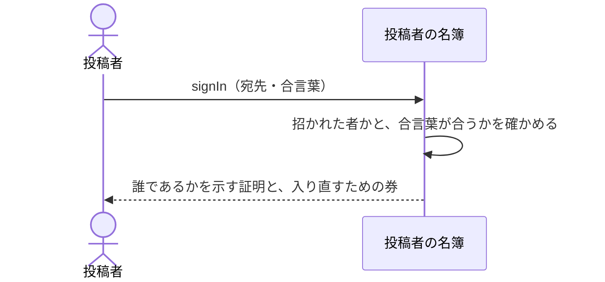

# 招かれた人が合言葉で入る：uc-sign-in

## 概要

- 招かれた投稿者が、宛先と合言葉を示して本人であることを確かめてもらう操作。以後の公開と管理は、すべてこれを通ってから行う。
- 初めて入るときは、招待で届いた仮の合言葉を自分だけが知るものへ決め直すまで、公開も管理もできない。

---

## 存在意義

- これが無いと、公開も管理も誰が行ったのか分からなくなる。自分が公開したものだけを扱えるという制限も、管理者だけが投稿者を出し入れできるという制限も、すべて『いま操作しているのが誰か』が分かって初めて成り立つ。
- 仮の合言葉のまま使い続けられると、招待のメールを見た者は誰でもその人になりすませる。初回に決め直させることで、招待が届く経路と、入るための合言葉を切り離す。

---

## 主アクターと意図

### 主アクター

投稿者

### 意図

自分であることを確かめてもらい、公開と管理ができる状態になる

---

## 関与する外部

- 投稿者の名簿（誰が招かれているかと、その合言葉を持つ、この文脈の外にある仕組み）

---

## 操作一覧

| 操作 | 概要 |
|---|---|
| `sign-in` | 宛先と合言葉を示して、誰であるかを示す証明を受け取る。 |
| `renew-password` | 初めて入るときに、仮の合言葉を自分だけが知るものへ決め直す。 |

---

## 事前条件

- 操作する者があらかじめ招かれていること
- 合言葉そのものの照合・仮の合言葉の決め直し・入り直すための券の扱いは、投稿者の名簿（この文脈の外にある仕組み）が行う。この文脈はその結果として渡される証明を受け取り、検証する
- 合言葉の強さは、名簿へ渡す設定として出荷する。判定そのものは名簿が行う

---

## 基本フロー



---

## 事後条件

- 誰であるかを示す証明が渡されている
- その証明に、管理者かどうかが含まれている
- しばらくのあいだ、合言葉を入れ直さずに入り直せる状態になっている
- 初めて入ったときは、仮の合言葉が使えなくなっている

---

## 受け入れ基準

- 招かれた人が正しい合言葉を示したとき、誰であるかを示す証明を返すこと
- その証明に、管理者かどうかを含めること
- 宛先が招かれていないときと、合言葉が合わないときで、返す内容を変えないこと
- 初めて入るとき、新しい合言葉を決めるまで証明を返さないこと
- 名簿が出したものでない証明では、誰とも特定しないこと
- 合言葉を、この文脈の側にどの形でも残さないこと
- 名簿へ渡す設定として、決められた合言葉の強さを出荷すること

---

## 操作保証

- 合言葉を、この文脈の側にどの形でも残さないこと
- 誰であるかを示す証明を、この文脈が自分で作り出さないこと

---

## エラー

| コード | 条件 |
|---|---|
| `SIGN_IN_FAILED` | - 宛先が招かれていない<br>- 合言葉が合わない<br>- （この2つを区別して返さない） |
| `PASSWORD_REJECTED` | - 新しい合言葉が決められた強さを満たさない |

---

## 受け入れシナリオ

### 背景

ある人が招かれている。

### 管理者かどうかが証明に含まれる

| 分類 | 観点 |
|---|---|
| 正常系 | 読み取り：名簿が示した肩書きを、こちらが正しく読むことを確かめる |

```gherkin
Scenario: 管理者かどうかが証明に含まれる
  Given 管理者が招かれている
  When その人が入る
  Then 返る証明に、管理者であることが含まれている
```

### 決められた強さの設定を出荷する

| 分類 | 観点 |
|---|---|
| 正常系 | 出荷物：強さを決めるのは名簿だが、その設定を渡すのはこちら |

```gherkin
Scenario: 決められた強さの設定を出荷する
  Given 利用者プールの設定を出荷する
  When その設定を確かめる
  Then 決められた合言葉の強さが含まれている
```

### 招かれていない宛先と、合言葉違いを区別しない

| 分類 | 観点 |
|---|---|
| 異常系 | 探索の防止：どちらで失敗したかを外から読み取らせない |

```gherkin
Scenario: 招かれていない宛先と、合言葉違いを区別しない
  Given 宛先Aは招かれておらず、宛先Bは招かれている
  When Aで入ろうとする
  And Bで誤った合言葉を示して入ろうとする
  Then どちらも SIGN_IN_FAILED として同じ内容で拒まれる
```

---

## 操作保証シナリオ

### 背景

ある人が入っている。

### 合言葉はどこにも残らない

| 分類 | 観点 |
|---|---|
| 正常系 | 秘匿：こちら側に残らないことを、持ち物を調べて確かめる |

```gherkin
Scenario: 合言葉はどこにも残らない
  Given ある人が合言葉を示して入っている
  When この文脈が持つものを調べる
  Then 合言葉も、そこから合言葉を導けるものも見つからない
```

### 証明の出どころは名簿ひとつ

| 分類 | 観点 |
|---|---|
| 異常系 | 関所：こちらが証明を作り出さないことを確かめる |

```gherkin
Scenario: 証明の出どころは名簿ひとつ
  Given 名簿が出したものではない証明が示される
  When その証明で操作しようとする
  Then 誰とも特定されず、操作は拒まれる
```
