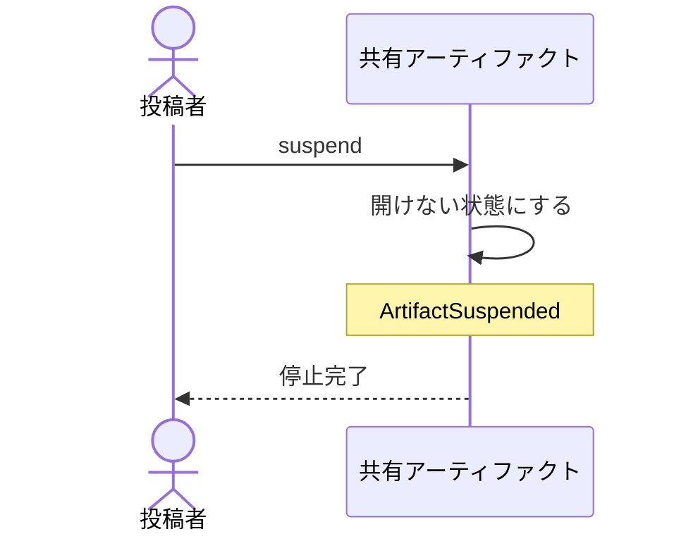

# 見せるのを止めるが、中身もコメントも残す：uc-suspend-artifact

## 概要

- 公開している共有アーティファクトを開けない状態にする操作。中身もコメントも消さず、あとから再び公開できる。
- 止める前に、中身とコメントを手元へ取り出しておくかどうかを尋ねる。既定では取り出す。

---

## 存在意義

- 見せる期間が終わったものを開いたままにしておくと、閲覧トークンが漏れたときの影響が延々と残る。止める手立てが要る。
- 止めることと消すことを分けないと、止めるたびに記録が失われる。指摘のやり取りは後から読み返す価値があるため、消さずに止められる必要がある。

---

## 主アクターと意図

### 主アクター

投稿者

### 意図

見せるのを止めるが、記録は失わずに残しておく

---

## 事前条件

- 対象の共有アーティファクトが公開されていること
- 操作する者が、あらかじめ招かれた投稿者であること

---

## 基本フロー



---

## 事後条件

- 共有アーティファクトが開けない状態になっている
- 中身が消えずに残っている
- それまでに集まったコメントが消えずに残っている
- ArtifactSuspended が発行されている

---

## 受け入れ基準

- 投稿者が停止を求めたとき、どの閲覧トークンでも開けない状態にすること
- 停止したとき、中身とコメントを消さないこと
- 停止したとき、プロジェクトの閲覧トークンでも開けなくすること
- 停止する前に、中身とコメントを手元へ取り出すかどうかを尋ね、既定では取り出すこと
- 止めても記録が残り、あとから再び公開できることを投稿者に伝えること
- 停止が行き渡るまで時間がかかりうることを投稿者に伝え、即座に止まるとは伝えないこと

---

## 操作保証

- 停止したとき、中身とコメントがいずれも取り出せる状態のまま保たれること

---

## エラー

| コード | 条件 |
|---|---|
| `NOT_PUBLISHED` | - 対象の共有アーティファクトが既に停止している |
| `NOT_INVITED` | - 操作する者が招かれた投稿者でない |

---

## 受け入れシナリオ

### 背景

共有アーティファクトAが公開されており、コメントが集まっている。操作する者は招かれた投稿者である。

### 止めると開けなくなる

| 分類 | 観点 |
|---|---|
| 正常系 | 状態遷移: 停止が閲覧を実際に止めることを確かめる |

```gherkin
When 共有アーティファクトAの公開を止める
Then 共有アーティファクトAの閲覧トークンで開けない
```

### プロジェクト閲覧トークンでも開けない

| 分類 | 観点 |
|---|---|
| 境界値 | 事前条件: 停止の意図が、まとめて見せる経路から迂回されないことを確かめる |

```gherkin
Given 共有アーティファクトAがプロジェクトPに入っている
When 共有アーティファクトAの公開を止める
Then Pの閲覧トークンでも共有アーティファクトAを開けない
```

### 中身もコメントも残る

| 分類 | 観点 |
|---|---|
| 正常系 | 計算整合: 止めることが消すことでないと確かめる |

```gherkin
When 共有アーティファクトAの公開を止める
Then 中身は残っている
And コメントもすべて残っている
And 手元へ取り出せる
```

### 止める前に取り出すかを尋ねる

| 分類 | 観点 |
|---|---|
| 正常系 | 事前条件: 既定が安全側に倒れていることを確かめる |

```gherkin
When 投稿者が停止を求める
Then 手元へ取り出すかどうかを尋ねられる
And 何も選ばなければ取り出したうえで停止する
```

### 既に止まっているものは止められない

| 分類 | 観点 |
|---|---|
| 異常系 | 事前条件: 状態の前提を確かめる |

```gherkin
Given 共有アーティファクトAが既に停止している
When もう一度停止しようとする
Then NOT_PUBLISHED として拒まれる
```

---

## 操作保証シナリオ

### 止めた後も取り出せる

| 分類 | 観点 |
|---|---|
| 正常系 | 一貫性: 停止後もデータが失われないことを確かめる |

```gherkin
Given 共有アーティファクトAが公開停止されている
When 中身とコメントを手元へ取り出す
Then 停止前と同じものが得られる
```
