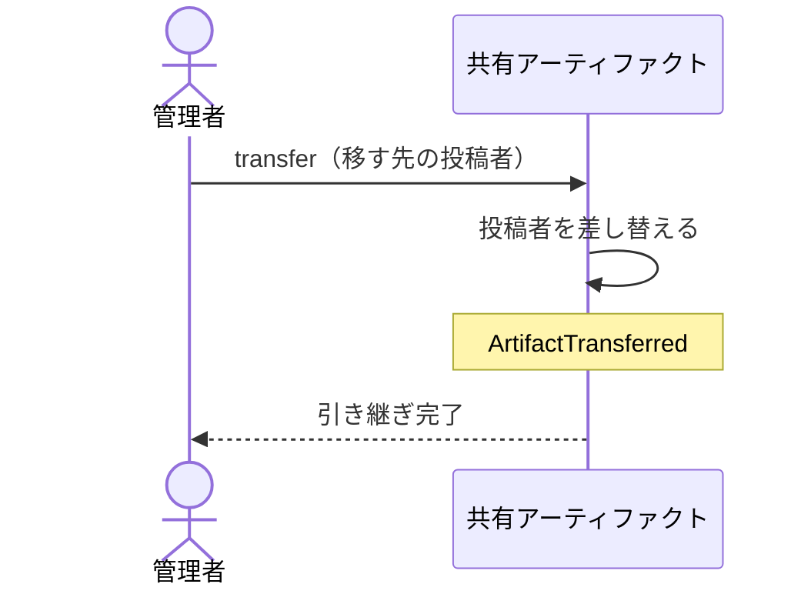

# 共有アーティファクトの投稿者を別の投稿者へ移す：uc-transfer-artifact

## 概要

- 管理者が、共有アーティファクトの投稿者を別の投稿者へ移す操作。移された人は、それを自分が公開したものと同じように扱える。
- 共有URLも閲覧トークンも中身もコメントも変わらない。誰が手入れできるかだけが変わる。

---

## 存在意義

- これが無いと、投稿者が抜けた時点でその共有アーティファクトは誰も公開停止も閲覧トークンの無効化もできなくなる。見せる相手を絞り直す必要が生じても手が出せず、公開したまま放置するしかない。
- 移せるのを管理者に限るのは、自分の共有アーティファクトを他人に押し付ける経路と、他人の共有アーティファクトを自分のものにする経路の両方を塞ぐため。

---

## 主アクターと意図

### 主アクター

管理者

### 意図

投稿者が抜けたあとも、その共有アーティファクトを手入れできる人を残す

---

## 事前条件

- 操作する者が管理者であること
- 対象の共有アーティファクトが存在すること
- 移す先の人が、現に招かれた投稿者であること

---

## 基本フロー



---

## 事後条件

- 共有アーティファクトの投稿者が、移す先の人になっている
- 移す先の人が、その共有アーティファクトを差し替え・公開停止・閲覧トークンの発行と無効化できる
- 移す前の人は、その共有アーティファクトを扱えない
- 共有URL・閲覧トークン・中身・コメントは変わっていない
- ArtifactTransferred が発行されている

---

## 受け入れ基準

- 管理者が移す先を指定したとき、その人が対象の共有アーティファクトを扱えるようになること
- 引き継いだあと、移す前の人がその共有アーティファクトを扱えなくなること
- 引き継いでも、共有URLと閲覧トークンと中身とコメントを一切変えないこと
- 管理者以外が移そうとしたとき、移さず拒むこと
- 招かれていない人へ移そうとしたとき、移さず拒むこと
- 公開停止されている共有アーティファクトも移せること

---

## 操作保証

- 引き継ぎのとき、共有URL・閲覧トークン・中身・コメントのいずれも変えないこと
- 引き継ぎのとき、共有アーティファクトの公開状態を変えないこと

---

## エラー

| コード | 条件 |
|---|---|
| `NOT_ADMINISTRATOR` | - 操作する者が管理者でない |
| `ARTIFACT_NOT_FOUND` | - 対象の共有アーティファクトが存在しない |
| `PUBLISHER_NOT_FOUND` | - 移す先の人が招かれた投稿者でない |

---

## 受け入れシナリオ

### 背景

操作する者は管理者であり、投稿者Xが共有アーティファクトAを公開している。投稿者Yも招かれている。

### 移した先が手入れできるようになる

| 分類 | 観点 |
|---|---|
| 正常系 | 状態遷移: 引き継ぎが、手入れできる人を入れ替えるものであることを確かめる |

```gherkin
Given 共有アーティファクトAの投稿者がXである
When 管理者がAの投稿者をYへ移す
Then YはAを差し替え・公開停止・閲覧トークンの発行と無効化できる
And ArtifactTransferred が発行されている
```

### 移す前の人は扱えなくなる

| 分類 | 観点 |
|---|---|
| 正常系 | 事前条件: 引き継ぎが移動であって複製ではないことを確かめる |

```gherkin
Given 共有アーティファクトAの投稿者がYへ移されている
When XがAを公開停止しようとする
Then Xからは見つからないものとして拒まれる
```

### 閲覧者から見て何も変わらない

| 分類 | 観点 |
|---|---|
| 境界値 | 一貫性: 引き継ぎが、渡した相手の手元に一切影響しないことを確かめる |

```gherkin
Given 閲覧者が共有アーティファクトAの閲覧トークンを持っている
When 管理者がAの投稿者をYへ移す
Then 閲覧者はそれまでの共有URLと閲覧トークンでAを開ける
And 中身もそれまでのコメントもそのまま見える
```

### 管理者でない者は移せない

| 分類 | 観点 |
|---|---|
| 異常系 | 事前条件: 移す側が管理者に限られることを確かめる。自分のものを他人へ押し付ける経路を塞ぐ |

```gherkin
Given 操作する者が管理者でない投稿者Xである
When XがAの投稿者をYへ移そうとする
Then NOT_ADMINISTRATOR として拒まれる
And Aの投稿者はXのままである
```

### 招かれていない人へは移せない

| 分類 | 観点 |
|---|---|
| 異常系 | 事前条件: 移した先が現に公開できる人であることを確かめる。招かれていない人へ移すと、その場で手入れできない状態に戻る |

```gherkin
Given ある人が招かれていない
When 管理者がAの投稿者をその人へ移そうとする
Then PUBLISHER_NOT_FOUND として拒まれる
And Aの投稿者はXのままである
```

### 公開停止されているものも移せる

| 分類 | 観点 |
|---|---|
| 境界値 | 事前条件: 引き継ぎが公開状態に左右されないことを確かめる。止まっているものこそ引き継ぎ先が要る |

```gherkin
Given 共有アーティファクトAが公開停止されている
When 管理者がAの投稿者をYへ移す
Then 引き継がれる
And Aは公開停止されたままである
```

---

## 操作保証シナリオ

### 背景

投稿者Xが共有アーティファクトAを公開しており、コメントが2件付いている。

### コメントは引き継ぎをまたいで残る

| 分類 | 観点 |
|---|---|
| 境界値 | 一貫性: 手入れする人が替わっても、それまでに集まったコメントが失われないことを確かめる |

```gherkin
Given 共有アーティファクトAにコメントが2件付いている
When 管理者がAの投稿者をYへ移す
Then Aのコメントは2件のまま残っている
And 区切りの記録は増えていない
```
