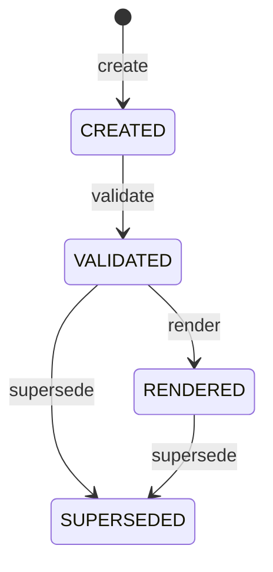
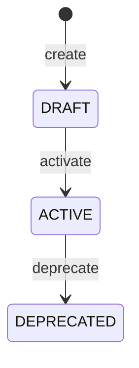

# agg-document

---

## 概要

構造化された成果物（Document）の一貫性とライフサイクルを表す集約。documentType により2系統のライフサイクルを使い分ける: Spec家族系（DomainSpecSchema/PresentationSpecSchema）は生成→検証→描画→置換の「処理パイプライン」（lifecycle）を、CodingSchema/SkillSchema 系（Coding/Skill）は起草→運用中→廃止の「成熟度」（maturityLifecycle）を持つ。

---

## 集約ルート

- **集約ルート**: Document

### 外部参照（ID）

- Schema

---

## エンティティ

### Document（集約ルート）

構造化された成果物の一貫性単位

| 属性 | 型 |
|---|---|
| **documentId**（識別子） | DocumentId |
| schemaRef | SchemaRef |
| status | Status |
| content | 構造化データ（schema 準拠） |
| tags | 文字列配列 |

---

## 値オブジェクト

| 値オブジェクト | 表すもの | 振る舞い・制約 |
|---|---|---|
| DocumentId | 一意な識別子 | 不変。kebab-case。value が等しければ等価。 |
| SchemaRef | 適合する Schema への参照 | name と version の組。両方が等しければ等価。 |
| Status | ライフサイクル状態 | Spec家族系（DomainSpecSchema/PresentationSpecSchema）: enum CREATED/VALIDATED/RENDERED/SUPERSEDED（lifecycle）。CodingSchema/SkillSchema 系: enum DRAFT/ACTIVE/DEPRECATED（maturityLifecycle）。documentType ごとにどちらか一方のみを持つ。値が等しければ等価。遷移は不変条件で守る。 |

---

## 不変条件

| ルール | 守り方 | 根拠 |
|---|---|---|
| Spec家族系（DomainSpecSchema/PresentationSpecSchema）の status は CREATED→VALIDATED→RENDERED→SUPERSEDED の順にのみ進み、逆行・飛ばしをしない | guard | 成果物の状態の一貫性を保つ |
| CodingSchema/SkillSchema 系の status は DRAFT→ACTIVE→DEPRECATED の順にのみ進み、逆行・飛ばしをしない | guard | 運用中の規約が予告なく後退・スキップしないことを保証する |
| schemaRef は常に存在する | schema | 型が無ければ検証も描画もできない |
| content が schema に適合しない限り VALIDATED へ進めない | guard | 不正な成果物を後段（render/deploy）に流さない |
| SUPERSEDED は終端であり、以後どのコマンドも受け付けない | guard | 置換後の変更を防ぐ |
| DEPRECATED は終端であり、以後どのコマンドも受け付けない | guard | 廃止後の変更を防ぐ |
| Document のパス解決は、いかなる operation・command からも常にプロジェクトルート内に閉じ込められる（パストラバーサルを許さない） | guard | ファイルアクセスというデータアクセス層の技術的関心事だが、Document 集約が扱う全ての操作に横断的に適用される不変条件であり、特定 usecase の業務シナリオではなく集約の不変条件として一箇所で保証する |
| schemaRef を持たない Document を対象にした、schema 解決を要する操作は、いかなる operation・command からも常に MISSING_SCHEMA_REF として拒否される | guard | 「schemaRef は常に存在する」は理想状態の不変条件だが、scaffold 直後の未検証 Document 等、実際には欠けている状態が生じうる。render/validate が個別に対応していた（重複）この防御的振る舞いを集約の不変条件として一箇所で保証する |

---

## ライフサイクル



### 遷移

| from | to | command | 条件 |
|---|---|---|---|
| [*] | CREATED | create |  |
| CREATED | VALIDATED | validate | schema に適合 |
| VALIDATED | RENDERED | render |  |
| VALIDATED | SUPERSEDED | supersede |  |
| RENDERED | SUPERSEDED | supersede |  |

---

## ライフサイクル



### 遷移

| from | to | command | 条件 |
|---|---|---|---|
| [*] | DRAFT | create |  |
| DRAFT | ACTIVE | activate | 利用可能な状態になった |
| ACTIVE | DEPRECATED | deprecate |  |

---

## コマンド

### create

schemaRef と documentId から schema 準拠の骨格を生成する（schemaRef 常在の不変条件を満たす）。

| 前提 | 後 | 発行イベント |
|---|---|---|
| （新規） | CREATED | DocumentCreated |

| 引数 | 意味 |
|---|---|
| schemaRef | 適用する schema |
| documentId | 新しい識別子 |

### validate

content が schema に適合するか検証する（適合判定の不変条件を守る・副作用なし）。

| 前提 | 後 | 発行イベント |
|---|---|---|
| CREATED | VALIDATED | DocumentValidated |

### render

x-render に従い成果物に描画し配置先へ反映する（VALIDATED 前提の不変条件を守る）。

| 前提 | 後 | 発行イベント |
|---|---|---|
| VALIDATED | RENDERED | DocumentRendered, DocumentDeployed |

### supersede

後続版に置き換えて終端化する（終端の不変条件を確立する）。

| 前提 | 後 | 発行イベント |
|---|---|---|
| VALIDATED / RENDERED | SUPERSEDED | DocumentSuperseded |

| 引数 | 意味 |
|---|---|
| successorId | 後継 Document の識別子 |

### activate

起草中の Coding/Skill 規約を運用可能にする（CodingSchema/SkillSchema 系のみ）。

| 前提 | 後 | 発行イベント |
|---|---|---|
| DRAFT | ACTIVE | DocumentActivated |

### deprecate

運用中の Coding/Skill 規約を廃止する（CodingSchema/SkillSchema 系のみ）。

| 前提 | 後 | 発行イベント |
|---|---|---|
| ACTIVE | DEPRECATED | DocumentDeprecated |

| 引数 | 意味 |
|---|---|
| successorId | 後継 Document の識別子（あれば） |

---

## ドメインイベント

### DocumentValidated

#### 発行契機

validate 成功時

#### ペイロード

| 項目 | 意味 |
|---|---|
| documentId | 対象の識別子 |
| schemaRef | 適合した schema |

### DocumentRendered

#### 発行契機

render 成功時

#### ペイロード

| 項目 | 意味 |
|---|---|
| documentId | 対象の識別子 |
| outputs | 生成された成果物のパス一覧 |

### DocumentDeployed

#### 発行契機

render が deploy 先を持つ Document を描画した時

#### ペイロード

| 項目 | 意味 |
|---|---|
| documentId | 対象の識別子 |
| targets | 反映された各ツールの配置先 |

### DocumentSuperseded

#### 発行契機

supersede 成功時

#### ペイロード

| 項目 | 意味 |
|---|---|
| documentId | 対象の識別子 |
| successorId | 後継の識別子 |

### DocumentActivated

#### 発行契機

activate 成功時

#### ペイロード

| 項目 | 意味 |
|---|---|
| documentId | 対象の識別子 |

### DocumentDeprecated

#### 発行契機

deprecate 成功時

#### ペイロード

| 項目 | 意味 |
|---|---|
| documentId | 対象の識別子 |
| successorId | 後継の識別子（あれば） |

---

## 不変条件シナリオ

### status は逆行できない

| 分類 | 観点 |
|---|---|
| 異常系 | 状態遷移：前進のみの不変条件が効く |

```gherkin
Scenario: status は逆行できない
  Given RENDERED 状態の Document
  When validate へ戻そうとする
  Then 状態遷移は拒否され、状態は RENDERED のままである
```

### 未検証では render できない

| 分類 | 観点 |
|---|---|
| 異常系 | 状態遷移：VALIDATED 前提が効く |

```gherkin
Scenario: 未検証では render できない
  Given CREATED 状態の Document
  When render する
  Then 拒否され、状態は CREATED のままである
```

### SUPERSEDED は終端

| 分類 | 観点 |
|---|---|
| 異常系 | 状態遷移：終端状態は不変 |

```gherkin
Scenario: SUPERSEDED は終端
  Given SUPERSEDED 状態の Document
  When 任意のコマンドを実行する
  Then 拒否される
```

### Coding/Skill の status も逆行できない

| 分類 | 観点 |
|---|---|
| 異常系 | 状態遷移：maturityLifecycle も前進のみの不変条件が効く |

```gherkin
Scenario: Coding/Skill の status も逆行できない
  Given ACTIVE 状態の Coding document
  When DRAFT へ戻そうとする
  Then 状態遷移は拒否され、状態は ACTIVE のままである
```

### DEPRECATED は終端

| 分類 | 観点 |
|---|---|
| 異常系 | 状態遷移：終端状態は不変（maturityLifecycle） |

```gherkin
Scenario: DEPRECATED は終端
  Given DEPRECATED 状態の Skill document
  When 任意のコマンドを実行する
  Then 拒否される
```

### パストラバーサルを含むパスは拒否される

| 分類 | 観点 |
|---|---|
| 異常系 | パス解決：'..' を含むパスはどの operation でも拒否される |

```gherkin
Scenario: パストラバーサルを含むパスは拒否される
  Given '..' を含む対象パス
  When 任意の operation・command を実行する
  Then INVALID_PATH エラーが返り、プロジェクトルート外へはアクセスしない
```

### ディレクトリ横断はプロジェクトルート外を拒否する

| 分類 | 観点 |
|---|---|
| 異常系 | パス解決：index_scan_dir 等のディレクトリ横断操作もルート外を拒否する |

```gherkin
Scenario: ディレクトリ横断はプロジェクトルート外を拒否する
  Given プロジェクトルート外を指すディレクトリパス
  When index_scan_dir を実行する
  Then INVALID_PATH エラーが返る
```

### schemaRefを持たないDocumentはMISSING_SCHEMA_REFとして拒否される

| 分類 | 観点 |
|---|---|
| 異常系 | パス解決：schema 解決を要する operation・command は schemaRef 欠如を同じ扱いにする |

```gherkin
Scenario: schemaRefを持たないDocumentはMISSING_SCHEMA_REFとして拒否される
  Given schemaRef を持たない Document
  When schema 解決を要する operation・command を実行する
  Then MISSING_SCHEMA_REF エラーが返る
```
