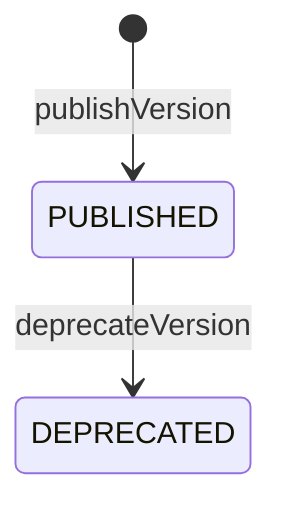

# agg-schema

---

## 概要

Document の型定義（Schema）の不変条件とバージョン進化を表す集約。Document が機械生成・検証・描画できることを保証し、版の移行を司る。対象は「Document の schemaRef が指しうる型」に限定する: DomainSpecSchema・PresentationSpecSchema・CodingSchema・SkillSchema。RenderMetaSchema・DocstringSchema は Document 型定義ではなく派生構造（x-render 部品／code_scan 出力）を検証する別概念であり、この集約の対象外。

---

## 集約ルート

- **集約ルート**: Schema

### 外部参照（ID）

- Document

---

## エンティティ

### Schema（集約ルート）

Document の型定義（構造・描画・記入/読取指示）の一貫性単位

| 属性 | 型 |
|---|---|
| **schemaId**（識別子） | SchemaId |
| version | Version |
| status | SchemaStatus |
| kindProfiles | KindProfile[] |

---

## 値オブジェクト

| 値オブジェクト | 表すもの | 振る舞い・制約 |
|---|---|---|
| SchemaId | スキーマ名（例: CodingSchema） | 不変。値が等しければ等価。 |
| Version | 単調増加する版識別子（例: v1, v2） | 不変。値が等しければ等価。上げる方向にのみ進む。 |
| SchemaRef | スキーマ名＋版の組（Document が指す参照） | 不変。name と version が共に等しければ等価。 |
| SchemaStatus | 版のライフサイクル状態 | enum: PUBLISHED/DEPRECATED。値が等しければ等価。遷移は不変条件で守る。 |
| KindProfile | kind（specKind/codingKind/skillKind）1つに対応する、必須 content ブロック集合とその形状 | 不変。kind 名＋必須ブロック集合の組で識別（同じ値なら同じものとして扱う）。Schema の版が変わらない限り不変（変える場合は publishVersion で新版を発行する。既存版内でその場変更はしない）。各ブロックが持つ x-render 属性は、RenderMetaSchema（ネストした値オブジェクトの型）が形を規定する。 |

---

## 不変条件

| ルール | 守り方 | 根拠 |
|---|---|---|
| 値フィールドは常に oneOf / anyOf を持たない | schema | scaffold が骨格を機械生成できるようにする |
| content の各ブロックは additionalProperties を常に閉じる（固定 properties のみ） | schema | 未知フィールドの混入を防ぎ構造を決定的にする |
| 再帰は常に有界である（無限ネストを許さない） | schema | 機械走査が停止することを保証する |
| 各ブロックの x-render は常に RenderMetaSchema の閉じた語彙にのみ従う | schema | 描画がロジックを持たず決定的であることを保つ |
| status の enum は常に遷移順に並び、先頭が初期状態である | schema | scaffold が初期状態を enum 先頭から一意に決められる |
| 公開済みの版は遡って構造を変えない（後方互換を壊さない） | guard | 既存 Document が破損しないよう版の進化を安全にする |
| 各 kind の KindProfile は同一版内で不変であり、他 kind のブロックを持たない（discriminator として機能する） | schema | kind ごとの content 構造の一貫性を保証し、scaffold/validate が kind から構造を一意に決定できるようにする |
| Schema集約が対象とするのは Document の schemaRef が指しうる型のみ（派生構造を検証する schema は対象外） | schema | 一貫性境界を「schemaRef の解決先」に閉じ、無関係な検証用 schema を集約に含めない |

---

## ライフサイクル



### 遷移

| from | to | command | 条件 |
|---|---|---|---|
| [*] | PUBLISHED | publishVersion | scaffoldability 不変条件を満たす |
| PUBLISHED | DEPRECATED | deprecateVersion |  |

---

## コマンド

### publishVersion

新しい版の Schema を公開し、以後その版で Document を作れるようにする（scaffoldability 不変条件を守る）。

| 前提 | 後 | 発行イベント |
|---|---|---|
| （新規） | PUBLISHED | SchemaVersionPublished |

| 引数 | 意味 |
|---|---|
| version | 公開する版 |

### deprecateVersion

古い版を非推奨にし、新規 Document の作成を止める（既存は移行まで有効）。

| 前提 | 後 | 発行イベント |
|---|---|---|
| PUBLISHED | DEPRECATED |  |

| 引数 | 意味 |
|---|---|
| version | 非推奨にする版 |

### migrateDocuments

既存 Document を旧版から新版へ移行する（版を上げる方向にのみ・後方互換の不変条件を守る）。

| 前提 | 後 | 発行イベント |
|---|---|---|
| PUBLISHED | PUBLISHED | DocumentsMigrated |

| 引数 | 意味 |
|---|---|
| fromVersion | 移行元の版 |
| toVersion | 移行先の版 |

---

## ドメインイベント

### SchemaVersionPublished

#### 発行契機

publishVersion 成功時

#### ペイロード

| 項目 | 意味 |
|---|---|
| schemaRef | 公開された name + version |

### DocumentsMigrated

#### 発行契機

migrateDocuments 成功時

#### ペイロード

| 項目 | 意味 |
|---|---|
| fromVersion | 移行元の版 |
| toVersion | 移行先の版 |
| count | 移行された Document 数 |

---

## テストシナリオ

### 値フィールドに oneOf を持てない

| 分類 | 観点 |
|---|---|
| 異常系 | 不変条件: scaffoldability（値フィールドは oneOf/anyOf を持たない） |

```gherkin
Scenario: 値フィールドに oneOf を持てない
  Given 値フィールドに oneOf を含む Schema
  When scaffoldability を検証する
  Then scaffold 不能として拒否される
```

### 公開済みの版は後方互換を壊さない

| 分類 | 観点 |
|---|---|
| 異常系 | 不変条件: 公開済みの版は遡って構造を変えない |

```gherkin
Scenario: 公開済みの版は後方互換を壊さない
  Given PUBLISHED の Schema 版
  When 既存ブロックに必須フィールドを追加しようとする
  Then 後方互換を壊す変更として拒否される
```

### 移行は版を上げる方向にのみ行う

| 分類 | 観点 |
|---|---|
| 異常系 | 状態: migrateDocuments は版を上げる方向にのみ |

```gherkin
Scenario: 移行は版を上げる方向にのみ行う
  Given v1 と v2 の Schema
  When v2 から v1 へ移行しようとする
  Then 拒否される
```

### x-render は閉じた語彙にのみ従う

| 分類 | 観点 |
|---|---|
| 異常系 | 不変条件: 各ブロックの x-render は常に RenderMetaSchema の閉じた語彙にのみ従う |

```gherkin
Scenario: x-render は閉じた語彙にのみ従う
  Given 未知の部品種別、または必須属性が欠けた x-render 宣言を持つ Schema
  When x-render の適合を検証する
  Then 不適合として拒否される
```
