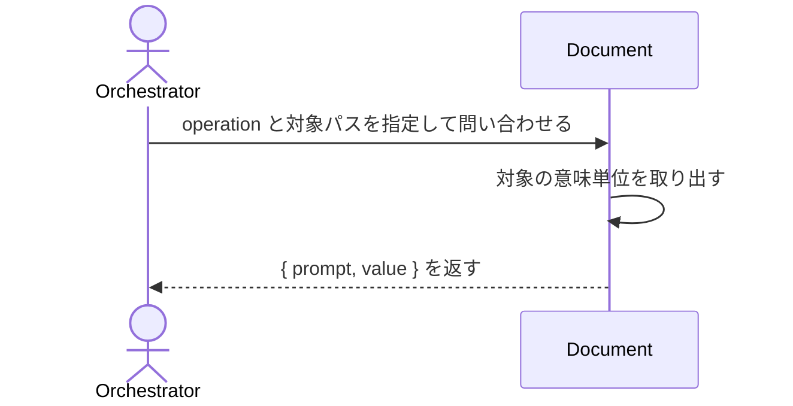

# uc-query-document

---

## 概要

AI がファイルを直接読まずに、Document の必要な意味単位（ブロック・フィールド・条件一致・全階層）だけを取得する。

---

## 主アクターと意図

- **主アクター**: Orchestrator（HarnessAgent）
- **意図**: 対象 Document から欲しい意味単位を取得し、読み方の指針とともに受け取る

---

## 事前条件

- 対象 Document（またはディレクトリ）のパスが要望テキストで与えられている

---

## 基本フロー



---

## 事後条件

- 要求された意味単位が value として返る
- ブロック/配列取得時は value の読み方の指針が prompt に付く

---

## 受け入れ基準

- When operation と対象パスが与えられたとき、エンジンは結果を { prompt, value } 形式で返す shall。
- When ブロック/配列を取得したとき、prompt に対象ブロックの読み方の指針（x-prompt-query 由来）を含める shall。
- While フィルタ条件に一致する要素が無いとき、エンジンは正常系として空配列 value: [] を返す shall。
- If operation が未知のとき、エンジンは INVALID_OPERATION エラーを返す shall。
- If 対象パスが存在しないとき、エンジンは INVALID_PATH エラーを返す shall。
- If 指定した blockKey/idValue が存在しないとき、エンジンは NOT_FOUND エラーを返す shall。
- If フィルタの正規表現パターンが不正なとき、エンジンは INVALID_PATTERN エラーを返す shall。

---

## エラー

| コード | 条件 |
|---|---|
| `INVALID_OPERATION` | operation が定義外 |
| `MISSING_PARAM` | 必須パラメータが欠落 |
| `NOT_FOUND` | 指定した blockKey/idValue に一致する要素が存在しない |
| `INVALID_PATTERN` | filter_pattern の正規表現が不正 |

---

## 受け入れシナリオ

### ブロックを丸ごと取得する

| 分類 | 観点 |
|---|---|
| 正常系 | 意味単位取得：ブロック取得で読み方の指針が付く |

```gherkin
Scenario: ブロックを丸ごと取得する
  Given query engine と対象 Document
  When operation get_block を blockKey interface で実行する
  Then value は対象ブロックであり、prompt に読み方の指針が付く
```

### 条件に一致する配列要素だけを絞り込む

| 分類 | 観点 |
|---|---|
| 正常系 | 意味単位取得：フィルタで条件一致だけを返す |

```gherkin
Scenario: 条件に一致する配列要素だけを絞り込む
  Given query engine と対象 Document
  When operation filter_items で required=true を指定する
  Then value には required な要素だけが含まれる
```

### 一致が無くても正常系で空配列を返す

| 分類 | 観点 |
|---|---|
| 境界値 | 空一致：一致ゼロは正常系（エラーにしない） |

```gherkin
Scenario: 一致が無くても正常系で空配列を返す
  When 一致しないフィルタ条件で filter_items を実行する
  Then value は空配列で、エラーにはならない
```

### 未知の operation はエラーを返す

| 分類 | 観点 |
|---|---|
| 異常系 | エラー：未知 operation は INVALID_OPERATION |

```gherkin
Scenario: 未知の operation はエラーを返す
  When 未知の operation を実行する
  Then INVALID_OPERATION エラーが返る
```

### 存在しないパスはエラーを返す

| 分類 | 観点 |
|---|---|
| 異常系 | エラー：対象パスが存在しないときは INVALID_PATH |

```gherkin
Scenario: 存在しないパスはエラーを返す
  When 存在しないパスを対象に query する
  Then INVALID_PATH エラーが返る
```

### 必須パラメータの欠落はエラーを返す

| 分類 | 観点 |
|---|---|
| 異常系 | エラー：必須パラメータ欠落は MISSING_PARAM |

```gherkin
Scenario: 必須パラメータの欠落はエラーを返す
  When blockKey を指定せずに get_block を実行する
  Then MISSING_PARAM エラーが返る
```

### 存在しないblockKeyはエラーを返す

| 分類 | 観点 |
|---|---|
| 異常系 | エラー：指定した blockKey が存在しないときは NOT_FOUND |

```gherkin
Scenario: 存在しないblockKeyはエラーを返す
  When 存在しない blockKey を指定して get_block を実行する
  Then NOT_FOUND エラーが返る
```

### 不正な正規表現はエラーを返す

| 分類 | 観点 |
|---|---|
| 異常系 | エラー：filter_pattern の正規表現が不正なときは INVALID_PATTERN |

```gherkin
Scenario: 不正な正規表現はエラーを返す
  When 不正な正規表現で filter_pattern を実行する
  Then INVALID_PATTERN エラーが返る
```

### scanは生テキストを返す

| 分類 | 観点 |
|---|---|
| 正常系 | ファイル単位：scanはファイルをそのまま読む(prompt=null) |

```gherkin
Scenario: scanは生テキストを返す
  Given query engine と対象 Document
  When operation scan を実行する
  Then value は生テキストであり、prompt は null である
```

### get_metaはメタ情報を返す

| 分類 | 観点 |
|---|---|
| 正常系 | ファイル単位：get_metaはdocumentId等のメタフィールドのみを返す |

```gherkin
Scenario: get_metaはメタ情報を返す
  Given query engine と対象 Document
  When operation get_meta を実行する
  Then value にはdocumentId等のメタフィールドのみが含まれる
```

### index_scanはblockTypeとpromptをschemaから動的算出する

| 分類 | 観点 |
|---|---|
| 正常系 | ファイル単位：index_scanは_indexを保存せず読み取り時に動的算出する |

```gherkin
Scenario: index_scanはblockTypeとpromptをschemaから動的算出する
  Given query engine と対象 Document
  When operation index_scan を実行する
  Then 各blockのblockTypeとx-prompt-query由来のpromptが返る
```

### index_scan_dirはディレクトリ横断でindexを集約する

| 分類 | 観点 |
|---|---|
| 正常系 | ファイル単位：index_scan_dirは複数Documentのindexを1回で集約する |

```gherkin
Scenario: index_scan_dirはディレクトリ横断でindexを集約する
  Given query engine と対象ディレクトリ
  When operation index_scan_dir を実行する
  Then ディレクトリ配下の各Documentのindexがまとめて返る
```

### get_fieldはblockの1フィールドを返す

| 分類 | 観点 |
|---|---|
| 正常系 | ブロック単位：get_fieldは指定フィールドのみを取り出す |

```gherkin
Scenario: get_fieldはblockの1フィールドを返す
  Given query engine と対象 Document
  When operation get_field を blockKey, field で実行する
  Then value は指定フィールドの値である
```

### get_by_idは単一オブジェクトを返す

| 分類 | 観点 |
|---|---|
| 正常系 | 配列操作：get_by_idはidが一意である前提でリストでなく単一要素を返す(filter_itemsとの役割分離) |

```gherkin
Scenario: get_by_idは単一オブジェクトを返す
  Given query engine と対象 Document
  When operation get_by_id を idField, idValue で実行する
  Then 一致した単一の要素がvalueとして返る（配列ではない）
```

### find_allは全階層を再帰収集する

| 分類 | 観点 |
|---|---|
| 正常系 | 再帰：find_allはネスト構造の全階層からfieldNameの値を集める |

```gherkin
Scenario: find_allは全階層を再帰収集する
  Given query engine と対象 Document
  When operation find_all を fieldName で実行する
  Then 全階層に出現するfieldNameの値がvalueとして返る
```

### schemaRefを持たないファイルはrawで返す

| 分類 | 観点 |
|---|---|
| 正常系 | フォールバック：schemaRefを持たない通常ファイルはtype=rawとして生テキストを返す |

```gherkin
Scenario: schemaRefを持たないファイルはrawで返す
  Given schemaRefを持たない対象ファイル
  When 任意のoperationを実行する
  Then valueはtype=rawとして生テキストを返す
```
