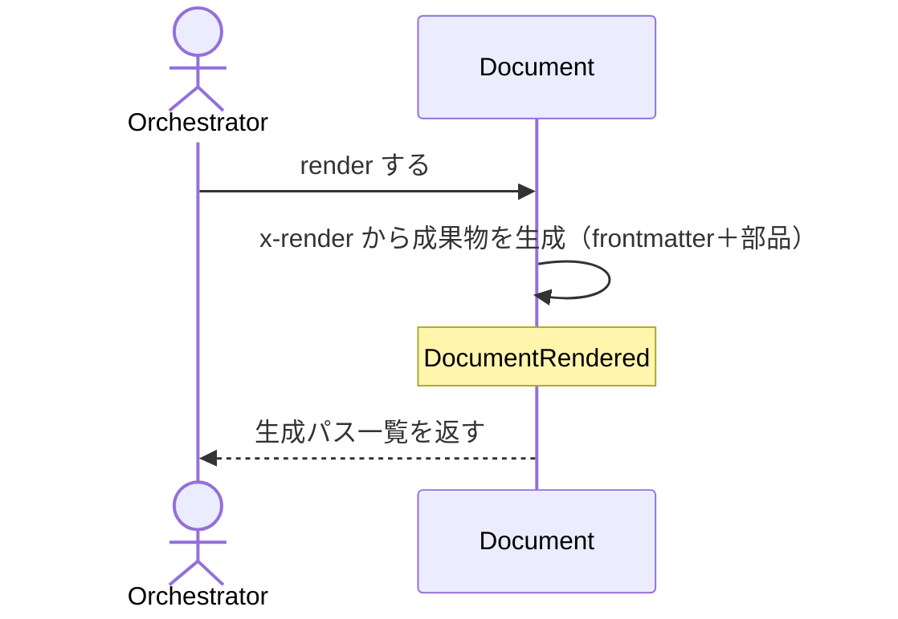

# uc-render-document

---

## 概要

検証済みの Document を schema の x-render に従って人間可読な成果物（SKILL.md / HTML / .feature）に描画し、配置先へ反映する。

---

## 主アクターと意図

- **主アクター**: Orchestrator（HarnessAgent）
- **意図**: 対象 Document を成果物に描画し、canonical と deploy 先へ反映する

---

## 事前条件

- 対象 Document が存在し、schemaRef を持つ

---

## 基本フロー



---

## 事後条件

- Document が RENDERED 状態になる
- DocumentRendered が発行される
- 成果物が canonical に書かれ、deploy 先へ verbatim コピーされる

---

## 受け入れ基準

- When 対象 Document が与えられたとき、engine は x-render に従い成果物を生成する shall。
- When deploy が有効なとき、engine は canonical と deploy 先の両方へ書き込む shall。
- If schemaRef が無いとき、engine は MISSING_SCHEMA_REF を返し描画しない shall。

---

## 操作保証

- When 同じ Document を複数回 render したとき、engine は常に同一の成果物を生成する shall（決定的：入力が同じなら出力も同じ）。
- When x-render が RenderMetaSchema の各部品種別（paragraph/list/table/keyvalue/code/section/kvtable/sequence/statediagram/architecture/flowchart）を宣言したとき、engine はその種別ごとの整形規則に従って決定的に描画する shall。

---

## エラー

| コード | 条件 |
|---|---|
| `MISSING_SCHEMA_REF` | schemaRef が無い（描画しない） |
| `INVALID_PATH` | 対象パスが存在しない |

---

## テストシナリオ

### 検証済み Document を成果物に描画する

| 分類 | 観点 |
|---|---|
| 正常系 | 描画：x-render に従い成果物と生成パスを返す |

```gherkin
Scenario: 検証済み Document を成果物に描画する
  Given 描画対象の Document
  When render する
  Then 成果物が生成され、生成パス一覧が返る
```

### schemaRef を持たない Document は描画しない

| 分類 | 観点 |
|---|---|
| 異常系 | エラー：schemaRef 欠如は MISSING_SCHEMA_REF |

```gherkin
Scenario: schemaRef を持たない Document は描画しない
  Given schemaRef の無い Document
  When render する
  Then MISSING_SCHEMA_REF エラーが返る
```

### 存在しないパスは描画しない

| 分類 | 観点 |
|---|---|
| 異常系 | エラー：対象パスが存在しないときは INVALID_PATH |

```gherkin
Scenario: 存在しないパスは描画しない
  When 存在しないパスを対象に render する
  Then INVALID_PATH エラーが返る
```

### deploy すると canonical と deploy 先の両方に書く

| 分類 | 観点 |
|---|---|
| 正常系 | 受け入れ基準：deploy が有効なとき canonical と deploy 先の両方へ書き込む |

```gherkin
Scenario: deploy すると canonical と deploy 先の両方に書く
  Given deploy 先を持つ Document
  When deploy を有効にして render する
  Then canonical と deploy 先の両方に成果物が書かれる
```

---

## 操作保証シナリオ

### 同じDocumentを2回renderしても同一の成果物になる

| 分類 | 観点 |
|---|---|
| 境界値 | 決定性：入力が変わらなければ出力も変わらない |

```gherkin
Scenario: 同じDocumentを2回renderしても同一の成果物になる
  Given 変更されていないDocument
  When 同じDocumentを2回renderする
  Then 1回目と2回目の成果物は同一である
```

### paragraph・listが正しく整形される

| 分類 | 観点 |
|---|---|
| 正常系 | paragraph/listの整形保証 |

```gherkin
Scenario: paragraph/listが正しく整形される
  Given paragraph/listを宣言するx-render
  When renderする
  Then paragraphは地の文、listは箇条書きとして整形される
```

### tableはパイプ文字をエスケープしboolを整形する

| 分類 | 観点 |
|---|---|
| 境界値 | tableのセルエスケープ・bool整形保証 |

```gherkin
Scenario: tableはパイプ文字をエスケープしboolを整形する
  Given パイプ文字やbool値を含む行データ
  When tableとしてrenderする
  Then パイプ文字はエスケープされ、boolは✓/-に整形される
```

### sectionは入れ子とitemLabelを整形する

| 分類 | 観点 |
|---|---|
| 正常系 | sectionの入れ子・itemLabel整形保証 |

```gherkin
Scenario: sectionは入れ子とitemLabelを整形する
  Given itemLabelを持つsection宣言と入れ子のeach部品
  When renderする
  Then 各itemの見出しにitemLabelが付与され、入れ子の部品も正しく描画される
```

### keyvalueが正しく整形される

| 分類 | 観点 |
|---|---|
| 正常系 | keyvalueの整形保証 |

```gherkin
Scenario: keyvalueが正しく整形される
  Given keyvalueを宣言するx-render
  When renderする
  Then ラベルと値の組が箇条書きとして整形される
```

### sectionはbadgeで条件付き強調を付与する

| 分類 | 観点 |
|---|---|
| 境界値 | sectionのbadge（条件付き強調）保証 |

```gherkin
Scenario: sectionはbadgeで条件付き強調を付与する
  Given badge条件を満たすitemを含むsection宣言
  When renderする
  Then 条件を満たすitemの見出しにのみ強調語が付与される
```

### tableはmarkFieldで識別子を太字強調する

| 分類 | 観点 |
|---|---|
| 境界値 | tableのmarkField（識別子強調）保証 |

```gherkin
Scenario: tableはmarkFieldで識別子を太字強調する
  Given markFieldが真の行を含むtable宣言
  When renderする
  Then 該当セルが太字＋markSuffixで強調される
```

### statediagramが正しいMermaid構文になる

| 分類 | 観点 |
|---|---|
| 正常系 | statediagramのMermaid構文生成保証 |

```gherkin
Scenario: statediagramが正しいMermaid構文になる
  Given 状態遷移の配列を宣言するx-render
  When renderする
  Then stateDiagram-v2として正しいMermaid構文が生成される
```

### statediagramは疑似状態を表現する

| 分類 | 観点 |
|---|---|
| 境界値 | statediagramの疑似状態（choice/fork/join）保証 |

```gherkin
Scenario: statediagramは疑似状態を表現する
  Given pseudoStatesFromで疑似状態を宣言するx-render
  When renderする
  Then choice/fork/joinの疑似状態宣言がMermaid構文の先頭に出力される
```

### sequenceはactor・participantを区別する

| 分類 | 観点 |
|---|---|
| 境界値 | sequenceのactor/participant区別保証 |

```gherkin
Scenario: sequenceはactor/participantを区別する
  Given kind:actor/participantを含む参加者宣言
  When renderする
  Then actor/participantそれぞれの宣言がMermaid構文で区別される
```

### sequenceはloop・altを入れ子で表現する

| 分類 | 観点 |
|---|---|
| 正常系 | sequenceのloop/alt入れ子保証 |

```gherkin
Scenario: sequenceはloop/altを入れ子で表現する
  Given loop/alt種別のstepを含むsteps配列
  When renderする
  Then loop/altブロックが正しく入れ子のMermaid構文になる
```

### sequenceはactivate・deactivateを表現する

| 分類 | 観点 |
|---|---|
| 境界値 | sequenceのactivate/deactivate保証 |

```gherkin
Scenario: sequenceはactivate/deactivateを表現する
  Given activate/deactivateフラグを持つstep
  When renderする
  Then Mermaidのアクティベーション記法(+/-)が正しく付与される
```

### architectureが正しいMermaid構文になる

| 分類 | 観点 |
|---|---|
| 正常系 | architectureのMermaid構文生成保証 |

```gherkin
Scenario: architectureが正しいMermaid構文になる
  Given zones/connectionsを宣言するx-render
  When renderする
  Then architecture-betaとして正しいMermaid構文が生成される
```

### flowchartが正しいMermaid構文になる

| 分類 | 観点 |
|---|---|
| 正常系 | flowchartのMermaid構文生成保証 |

```gherkin
Scenario: flowchartが正しいMermaid構文になる
  Given stages/transitionsを宣言するx-render
  When renderする
  Then flowchart LRとして正しいMermaid構文が生成される
```

### kvtableは単一行として整形される

| 分類 | 観点 |
|---|---|
| 境界値 | kvtableの単一行整形保証 |

```gherkin
Scenario: kvtableは単一行として整形される
  Given kvtableを宣言するx-render
  When renderする
  Then block自身の値が1行のtableとして整形される
```

### tableはjoin指定で配列セルを結合整形する

| 分類 | 観点 |
|---|---|
| 境界値 | tableのjoin（配列セル結合）保証 |

```gherkin
Scenario: tableはjoin指定で配列セルを結合整形する
  Given join/sepを指定したcolumns宣言と配列値を持つセル
  When renderする
  Then 配列の各要素がjoinテンプレートで整形されsepで連結される
```
