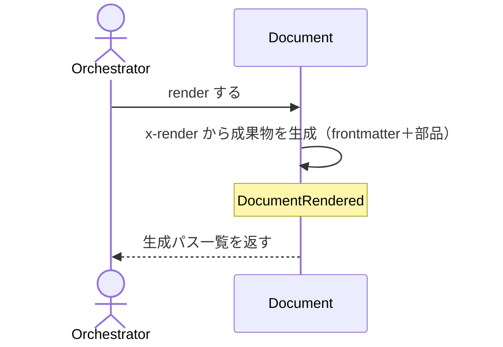

# uc-render-document

---

## 概要

検証済みの Document を schema の x-render に従って人間可読な成果物（SKILL.md / HTML / .feature）に描画し、配置先へ反映する。

---

## 主アクターと意図

- **主アクター**: Orchestrator（HarnessAgent）
- **意図**: 対象 Document を成果物に描画し、canonical と deploy 先へ反映する

---

## 事前条件

- 対象 Document が存在し、schemaRef を持つ

---

## 基本フロー



---

## 事後条件

- Document が RENDERED 状態になる
- DocumentRendered が発行される
- 成果物が canonical に書かれ、deploy 先へ verbatim コピーされる

---

## 受け入れ基準

- When 対象 Document が与えられたとき、engine は x-render に従い成果物を生成する shall。
- When deploy が有効なとき、engine は canonical と deploy 先の両方へ書き込む shall。
- If schemaRef が無いとき、engine は MISSING_SCHEMA_REF を返し描画しない shall。

---

## 操作保証

- When 同じ Document を複数回 render したとき、engine は常に同一の成果物を生成する shall（決定的：入力が同じなら出力も同じ）。
- When x-render が RenderMetaSchema の各部品種別（paragraph/list/table/keyvalue/code/section/kvtable/sequence/statediagram/architecture/flowchart）を宣言したとき、engine はその種別ごとの整形規則に従って決定的に描画する shall。
- When 対象パスが存在しないとき、engine は INVALID_PATH エラーを返す shall（リポジトリによる解決プロセス自体の契約・DocumentRepositoryを介して判定する）。
- When 対象のschemaRefを解決できないとき、engine は INVALID_SCHEMA_REF エラーを返す shall（リポジトリによる解決プロセス自体の契約・SchemaRepositoryを介して判定する）。

---

## エラー

---

## 受け入れシナリオ

### 検証済み Document を成果物に描画する

| 分類 | 観点 |
|---|---|
| 正常系 | 描画：x-render に従い成果物と生成パスを返す |

```gherkin
Scenario: 検証済み Document を成果物に描画する
  Given 描画対象の Document
  When render する
  Then 成果物が生成され、生成パス一覧が返る
```

### schemaRef を持たない Document は描画しない

| 分類 | 観点 |
|---|---|
| 異常系 | エラー：schemaRef 欠如は MISSING_SCHEMA_REF |

```gherkin
Scenario: schemaRef を持たない Document は描画しない
  Given schemaRef の無い Document
  When render する
  Then MISSING_SCHEMA_REF エラーが返る
```

### deploy すると canonical と deploy 先の両方に書く

| 分類 | 観点 |
|---|---|
| 正常系 | 受け入れ基準：deploy が有効なとき canonical と deploy 先の両方へ書き込む |

```gherkin
Scenario: deploy すると canonical と deploy 先の両方に書く
  Given deploy 先を持つ Document
  When deploy を有効にして render する
  Then canonical と deploy 先の両方に成果物が書かれる
```

### SkillSchemaをMarkdownにレンダリングする

| 分類 | 観点 |
|---|---|
| 正常系 | schema種別横断：SkillSchemaのDocumentが見出し・パラメータ表・呼び出し例まで正しく描画される |

```gherkin
Scenario: SkillSchemaをMarkdownにレンダリングする
  Given SkillSchemaのDocument
  When renderする
  Then 見出し・目的・パラメータ表・オペレーション選択・呼び出し例が全て出力に含まれる
```

### frontmatterはx_frontmatterのドットパスを解決して生成する

| 分類 | 観点 |
|---|---|
| 正常系 | frontmatter：schemaのx-frontmatter宣言(フィールド→ドットパス)を解決してYAML frontmatterを生成する |

```gherkin
Scenario: frontmatterはx_frontmatterのドットパスを解決して生成する
  Given x-frontmatterを宣言するSchemaのDocument
  When renderする
  Then 出力冒頭にname/description等を含むYAML frontmatterが生成される
```

### CodingSchemaはMarkdownとして描画できる

| 分類 | 観点 |
|---|---|
| 正常系 | schema種別横断：CodingSchemaのDocumentも同一engineで描画できる(schema固有ロジックを持たない汎用性) |

```gherkin
Scenario: CodingSchemaはMarkdownとして描画できる
  Given CodingSchemaのDocument
  When renderする
  Then Markdown形式で見出しを含む出力が生成される
```

### usecase_Specは基本フローをシーケンス図に受け入れシナリオをMarkdownに出す

| 分類 | 観点 |
|---|---|
| 正常系 | schema種別横断：usecase Specは MainFlow をMermaidシーケンス図に、TestScenariosをMarkdown+.featureの両方に出す |

```gherkin
Scenario: usecase_Specは基本フローをシーケンス図に受け入れシナリオをMarkdownに出す
  Given usecase SpecのDocument
  When renderする
  Then 出力にmermaidのsequenceDiagramとテストシナリオ節が含まれ、feature出力にも同じシナリオが含まれる
```

### aggregate_Specは集約の構造とライフサイクルをMarkdownに出す

| 分類 | 観点 |
|---|---|
| 正常系 | schema種別横断：aggregate Specはコマンド・ドメインイベント・ライフサイクルをMermaidのstateDiagramと表で出す |

```gherkin
Scenario: aggregate_Specは集約の構造とライフサイクルをMarkdownに出す
  Given aggregate SpecのDocument
  When renderする
  Then 出力にコマンド節・ドメインイベント名・mermaidのstateDiagram-v2が含まれる
```

### 不正なJSONはINVALID_JSON

| 分類 | 観点 |
|---|---|
| 異常系 | エラー：対象ファイルがJSONとして解釈できないときはINVALID_JSON |

```gherkin
Scenario: 不正なJSONはINVALID_JSON
  Given 不正なJSONの対象ファイル
  When renderする
  Then INVALID_JSONエラーが返る
```

---

## 操作保証シナリオ

### 同じDocumentを2回renderしても同一の成果物になる

| 分類 | 観点 |
|---|---|
| 境界値 | 決定性：入力が変わらなければ出力も変わらない |

```gherkin
Scenario: 同じDocumentを2回renderしても同一の成果物になる
  Given 変更されていないDocument
  When 同じDocumentを2回renderする
  Then 1回目と2回目の成果物は同一である
```

### render_engineはschemaのx_render宣言をpart_rendererへ正しく配線する

| 分類 | 観点 |
|---|---|
| 正常系 | 配線：render engineがschemaのx-render宣言を読み取りpart_rendererへ正しく渡す(part_renderer自体の整形保証とは別に、engine自体の配線を検証する) |

```gherkin
Scenario: render_engineはschemaのx_render宣言をpart_rendererへ正しく配線する
  Given interfaceブロック(x-render宣言=table)を持つDocument
  When render engine経由でrenderする
  Then schemaのx-render宣言どおりに整形されたMarkdownテーブルが出力に含まれる
```

### 存在しないパスはINVALID_PATH

| 分類 | 観点 |
|---|---|
| 異常系 | リポジトリ解決契約：対象パスが実在しないとき、DocumentRepositoryを介した解決に失敗しINVALID_PATHになる |

```gherkin
Scenario: 存在しないパスはINVALID_PATH
  Given 実在しない対象パス
  When 本usecaseを実行する
  Then INVALID_PATHエラーが返る
```

### 解決できないschemaRefはINVALID_SCHEMA_REF

| 分類 | 観点 |
|---|---|
| 異常系 | リポジトリ解決契約：schemaRefを解決できないとき、SchemaRepositoryを介した解決に失敗しINVALID_SCHEMA_REFになる |

```gherkin
Scenario: 解決できないschemaRefはINVALID_SCHEMA_REF
  Given 解決できないschemaRef
  When 本usecaseを実行する
  Then INVALID_SCHEMA_REFエラーが返る
```
