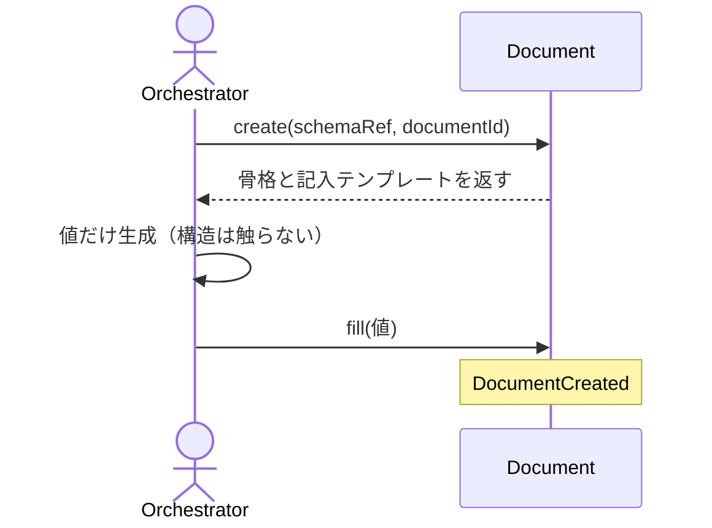

# uc-scaffold-document

---

## 概要

schema から Document の骨格を機械生成し（create）、AI が生成した値を宣言済みフィールドにのみ機械的に書き込む（fill）。AI は構造を触らない。

---

## 主アクターと意図

- **主アクター**: Orchestrator（HarnessAgent）
- **意図**: 新しい Document を schema 通りに起こし、値だけを安全に埋める

---

## 事前条件

- 生成対象の schema と documentId が与えられている
- 分岐のある schema では discriminator が与えられている

---

## 基本フロー



---

## 事後条件

- Document が schema の初期 status（enum 先頭）で生成される
- 宣言済みの値フィールドにのみ値が書き込まれる
- 構造（const / discriminator）は AI に変更されない

---

## 受け入れ基準

- When schemaRef と documentId が与えられたとき、engine は schema に適合する骨格を生成する shall（status=schema の enum 先頭）。
- When fill で値が与えられたとき、engine は宣言済み値フィールドにのみ書き込む shall。
- If 構造を変える値や const / discriminator が与えられたとき、engine は拒否し skipped に記録する shall。
- If 分岐のある schema で discriminator が無いとき、engine は MISSING_DISCRIMINATOR を返し候補を案内する shall。

---

## 操作保証

- When 同じ documentId で create を複数回実行したとき、engine の生成する構造（schema由来の骨格の形）は常にべき等である shall。
- While document.json が既に存在するとき、create を再実行しても、fill で書き込まれた既存の values は保持され、破壊されない shall（values 自体の再現性はengineの管轄外・呼び出し側の責務）。
- When 対象パスが存在しないとき、engine は INVALID_PATH エラーを返す shall（対象を特定し取得する解決プロセス自体の契約であり、複数のusecaseに共通する）。
- When 対象のschemaRefを解決できないとき、engine は INVALID_SCHEMA_REF エラーを返す shall（schemaを特定し取得する解決プロセス自体の契約であり、複数のusecaseに共通する）。

---

## エラー

| コード | 条件 |
|---|---|
| `MISSING_DISCRIMINATOR` | 分岐のある schema で discriminator が未指定（候補 enum を案内） |
| `SKIPPED` | 未知 path / const / discriminator への書き込み（書き込まず skipped に記録） |

---

## 受け入れシナリオ

### 生成した骨格は自分の schema で valid

| 分類 | 観点 |
|---|---|
| 正常系 | 骨格生成：生成骨格は schema 適合・status は初期値 |

```gherkin
Scenario: 生成した骨格は自分の schema で valid
  Given engine 種別の Document（discriminator 指定済み）
  When create する
  Then 骨格は schema に適合し、status は schema の初期値である
```

### 構造を変える値は拒否される

| 分類 | 観点 |
|---|---|
| 異常系 | 構造保護：const フィールドへの書き込みは skipped |

```gherkin
Scenario: 構造を変える値は拒否される
  Given 作成済みの Document
  When const フィールドへ値を書き込もうとする
  Then 書き込まれず skipped に記録される
```

### 宣言済みの値フィールドに書き込まれる

| 分類 | 観点 |
|---|---|
| 正常系 | fill：宣言済み値フィールドへの書き込みは written に記録される |

```gherkin
Scenario: 宣言済みの値フィールドに書き込まれる
  Given 作成済みの Document
  When 宣言済みの値フィールドへ値を書き込む
  Then written に記録され、ファイルに反映される
```

### discriminator が無いと候補を案内する

| 分類 | 観点 |
|---|---|
| 異常系 | エラー：分岐のある schema で discriminator 未指定は MISSING_DISCRIMINATOR |

```gherkin
Scenario: discriminator が無いと候補を案内する
  Given 分岐のある schema
  When discriminator を指定せずに create する
  Then MISSING_DISCRIMINATOR エラーが候補つきで返る
```

### createはengine_skillの骨格を生成する

| 分類 | 観点 |
|---|---|
| 正常系 | 骨格生成：discriminator(skillKind=engine)からschema分岐に沿った骨格が組まれる |

```gherkin
Scenario: createはengine_skillの骨格を生成する
  Given schemaRef, documentId, discriminator(skillKind=engine)
  When createを実行する
  Then documentType/schemaRef/skillKind/statusが正しく設定され、content配下にinterface/invocationSpecがある骨格が生成される
```

### createはx_source_targetに骨格を書き出す

| 分類 | 観点 |
|---|---|
| 正常系 | 永続化：createはschema宣言のx-source-targetへ骨格ファイルを書き出す |

```gherkin
Scenario: createはx_source_targetに骨格を書き出す
  Given schemaRef, documentId, discriminator
  When createを実行する
  Then schemaのx-source-target宣言どおりのパスにファイルが書き出される
```

### fillTemplateは値フィールドのpathとprompt_x_prompt_writeを持つ

| 分類 | 観点 |
|---|---|
| 正常系 | fillTemplate：createが返すfillTemplateは値フィールドのpath×x-prompt-writeの一覧である |

```gherkin
Scenario: fillTemplateは値フィールドのpathとprompt_x_prompt_writeを持つ
  Given schemaRef, documentId, discriminator
  When createを実行する
  Then fillTemplateには値フィールドのpathとx-prompt-write由来のpromptを持つエントリが含まれる
```

### customはengineと構成が異なる

| 分類 | 観点 |
|---|---|
| 正常系 | discriminator分岐：skillKind=customはengineと異なるcontent構造(processingTarget)を持つ |

```gherkin
Scenario: customはengineと構成が異なる
  Given discriminator(skillKind=custom)
  When createを実行する
  Then engineとは異なりcontent配下にprocessingTargetを持つ骨格が生成される
```

---

## 操作保証シナリオ

### 既存documentへの再createはvaluesを破壊しない

| 分類 | 観点 |
|---|---|
| 境界値 | べき等性：fill済みのvaluesはcreateの再実行で保持される |

```gherkin
Scenario: 既存documentへの再createはvaluesを破壊しない
  Given create済みかつfillで値を書き込み済みのdocumentId
  When 同じdocumentIdでcreateを再実行する
  Then fillで書き込んだvaluesは保持されたままである
```

### 存在しないパスはINVALID_PATH

| 分類 | 観点 |
|---|---|
| 異常系 | 解決契約：対象パスが実在しないとき、パスの解決に失敗しINVALID_PATHになる |

```gherkin
Scenario: 存在しないパスはINVALID_PATH
  Given 実在しない対象パス
  When 本usecaseを実行する
  Then INVALID_PATHエラーが返る
```

### 解決できないschemaRefはINVALID_SCHEMA_REF

| 分類 | 観点 |
|---|---|
| 異常系 | 解決契約：schemaRefを解決できないとき、schemaの解決に失敗しINVALID_SCHEMA_REFになる |

```gherkin
Scenario: 解決できないschemaRefはINVALID_SCHEMA_REF
  Given 解決できないschemaRef
  When 本usecaseを実行する
  Then INVALID_SCHEMA_REFエラーが返る
```
