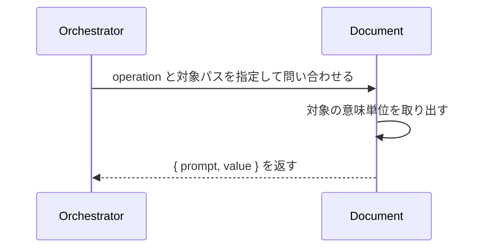

# uc-query-document

---

## 概要

AI がファイルを直接読まずに、Document の必要な意味単位（ブロック・フィールド・条件一致・全階層）だけを取得する。

---

## 主アクターと意図

- **主アクター**: Orchestrator（HarnessAgent）
- **意図**: 対象 Document から欲しい意味単位を取得し、読み方の指針とともに受け取る

---

## 事前条件

- 対象 Document（またはディレクトリ）のパスが要望テキストで与えられている

---

## 基本フロー



---

## 事後条件

- 要求された意味単位が value として返る
- ブロック/配列取得時は value の読み方の指針が prompt に付く

---

## 受け入れ基準

- When operation と対象パスが与えられたとき、エンジンは結果を { prompt, value } 形式で返す shall。
- When ブロック/配列を取得したとき、prompt に対象ブロックの読み方の指針（x-prompt-query 由来）を含める shall。
- While フィルタ条件に一致する要素が無いとき、エンジンは正常系として空配列 value: [] を返す shall。
- If operation が未知のとき、エンジンは INVALID_OPERATION エラーを返す shall。
- If 対象パスが存在しないとき、エンジンは INVALID_PATH エラーを返す shall。

---

## エラー

| コード | 条件 |
|---|---|
| `INVALID_OPERATION` | operation が定義外 |
| `INVALID_PATH` | 対象パスが存在しない |
| `MISSING_PARAM` | 必須パラメータが欠落 |

---

## テストシナリオ

### ブロックを丸ごと取得する

| 分類 | 観点 |
|---|---|
| 正常系 | 意味単位取得：ブロック取得で読み方の指針が付く |

```gherkin
Scenario: ブロックを丸ごと取得する
  Given query engine と対象 Document
  When operation get_block を blockKey interface で実行する
  Then value は対象ブロックであり、prompt に読み方の指針が付く
```

### 条件に一致する配列要素だけを絞り込む

| 分類 | 観点 |
|---|---|
| 正常系 | 意味単位取得：フィルタで条件一致だけを返す |

```gherkin
Scenario: 条件に一致する配列要素だけを絞り込む
  Given query engine と対象 Document
  When operation filter_items で required=true を指定する
  Then value には required な要素だけが含まれる
```

### 一致が無くても正常系で空配列を返す

| 分類 | 観点 |
|---|---|
| 境界値 | 空一致：一致ゼロは正常系（エラーにしない） |

```gherkin
Scenario: 一致が無くても正常系で空配列を返す
  When 一致しないフィルタ条件で filter_items を実行する
  Then value は空配列で、エラーにはならない
```

### 未知の operation はエラーを返す

| 分類 | 観点 |
|---|---|
| 異常系 | エラー：未知 operation は INVALID_OPERATION |

```gherkin
Scenario: 未知の operation はエラーを返す
  When 未知の operation を実行する
  Then INVALID_OPERATION エラーが返る
```
