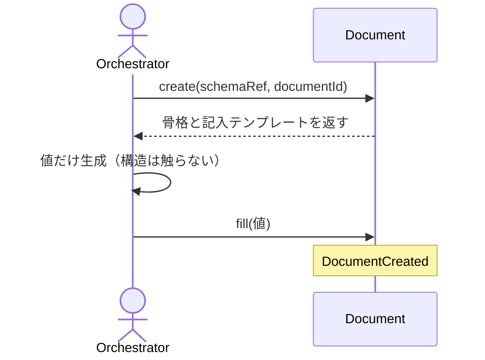

# uc-scaffold-document

---

## 概要

schema から Document の骨格を機械生成し（create）、AI が生成した値を宣言済みフィールドにのみ機械的に書き込む（fill）。AI は構造を触らない。

---

## 主アクターと意図

- **主アクター**: Orchestrator（HarnessAgent）
- **意図**: 新しい Document を schema 通りに起こし、値だけを安全に埋める

---

## 事前条件

- 生成対象の schema と documentId が与えられている
- 分岐のある schema では discriminator が与えられている

---

## 基本フロー



---

## 事後条件

- Document が schema の初期 status（enum 先頭）で生成される
- 宣言済みの値フィールドにのみ値が書き込まれる
- 構造（const / discriminator）は AI に変更されない

---

## 受け入れ基準

- When schemaRef と documentId が与えられたとき、engine は schema に適合する骨格を生成する shall（status=schema の enum 先頭）。
- When fill で値が与えられたとき、engine は宣言済み値フィールドにのみ書き込む shall。
- If 構造を変える値や const / discriminator が与えられたとき、engine は拒否し skipped に記録する shall。
- If 分岐のある schema で discriminator が無いとき、engine は MISSING_DISCRIMINATOR を返し候補を案内する shall。

---

## 操作保証

- When 同じ documentId で create を複数回実行したとき、engine はべき等に振る舞う shall（2回目以降は既存の骨格を上書きしない、または同一結果を返す）。

---

## エラー

| コード | 条件 |
|---|---|
| `MISSING_DISCRIMINATOR` | 分岐のある schema で discriminator が未指定（候補 enum を案内） |
| `INVALID_SCHEMA_REF` | 未知の schemaRef |
| `SKIPPED` | 未知 path / const / discriminator への書き込み（書き込まず skipped に記録） |

---

## テストシナリオ

### 生成した骨格は自分の schema で valid

| 分類 | 観点 |
|---|---|
| 正常系 | 骨格生成：生成骨格は schema 適合・status は初期値 |

```gherkin
Scenario: 生成した骨格は自分の schema で valid
  Given engine 種別の Document（discriminator 指定済み）
  When create する
  Then 骨格は schema に適合し、status は schema の初期値である
```

### 構造を変える値は拒否される

| 分類 | 観点 |
|---|---|
| 異常系 | 構造保護：const フィールドへの書き込みは skipped |

```gherkin
Scenario: 構造を変える値は拒否される
  Given 作成済みの Document
  When const フィールドへ値を書き込もうとする
  Then 書き込まれず skipped に記録される
```

### 宣言済みの値フィールドに書き込まれる

| 分類 | 観点 |
|---|---|
| 正常系 | fill：宣言済み値フィールドへの書き込みは written に記録される |

```gherkin
Scenario: 宣言済みの値フィールドに書き込まれる
  Given 作成済みの Document
  When 宣言済みの値フィールドへ値を書き込む
  Then written に記録され、ファイルに反映される
```

### discriminator が無いと候補を案内する

| 分類 | 観点 |
|---|---|
| 異常系 | エラー：分岐のある schema で discriminator 未指定は MISSING_DISCRIMINATOR |

```gherkin
Scenario: discriminator が無いと候補を案内する
  Given 分岐のある schema
  When discriminator を指定せずに create する
  Then MISSING_DISCRIMINATOR エラーが候補つきで返る
```

---

## 操作保証シナリオ

### 同じdocumentIdでcreateを2回実行してもべき等

| 分類 | 観点 |
|---|---|
| 境界値 | べき等性：同一documentIdへのcreate再実行は安全 |

```gherkin
Scenario: 同じdocumentIdでcreateを2回実行してもべき等
  Given 既に作成済みのdocumentId
  When 同じdocumentIdでcreateを再実行する
  Then 既存の骨格は上書きされず、同一の結果が返る
```
