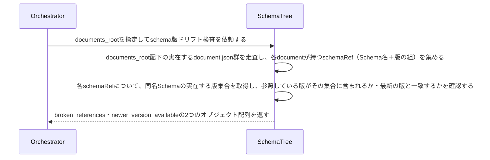

# uc-check-schema-version-drift

---

## 概要

Document集約の実インスタンス群が持つschemaRefを、実在するSchemaの版集合と突き合わせ、指す先が存在しない参照・最新版でない参照を機械的に検出する。Schemaが進化した際に既存Documentが気づかれず陳腐化するリスクに対する第4のドリフト検知。

---

## 主アクターと意図

- **主アクター**: Orchestrator（HarnessAgent）
- **意図**: Documentが参照するSchemaの版が実在し、かつ最新であるかを確認したい

---

## 事前条件

- Document集約の実インスタンス群を走査する対象ディレクトリ（documents_root）が与えられている

---

## 基本フロー



---

## 事後条件

- 返り値は次の2フィールドを持つ: broken_references（schemaRefが指す版が実在しないDocumentの組）・newer_version_available（schemaRefは実在するが、同名Schemaの最新版ではないDocumentの組。参照先の最新schemaRefも併せて含む）
- 版の新旧比較は、版識別子（例: v2）から取り出した数値の大小で行う（文字列としての辞書順比較はしない。'v10'と'v2'の大小を誤らないため）
- schemaRefを持たないDocumentは対象外とする（MISSING_SCHEMA_REFの判定は本usecaseの対象外）
- broken_references・newer_version_availableが共に空配列であれば、全DocumentのSchema参照が最新かつ実在する（正常系）

---

## 受け入れ基準

- When Documentのschema参照が指す版が実在しないとき、エンジンはその組をbroken_referencesに含める shall。
- When Documentのschema参照は実在するが、同名Schemaの最新版でないとき、エンジンはその組（参照先の最新schemaRef付き）をnewer_version_availableに含める shall。
- While 全DocumentのSchema参照が実在しかつ最新であるとき、エンジンはbroken_references・newer_version_available共に空配列で返す shall。
- If 対象のdocuments_rootが存在しないとき、エンジンはINVALID_PATHエラーを返す shall。

---

## 操作保証

- When 対象のdocuments_rootが存在しないとき、engine は INVALID_PATH エラーを返す shall（対象を特定し取得する解決プロセス自体の契約であり、複数のusecaseに共通する）。

---

## 受け入れシナリオ

### 全Documentが最新版を参照しているとき差分なしと判定する

| 分類 | 観点 |
|---|---|
| 正常系 | 整合：全参照が実在かつ最新は正常系（空配列） |

```gherkin
Scenario: 全Documentが最新版を参照しているとき差分なしと判定する
  Given 全DocumentのschemaRefが、実在する同名Schemaの最新版を指しているspecツリー
  When schema版ドリフト検査を実行する
  Then broken_references・newer_version_available共に空配列で返る
```

### 実在しない版を指すschemaRefを検出する

| 分類 | 観点 |
|---|---|
| 異常系 | ドリフト：schemaRefが指す版が実在しない |

```gherkin
Scenario: 実在しない版を指すschemaRefを検出する
  Given 実在しない版をschemaRefに持つDocument
  When schema版ドリフト検査を実行する
  Then broken_referencesにその組が含まれる
```

### 最新でない版を参照しているDocumentを検出する

| 分類 | 観点 |
|---|---|
| 異常系 | ドリフト：参照は実在するが最新版でない |

```gherkin
Scenario: 最新でない版を参照しているDocumentを検出する
  Given 同名Schemaに新しい版が実在するが、旧い版をschemaRefに持つDocument
  When schema版ドリフト検査を実行する
  Then newer_version_availableにその組が含まれる
```

---

## 操作保証シナリオ

### 存在しないdocuments_rootはINVALID_PATH

| 分類 | 観点 |
|---|---|
| 異常系 | エラー：走査起点の不在 |

```gherkin
Scenario: 存在しないdocuments_rootはINVALID_PATH
  When 存在しないdocuments_rootでschema版ドリフト検査を実行する
  Then INVALID_PATHエラーが返る
```
