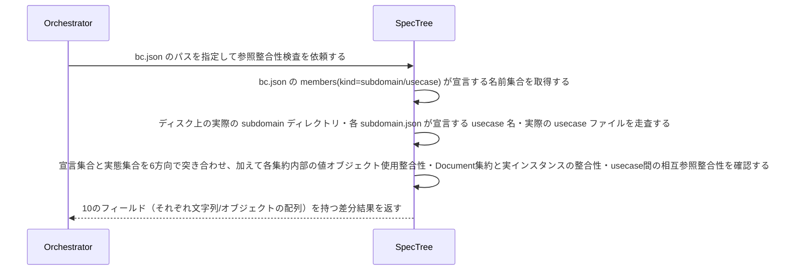

# uc-check-spec-integrity

---

## 概要

bounded-context が宣言する members(subdomain/usecase) と、ディスク上に実在する subdomain/usecase ドキュメントの参照整合性を検証する。加えて、各集約内部の値オブジェクトの使用整合性・Document集約とその実インスタンスとの整合性・usecase間の相互参照(subdomainRef/aggregateRef)の整合性も検証する。宣言と実態がずれている箇所（宙に浮いた参照・未宣言の実体・不整合な相互参照）を機械的に検出する。

---

## 主アクターと意図

- **主アクター**: Orchestrator（HarnessAgent）
- **意図**: spec ツリー内部の参照整合性（宣言と実ファイルの対応）が保たれているかを確認したい

---

## 事前条件

- 対象 bounded-context の bc.json のパスが与えられている
- Document集約の実インスタンス群を走査する対象ディレクトリ（documents_root。通常は.waffle/documents/）が与えられている

---

## 基本フロー



---

## 事後条件

- 返り値は次の10フィールドを持つ: declared_subdomains_missing_on_disk（bc.jsonが宣言するが実在しないsubdomain）・subdomains_on_disk_not_declared_in_bc（実在するがbc.jsonに未宣言のsubdomain）・usecases_orphaned_no_subdomain（bc.jsonが宣言するがどのsubdomainのmembersにも属さないusecase）・usecases_in_subdomain_not_declared_in_bc（いずれかのsubdomainのmembersが宣言するがbc.jsonに未宣言のusecase）・usecase_files_missing_on_disk（subdomainが宣言するが実ファイルが無いusecase）・usecase_files_orphaned_on_disk（実ファイルはあるがどのsubdomainのmembersにも宣言されていないusecase）・orphaned_value_objects（集約が宣言するvalueObjectsのうち、どのentity属性の型としても参照されていないもの）・undeclared_document_fields（実在するdocument.jsonが持つトップレベルフィールドのうち、Document集約のentity属性に無いもの）・subdomain_ref_mismatches（usecase自身のsubdomainRefと、参照先subdomainのmembers宣言が食い違っているもの）・missing_aggregate_refs（usecaseのaggregateRefが指す集約が実在しないもの）
- 宣言先ファイルがディスクに存在しないことはエラーではなく、それ自体がこのusecaseの検出結果（ドリフト）である
- 全10フィールドが空配列であれば、参照整合性が保たれている（正常系）
- orphaned_value_objectsは、各集約documentのvalueObjects.itemsの各nameが、同じ集約のentities[].attributes[].typeのどこにも現れないかを確認する
- undeclared_document_fieldsは、対象ディレクトリ配下の実在するdocument.json群のトップレベルキー全体の和集合を取り、Document集約（agg-document）のentities[].attributesに宣言された属性名の集合との差分を取る
- subdomain_ref_mismatchesは、各usecase documentが持つsubdomainRefフィールドと、参照先subdomain documentのmembers宣言を突き合わせ、双方向（usecaseがsubdomainRefで指す先／subdomainのmembersが指すusecase）で一致しないものを検出する
- missing_aggregate_refsは、各usecase documentが持つaggregateRefフィールドが指す集約documentIdが、実在する集約一覧に無いものを検出する
- 実行/意味理解はしない（宣言された名前集合の機械的な突き合わせのみ。差分の妥当性評価はAIが担う）

---

## 受け入れ基準

- When bc.jsonが宣言するsubdomain名がディスク上に実在しないとき、エンジンはdeclared_subdomains_missing_on_diskにその名前を含める shall。
- When ディスク上に実在するsubdomainがbc.jsonに未宣言のとき、エンジンはsubdomains_on_disk_not_declared_in_bcにその名前を含める shall。
- When bc.jsonが宣言するusecaseがどのsubdomainのmembersにも属さないとき、エンジンはusecases_orphaned_no_subdomainにその名前を含める shall。
- When いずれかのsubdomainのmembersが宣言するusecaseがbc.jsonに未宣言のとき、エンジンはusecases_in_subdomain_not_declared_in_bcにその名前を含める shall。
- When subdomainが宣言するusecaseの実ファイルがディスクに無いとき、エンジンはusecase_files_missing_on_diskにその名前を含める shall。
- When 実ファイルはあるがどのsubdomainのmembersにも宣言されていないusecaseがあるとき、エンジンはusecase_files_orphaned_on_diskにその名前を含める shall。
- While 6方向全てで宣言と実態が一致しているとき、エンジンは全フィールドを空配列で返す shall。
- If bc.json自体が存在しないとき、エンジンはINVALID_PATHエラーを返す shall。
- When 集約が宣言するvalueObjectのうち、どのentity属性の型としても参照されていないものがあるとき、エンジンはそのvalueObject名をorphaned_value_objectsに含める shall。
- When 実在するdocument.jsonが持つトップレベルフィールドが、Document集約のentity属性に宣言されていないとき、エンジンはそのフィールド名をundeclared_document_fieldsに含める shall。
- When usecaseのsubdomainRefと参照先subdomainのmembers宣言が食い違うとき、エンジンはその組をsubdomain_ref_mismatchesに含める shall。
- When usecaseのaggregateRefが指す集約が実在しないとき、エンジンはその組をmissing_aggregate_refsに含める shall。

---

## 操作保証

- When 対象のbc.jsonが存在しないとき、engine は INVALID_PATH エラーを返す shall（対象を特定し取得する解決プロセス自体の契約であり、複数のusecaseに共通する）。

---

## 受け入れシナリオ

### 全ての宣言と実態が一致するとき差分なしと判定する

| 分類 | 観点 |
|---|---|
| 正常系 | 整合：10方向全て一致は正常系（空配列） |

```gherkin
Scenario: 全ての宣言と実態が一致するとき差分なしと判定する
  Given bc.jsonの宣言とディスク上の実ファイルが完全に一致するspecツリー
  When 参照整合性検査を実行する
  Then 10フィールド全てが空配列で返る
```

### 宣言されたsubdomainがディスクに無いことを検出する

| 分類 | 観点 |
|---|---|
| 異常系 | ドリフト：宣言はあるが実体が無い |

```gherkin
Scenario: 宣言されたsubdomainがディスクに無いことを検出する
  Given bc.jsonがsubdomainを宣言するが、そのディレクトリが実在しないspecツリー
  When 参照整合性検査を実行する
  Then declared_subdomains_missing_on_diskにその名前が含まれる
```

### 未宣言のsubdomainがディスクにあることを検出する

| 分類 | 観点 |
|---|---|
| 異常系 | ドリフト：実体はあるが宣言が無い |

```gherkin
Scenario: 未宣言のsubdomainがディスクにあることを検出する
  Given ディスク上に実在するがbc.jsonに宣言されていないsubdomainを含むspecツリー
  When 参照整合性検査を実行する
  Then subdomains_on_disk_not_declared_in_bcにその名前が含まれる
```

### どのsubdomainにも属さない宙に浮いたusecaseを検出する

| 分類 | 観点 |
|---|---|
| 異常系 | ドリフト：bc宣言はあるがsubdomain所属が無い |

```gherkin
Scenario: どのsubdomainにも属さない宙に浮いたusecaseを検出する
  Given bc.jsonがusecaseを宣言するが、どのsubdomainのmembersにも含まれないspecツリー
  When 参照整合性検査を実行する
  Then usecases_orphaned_no_subdomainにその名前が含まれる
```

### subdomainには属するがbcに未宣言のusecaseを検出する

| 分類 | 観点 |
|---|---|
| 異常系 | ドリフト：subdomain所属はあるがbc宣言が無い |

```gherkin
Scenario: subdomainには属するがbcに未宣言のusecaseを検出する
  Given いずれかのsubdomainのmembersが宣言するがbc.jsonには宣言されていないusecaseを含むspecツリー
  When 参照整合性検査を実行する
  Then usecases_in_subdomain_not_declared_in_bcにその名前が含まれる
```

### 宣言されたusecaseの実ファイルが無いことを検出する

| 分類 | 観点 |
|---|---|
| 異常系 | ドリフト：宣言はあるがusecase実ファイルが無い |

```gherkin
Scenario: 宣言されたusecaseの実ファイルが無いことを検出する
  Given subdomainがusecaseを宣言するが、対応するjsonファイルが実在しないspecツリー
  When 参照整合性検査を実行する
  Then usecase_files_missing_on_diskにその名前が含まれる
```

### 未宣言のusecaseファイルがディスクにあることを検出する

| 分類 | 観点 |
|---|---|
| 異常系 | ドリフト：実ファイルはあるがどのsubdomainにも宣言が無い |

```gherkin
Scenario: 未宣言のusecaseファイルがディスクにあることを検出する
  Given ディスク上に実在するがどのsubdomainのmembersにも宣言されていないusecaseファイルを含むspecツリー
  When 参照整合性検査を実行する
  Then usecase_files_orphaned_on_diskにその名前が含まれる
```

### 使われていない値オブジェクトを検出する

| 分類 | 観点 |
|---|---|
| 異常系 | ドリフト：集約が値オブジェクトを宣言するが、entity属性のどこからも参照されていない |

```gherkin
Scenario: 使われていない値オブジェクトを検出する
  Given valueObjectsに宣言されているが、entities[].attributes[].typeのどこにも現れない値オブジェクトを含む集約document
  When 参照整合性検査を実行する
  Then orphaned_value_objectsにその値オブジェクト名が含まれる
```

### 実document.jsonにある未宣言のフィールドを検出する

| 分類 | 観点 |
|---|---|
| 異常系 | ドリフト：実データにあるがSpecのentity属性に無いフィールド |

```gherkin
Scenario: 実document.jsonにある未宣言のフィールドを検出する
  Given トップレベルにDocument集約のentity属性に宣言されていないフィールドを持つ実document.json
  When 参照整合性検査を実行する
  Then undeclared_document_fieldsにそのフィールド名が含まれる
```

### subdomainRefの食い違いを検出する

| 分類 | 観点 |
|---|---|
| 異常系 | ドリフト：usecase自身のsubdomainRefと参照先subdomainのmembersが一致しない |

```gherkin
Scenario: subdomainRefの食い違いを検出する
  Given subdomainRefが指すsubdomainのmembersに自分自身が含まれていないusecase document
  When 参照整合性検査を実行する
  Then subdomain_ref_mismatchesにその組が含まれる
```

### 存在しない集約を指すaggregateRefを検出する

| 分類 | 観点 |
|---|---|
| 異常系 | ドリフト：usecaseのaggregateRefが実在しない集約を指している |

```gherkin
Scenario: 存在しない集約を指すaggregateRefを検出する
  Given 実在しない集約documentIdをaggregateRefに持つusecase document
  When 参照整合性検査を実行する
  Then missing_aggregate_refsにその組が含まれる
```

---

## 操作保証シナリオ

### 存在しないbc.jsonはINVALID_PATH

| 分類 | 観点 |
|---|---|
| 異常系 | エラー：走査起点の不在 |

```gherkin
Scenario: 存在しないbc.jsonはINVALID_PATH
  When 存在しないbc.jsonのパスで参照整合性検査を実行する
  Then INVALID_PATHエラーが返る
```
