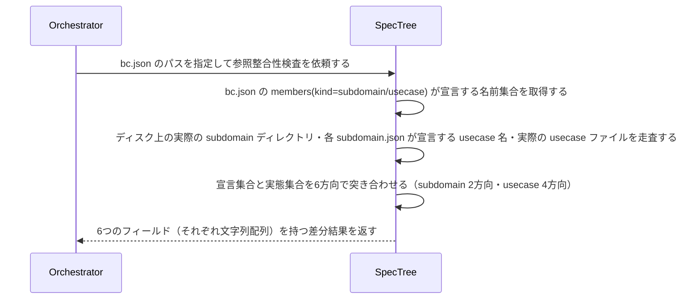

# uc-check-spec-integrity

---

## 概要

bounded-context が宣言する members(subdomain/usecase) と、ディスク上に実在する subdomain/usecase ドキュメントの参照整合性を検証する。宣言と実態がずれている箇所（宙に浮いた参照・未宣言の実体）を機械的に検出する。

---

## 主アクターと意図

- **主アクター**: Orchestrator（HarnessAgent）
- **意図**: spec ツリー内部の参照整合性（宣言と実ファイルの対応）が保たれているかを確認したい

---

## 関与する外部

- DocumentRepository（bc.json・各 subdomain.json の読込に使う既存 port）

---

## 事前条件

- 対象 bounded-context の bc.json のパスが与えられている

---

## 基本フロー



---

## 事後条件

- 返り値は次の6フィールドを持つ: declared_subdomains_missing_on_disk（bc.jsonが宣言するが実在しないsubdomain）・subdomains_on_disk_not_declared_in_bc（実在するがbc.jsonに未宣言のsubdomain）・usecases_orphaned_no_subdomain（bc.jsonが宣言するがどのsubdomainのmembersにも属さないusecase）・usecases_in_subdomain_not_declared_in_bc（いずれかのsubdomainのmembersが宣言するがbc.jsonに未宣言のusecase）・usecase_files_missing_on_disk（subdomainが宣言するが実ファイルが無いusecase）・usecase_files_orphaned_on_disk（実ファイルはあるがどのsubdomainのmembersにも宣言されていないusecase）
- 宣言先ファイルがディスクに存在しないことはエラーではなく、それ自体がこのusecaseの検出結果（ドリフト）である
- 全6フィールドが空配列であれば、参照整合性が保たれている（正常系）
- 実行/意味理解はしない（宣言された名前集合の機械的な突き合わせのみ。差分の妥当性評価はAIが担う）

---

## 受け入れ基準

- When bc.jsonが宣言するsubdomain名がディスク上に実在しないとき、エンジンはdeclared_subdomains_missing_on_diskにその名前を含める shall。
- When ディスク上に実在するsubdomainがbc.jsonに未宣言のとき、エンジンはsubdomains_on_disk_not_declared_in_bcにその名前を含める shall。
- When bc.jsonが宣言するusecaseがどのsubdomainのmembersにも属さないとき、エンジンはusecases_orphaned_no_subdomainにその名前を含める shall。
- When いずれかのsubdomainのmembersが宣言するusecaseがbc.jsonに未宣言のとき、エンジンはusecases_in_subdomain_not_declared_in_bcにその名前を含める shall。
- When subdomainが宣言するusecaseの実ファイルがディスクに無いとき、エンジンはusecase_files_missing_on_diskにその名前を含める shall。
- When 実ファイルはあるがどのsubdomainのmembersにも宣言されていないusecaseがあるとき、エンジンはusecase_files_orphaned_on_diskにその名前を含める shall。
- While 6方向全てで宣言と実態が一致しているとき、エンジンは全フィールドを空配列で返す shall。
- If bc.json自体が存在しないとき、エンジンはINVALID_PATHエラーを返す shall。

---

## 操作保証

- When 対象のbc.jsonが存在しないとき、engine は INVALID_PATH エラーを返す shall（リポジトリによる解決プロセス自体の契約・DocumentRepositoryを介して判定する）。

---

## 受け入れシナリオ

### 全ての宣言と実態が一致するとき差分なしと判定する

| 分類 | 観点 |
|---|---|
| 正常系 | 整合：6方向全て一致は正常系（空配列） |

```gherkin
Scenario: 全ての宣言と実態が一致するとき差分なしと判定する
  Given bc.jsonの宣言とディスク上の実ファイルが完全に一致するspecツリー
  When 参照整合性検査を実行する
  Then 6フィールド全てが空配列で返る
```

### 宣言されたsubdomainがディスクに無いことを検出する

| 分類 | 観点 |
|---|---|
| 異常系 | ドリフト：宣言はあるが実体が無い |

```gherkin
Scenario: 宣言されたsubdomainがディスクに無いことを検出する
  Given bc.jsonがsubdomainを宣言するが、そのディレクトリが実在しないspecツリー
  When 参照整合性検査を実行する
  Then declared_subdomains_missing_on_diskにその名前が含まれる
```

### 未宣言のsubdomainがディスクにあることを検出する

| 分類 | 観点 |
|---|---|
| 異常系 | ドリフト：実体はあるが宣言が無い |

```gherkin
Scenario: 未宣言のsubdomainがディスクにあることを検出する
  Given ディスク上に実在するがbc.jsonに宣言されていないsubdomainを含むspecツリー
  When 参照整合性検査を実行する
  Then subdomains_on_disk_not_declared_in_bcにその名前が含まれる
```

### どのsubdomainにも属さない宙に浮いたusecaseを検出する

| 分類 | 観点 |
|---|---|
| 異常系 | ドリフト：bc宣言はあるがsubdomain所属が無い |

```gherkin
Scenario: どのsubdomainにも属さない宙に浮いたusecaseを検出する
  Given bc.jsonがusecaseを宣言するが、どのsubdomainのmembersにも含まれないspecツリー
  When 参照整合性検査を実行する
  Then usecases_orphaned_no_subdomainにその名前が含まれる
```

### subdomainには属するがbcに未宣言のusecaseを検出する

| 分類 | 観点 |
|---|---|
| 異常系 | ドリフト：subdomain所属はあるがbc宣言が無い |

```gherkin
Scenario: subdomainには属するがbcに未宣言のusecaseを検出する
  Given いずれかのsubdomainのmembersが宣言するがbc.jsonには宣言されていないusecaseを含むspecツリー
  When 参照整合性検査を実行する
  Then usecases_in_subdomain_not_declared_in_bcにその名前が含まれる
```

### 宣言されたusecaseの実ファイルが無いことを検出する

| 分類 | 観点 |
|---|---|
| 異常系 | ドリフト：宣言はあるがusecase実ファイルが無い |

```gherkin
Scenario: 宣言されたusecaseの実ファイルが無いことを検出する
  Given subdomainがusecaseを宣言するが、対応するjsonファイルが実在しないspecツリー
  When 参照整合性検査を実行する
  Then usecase_files_missing_on_diskにその名前が含まれる
```

### 未宣言のusecaseファイルがディスクにあることを検出する

| 分類 | 観点 |
|---|---|
| 異常系 | ドリフト：実ファイルはあるがどのsubdomainにも宣言が無い |

```gherkin
Scenario: 未宣言のusecaseファイルがディスクにあることを検出する
  Given ディスク上に実在するがどのsubdomainのmembersにも宣言されていないusecaseファイルを含むspecツリー
  When 参照整合性検査を実行する
  Then usecase_files_orphaned_on_diskにその名前が含まれる
```

---

## 操作保証シナリオ

### 存在しないbc.jsonはINVALID_PATH

| 分類 | 観点 |
|---|---|
| 異常系 | エラー：走査起点の不在 |

```gherkin
Scenario: 存在しないbc.jsonはINVALID_PATH
  When 存在しないbc.jsonのパスで参照整合性検査を実行する
  Then INVALID_PATHエラーが返る
```
