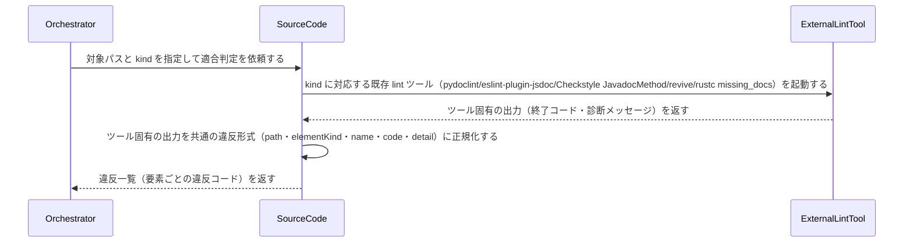

# uc-lint-docstring

---

## 概要

ソースコードの docstring が規約どおりの構造か（必須セクションの有無・引数名と実シグネチャの整合）を、kind ごとに確立された既存 lint ツールを呼び出して判定する。自前の照合ロジックは持たない。

---

## 主アクターと意図

- **主アクター**: Orchestrator（HarnessAgent）
- **意図**: 対象コードベースの docstring が規約どおりの構造か（必須セクションの有無・引数名と実シグネチャの整合）を確認したい

---

## 関与する外部

- kind ごとの既存 lint ツール（実体・調査確定済み）: google→pydoclint / tsdoc→eslint-plugin-jsdoc（check-param-names 系ルール）/ javadoc→Checkstyle JavadocMethod / godoc→revive（exported ルール・有無のみ）/ rustdoc→rustc 組み込み missing_docs lint（有無のみ）
- uc-scan-source-code（対象要素一覧・signatureParams の入力元。ツールの出力正規化に使う）

---

## 事前条件

- 対象コードベース（ディレクトリ）のパスが要望テキストで与えられている
- 対象言語に対応する DocstringSchema の kind が解決できる

---

## 基本フロー



---

## 事後条件

- 適合判定は kind ごとに確立された既存 lint ツールが行う（自前の照合ロジックは持たない）: google→pydoclint / tsdoc→eslint-plugin-jsdoc / javadoc→Checkstyle JavadocMethod / godoc→revive / rustdoc→rustc 組み込み missing_docs
- godoc/rustdoc は対象言語の公式規約に args/returns/raises の構造が無いため、判定できるのは「docstring の有無」のみ（ARGS_MISMATCH 相当は判定しない）
- 違反が無ければ空配列が返る（全要素が適合）
- 違反があれば、次のフィールドを持つオブジェクトの配列で返る: path・elementKind・name（違反した要素の特定）・code（違反コード。MISSING_DOC_COMMENT/ARGS_MISMATCH のいずれか。ツール固有の診断は code に正規化して吸収する）・detail（ツールの元メッセージ。人が読むための補足）
- 1つの要素が複数の違反を同時に持つ場合は、要素ごとに複数のオブジェクトを返す（1違反=1オブジェクト）
- docstring の“意味”（要約行の語選びの適切さ等）は判定しない（機械判定できない範囲は対象外）

---

## 受け入れ基準

- When kind が google/tsdoc/javadoc のとき、エンジンは対応する既存 lint ツールを起動し、その出力を正規化して返す shall。
- When kind が godoc/rustdoc のとき、エンジンは docstring の有無のみを判定するツールを起動し、ARGS_MISMATCH 相当の判定は行わない shall。
- When 既存 lint ツールが「引数の記載漏れ・余分な記載」を報告したとき、エンジンはこれを code=ARGS_MISMATCH として正規化する shall。
- When 要素の hasDocstring が false のとき、エンジンは code=MISSING_DOC_COMMENT の違反として報告する shall。
- While 全要素が適合しているとき、エンジンは空配列を返す（正常系）shall。
- If 対象言語に対応する DocstringSchema の kind が無いとき、エンジンは UNSUPPORTED_KIND エラーを返す shall。
- If kind に対応する既存 lint ツールが実行環境に存在しないとき、エンジンは TOOL_NOT_AVAILABLE エラーを返す shall。

---

## エラー

| コード | 条件 |
|---|---|
| `UNSUPPORTED_KIND` | 対象言語に対応する DocstringSchema の kind が無い |
| `INVALID_PATH` | 対象パスが存在しない |
| `TOOL_NOT_AVAILABLE` | kind に対応する既存 lint ツールが実行環境に存在しない |

---

## テストシナリオ

### 全要素が規約に適合するとき違反なしと判定する

| 分類 | 観点 |
|---|---|
| 正常系 | 適合：違反ゼロは正常系（空配列） |

```gherkin
Scenario: 全要素が規約に適合するとき違反なしと判定する
  Given DocstringSchema の google kind に適合する docstring だけを持つコードベース
  When 適合判定を実行する
  Then 違反は空配列で返り、エラーにはならない
```

### docstring が無い公開要素を検出する

| 分類 | 観点 |
|---|---|
| 異常系 | 違反：MISSING_DOC_COMMENT |

```gherkin
Scenario: docstring が無い公開要素を検出する
  Given docstring を持たない公開関数を含むコードベース
  When 適合判定を実行する
  Then その要素について MISSING_DOC_COMMENT 違反が報告される
```

### Args の引数名がシグネチャと不一致な要素を検出する

| 分類 | 観点 |
|---|---|
| 異常系 | 違反：ARGS_MISMATCH（構造照合の核） |

```gherkin
Scenario: Args の引数名がシグネチャと不一致な要素を検出する
  Given Args セクションの引数名が実シグネチャと異なる関数を含むコードベース
  When 適合判定を実行する
  Then その要素について ARGS_MISMATCH 違反が報告される
```

### 対応する kind が無い言語は UNSUPPORTED_KIND

| 分類 | 観点 |
|---|---|
| 異常系 | エラー：未対応言語の扱い |

```gherkin
Scenario: 対応する kind が無い言語は UNSUPPORTED_KIND
  Given DocstringSchema に定義の無い言語のコードベース
  When 適合判定を実行する
  Then UNSUPPORTED_KIND エラーが返る
```

### godoc/rustdoc は docstring の有無のみを判定する

| 分類 | 観点 |
|---|---|
| 境界値 | 言語ごとの実態：構造化記法の無い言語では ARGS_MISMATCH を判定しない |

```gherkin
Scenario: godoc/rustdoc は docstring の有無のみを判定する
  Given godoc kind のコードベース（docstring が無い公開関数を含む）
  When 適合判定を実行する
  Then MISSING_DOC_COMMENT は報告されるが、ARGS_MISMATCH は判定されない
```

### 対応するツールが実行環境に無いとき TOOL_NOT_AVAILABLE

| 分類 | 観点 |
|---|---|
| 異常系 | エラー：既存ツール不在の扱い |

```gherkin
Scenario: 対応するツールが実行環境に無いとき TOOL_NOT_AVAILABLE
  Given kind に対応する lint ツールがインストールされていない環境
  When 適合判定を実行する
  Then TOOL_NOT_AVAILABLE エラーが返る
```
