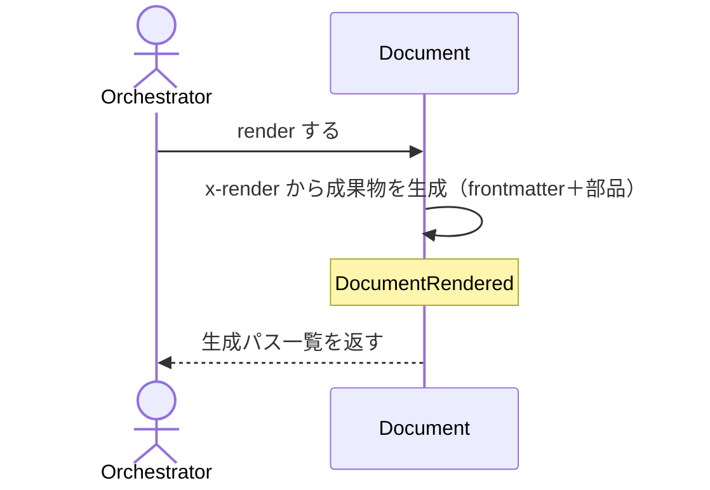

# uc-render-document

---

## 概要

検証済みの Document を schema の x-render に従って人間可読な成果物（SKILL.md / HTML / .feature）に描画し、配置先へ反映する。

---

## 主アクターと意図

- **主アクター**: Orchestrator（HarnessAgent）
- **意図**: 対象 Document を成果物に描画し、canonical と deploy 先へ反映する

---

## 事前条件

- 対象 Document が存在し、schemaRef を持つ

---

## 基本フロー



---

## 事後条件

- Document が RENDERED 状態になる
- DocumentRendered が発行される
- 成果物が canonical に書かれ、deploy 先へ verbatim コピーされる

---

## 受け入れ基準

- When 対象 Document が与えられたとき、engine は x-render に従い成果物を生成する shall。
- When deploy が有効なとき、engine は canonical と deploy 先の両方へ書き込む shall。
- If schemaRef が無いとき、engine は MISSING_SCHEMA_REF を返し描画しない shall。

---

## 操作保証

- When 同じ Document を複数回 render したとき、engine は常に同一の成果物を生成する shall（決定的：入力が同じなら出力も同じ）。

---

## エラー

| コード | 条件 |
|---|---|
| `MISSING_SCHEMA_REF` | schemaRef が無い（描画しない） |
| `INVALID_PATH` | 対象パスが存在しない |

---

## テストシナリオ

### 検証済み Document を成果物に描画する

| 分類 | 観点 |
|---|---|
| 正常系 | 描画：x-render に従い成果物と生成パスを返す |

```gherkin
Scenario: 検証済み Document を成果物に描画する
  Given 描画対象の Document
  When render する
  Then 成果物が生成され、生成パス一覧が返る
```

### schemaRef を持たない Document は描画しない

| 分類 | 観点 |
|---|---|
| 異常系 | エラー：schemaRef 欠如は MISSING_SCHEMA_REF |

```gherkin
Scenario: schemaRef を持たない Document は描画しない
  Given schemaRef の無い Document
  When render する
  Then MISSING_SCHEMA_REF エラーが返る
```

### 存在しないパスは描画しない

| 分類 | 観点 |
|---|---|
| 異常系 | エラー：対象パスが存在しないときは INVALID_PATH |

```gherkin
Scenario: 存在しないパスは描画しない
  When 存在しないパスを対象に render する
  Then INVALID_PATH エラーが返る
```

### deploy すると canonical と deploy 先の両方に書く

| 分類 | 観点 |
|---|---|
| 正常系 | 受け入れ基準：deploy が有効なとき canonical と deploy 先の両方へ書き込む |

```gherkin
Scenario: deploy すると canonical と deploy 先の両方に書く
  Given deploy 先を持つ Document
  When deploy を有効にして render する
  Then canonical と deploy 先の両方に成果物が書かれる
```

---

## 操作保証シナリオ

### 同じDocumentを2回renderしても同一の成果物になる

| 分類 | 観点 |
|---|---|
| 境界値 | 決定性：入力が変わらなければ出力も変わらない |

```gherkin
Scenario: 同じDocumentを2回renderしても同一の成果物になる
  Given 変更されていないDocument
  When 同じDocumentを2回renderする
  Then 1回目と2回目の成果物は同一である
```
