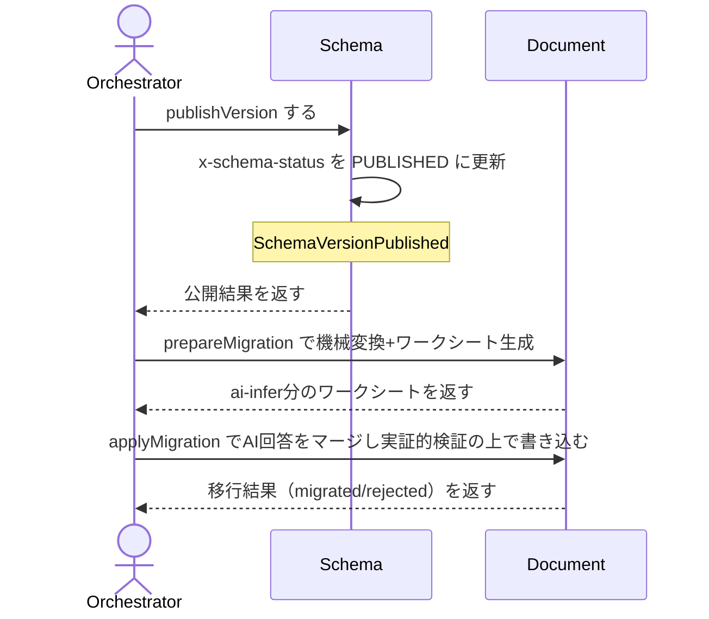

# uc-migrate-schema-version

---

## 概要

Schemaの新版公開(publishVersion)・旧版非推奨化(deprecateVersion)・既存Documentの移行(prepareMigration/applyMigration)を行う。

---

## 主アクターと意図

- **主アクター**: Orchestrator（HarnessAgent）
- **意図**: Schemaを新版として公開し、旧版を非推奨にし、既存Documentを安全に新版へ移行したい

---

## 事前条件

- publishVersion: 公開対象のSchemaファイルが実在し、x-schema-statusが未設定である
- deprecateVersion: 対象のSchemaファイルがPUBLISHEDである
- prepareMigration/applyMigration: 移行先のtoSchemaRefが解決可能である

---

## 基本フロー



---

## 事後条件

- publishVersion成功後、以後その版でDocumentをscaffold可能になる
- deprecateVersion成功後、新規Document作成は止まるが既存は移行まで有効
- applyMigration成功後、対象Documentのschema Refが新版に更新され、旧版の内容は上書きされない(検証失敗時)

---

## 受け入れ基準

- When 未公開のSchemaにpublishVersionを実行したとき、engineはx-schema-statusをPUBLISHEDにする shall。
- When 既に公開済みのSchemaにpublishVersionを実行したとき、engineはALREADY_PUBLISHEDを返す shall。
- When PUBLISHEDのSchemaにdeprecateVersionを実行したとき、engineはx-schema-statusをDEPRECATEDにする shall。
- When PUBLISHED以外のSchemaにdeprecateVersionを実行したとき、engineはINVALID_STATEを返す shall。
- When prepareMigrationを実行したとき、engineはx-migrationのrename/default/value-map/discriminator-remapを機械的に適用し、ai-infer宣言を持つフィールドだけをワークシートとして返す shall。
- When applyMigrationでAIの回答が新schemaに適合するとき、engineはDocumentを書き込む shall。
- When applyMigrationでAIの回答が新schemaに不適合のとき、engineは書き込まずrejectedとして報告する shall（安全網）。
- When 版を下げる方向へprepareMigrationを実行したとき、engineはINVALID_MIGRATION_DIRECTIONを返す shall。

---

## エラー

| コード | 条件 |
|---|---|
| `ALREADY_PUBLISHED` | publishVersionの対象が既にx-schema-statusを持つ |
| `INVALID_STATE` | deprecateVersionの対象がPUBLISHEDでない |
| `INVALID_MIGRATION_DIRECTION` | fromSchemaRefのバージョン番号がtoSchemaRef以上 |
| `INVALID_SCHEMA_REF` | schemaRefを解決できない |

---

## テストシナリオ

### publishVersionは未公開のschemaをPUBLISHEDにする

| 分類 | 観点 |
|---|---|
| 正常系 | publishVersion：未公開のSchemaを公開する |

```gherkin
Scenario: publishVersionは未公開のschemaをPUBLISHEDにする
  Given x-schema-statusが未設定のSchemaファイル
  When publishVersionを実行する
  Then x-schema-statusがPUBLISHEDになる
```

### publishVersionは既に公開済みのschemaを拒否する

| 分類 | 観点 |
|---|---|
| 異常系 | publishVersion：二重公開の拒否 |

```gherkin
Scenario: publishVersionは既に公開済みのschemaを拒否する
  Given x-schema-statusが既に設定されたSchemaファイル
  When publishVersionを実行する
  Then ALREADY_PUBLISHEDエラーが返る
```

### deprecateVersionはPUBLISHEDをDEPRECATEDにする

| 分類 | 観点 |
|---|---|
| 正常系 | deprecateVersion：公開済み版の非推奨化 |

```gherkin
Scenario: deprecateVersionはPUBLISHEDをDEPRECATEDにする
  Given PUBLISHEDのSchemaファイル
  When deprecateVersionを実行する
  Then x-schema-statusがDEPRECATEDになる
```

### deprecateVersionはPUBLISHED以外を拒否する

| 分類 | 観点 |
|---|---|
| 異常系 | deprecateVersion：前提状態違反の拒否 |

```gherkin
Scenario: deprecateVersionはPUBLISHED以外を拒否する
  Given PUBLISHED以外の状態のSchemaファイル
  When deprecateVersionを実行する
  Then INVALID_STATEエラーが返る
```

### prepareMigrationは機械変換を適用しai-infer分のワークシートを作る

| 分類 | 観点 |
|---|---|
| 正常系 | prepareMigration：機械変換とAI推論の分離 |

```gherkin
Scenario: prepareMigrationは機械変換を適用しai-infer分のワークシートを作る
  Given rename/default/ai-infer宣言を持つ新schemaと旧schema形状のDocument
  When prepareMigrationを実行する
  Then 機械変換フィールドは適用され、ai-infer分だけがワークシートとして返る
```

### applyMigrationはAI回答をマージし検証をパスすれば書き込む

| 分類 | 観点 |
|---|---|
| 正常系 | applyMigration：AI回答の反映 |

```gherkin
Scenario: applyMigrationはAI回答をマージし検証をパスすれば書き込む
  Given 機械変換済みの部分DocumentとAIが埋めたai-infer分の回答
  When applyMigrationを実行する
  Then マージ結果が新schemaで検証に通り書き込まれる
```

### applyMigrationはAIの不正な回答を安全網で拒否する

| 分類 | 観点 |
|---|---|
| 境界値 | applyMigration：不正なAI回答の安全網 |

```gherkin
Scenario: applyMigrationはAIの不正な回答を安全網で拒否する
  Given 新schemaのenum範囲外の値を含むAI回答
  When applyMigrationを実行する
  Then 書き込まれずrejectedとして報告される
```

### value-mapとdiscriminator-remapで実際のspecKind移行を機械的に処理する

| 分類 | 観点 |
|---|---|
| 正常系 | prepareMigration：値の対応表・構造パターンによる機械的な移行 |

```gherkin
Scenario: value-mapとdiscriminator-remapで実際のspecKind移行を機械的に処理する
  Given value-map/discriminator-remap宣言を持つ新schemaと、旧documentType/specKindを持つDocument
  When prepareMigrationを実行する
  Then 値の対応表と旧content構造の照合により、AIの推論を介さず機械的に新しい値へ変換される
```
