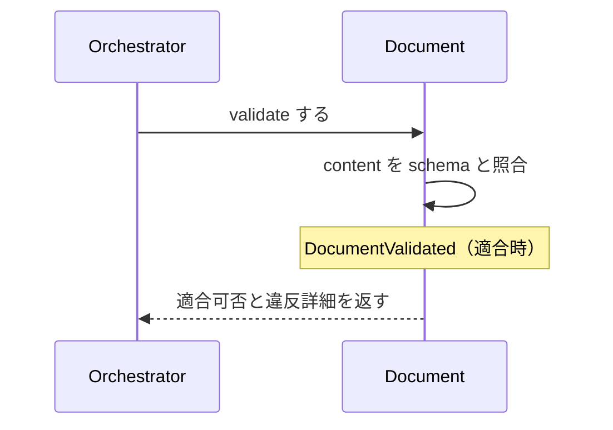

# uc-validate-document

---

## 概要

Document の content が schema に適合するかを検証し、適合可否と違反詳細を返す（副作用なし）。

---

## 主アクターと意図

- **主アクター**: Orchestrator（HarnessAgent）
- **意図**: 対象 Document が schema に適合するかを判定し、進められるか確かめる

---

## 事前条件

- 対象 Document が存在する

---

## 基本フロー



---

## 事後条件

- 適合なら VALIDATED へ進めてよいという判定が返る
- 適合時は DocumentValidated が発行される
- status 自体は書き換えない（判定のみ・冪等）

---

## 受け入れ基準

- When 適合する Document が与えられたとき、engine は VALIDATED 判定を返す shall。
- When 不適合のとき、engine は違反詳細つきで失敗を返す shall。
- If schemaRef が無いとき、engine は MISSING_SCHEMA_REF を返す shall。
- While 検証中、engine は Document の status を書き換えない shall（副作用なし）。

---

## エラー

| コード | 条件 |
|---|---|
| `VALIDATION_FAILED` | schema に不適合（違反詳細つきで失敗・status は変えない） |
| `MISSING_SCHEMA_REF` | schemaRef が無い |

---

## テストシナリオ

### 適合する Document は VALIDATED 判定になる

| 分類 | 観点 |
|---|---|
| 正常系 | 適合判定：適合する Document は VALIDATED |

```gherkin
Scenario: 適合する Document は VALIDATED 判定になる
  Given schema に適合する Document
  When validate する
  Then VALIDATED 判定が返る
```

### 不適合は違反詳細つきで失敗する

| 分類 | 観点 |
|---|---|
| 異常系 | 適合判定：不適合は違反詳細つきで失敗 |

```gherkin
Scenario: 不適合は違反詳細つきで失敗する
  Given schema に適合しない Document
  When validate する
  Then 違反詳細つきで失敗する
```
