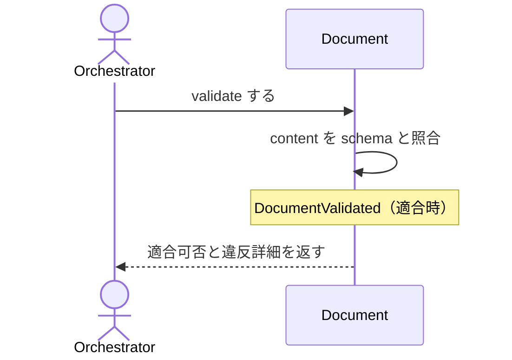

# uc-validate-document

---

## 概要

Document の content が schema に適合するかを検証し、適合可否と違反詳細を返す（副作用なし）。

---

## 主アクターと意図

- **主アクター**: Orchestrator（HarnessAgent）
- **意図**: 対象 Document が schema に適合するかを判定し、進められるか確かめる

---

## 事前条件

- 対象 Document が存在する

---

## 基本フロー



---

## 事後条件

- 適合なら VALIDATED へ進めてよいという判定が返る
- 適合時は DocumentValidated が発行される
- status 自体は書き換えない（判定のみ・冪等）

---

## 受け入れ基準

- When 適合する Document が与えられたとき、engine は VALIDATED 判定を返す shall。
- When 不適合のとき、engine は違反詳細つきで失敗を返す shall。
- If schemaRef が無いとき、engine は MISSING_SCHEMA_REF を返す shall。
- While 検証中、engine は Document の status を書き換えない shall（副作用なし）。

---

## 操作保証

- When 対象パスが存在しないとき、engine は INVALID_PATH エラーを返す shall（リポジトリによる解決プロセス自体の契約・DocumentRepositoryを介して判定する）。
- When 対象のschemaRefを解決できないとき、engine は INVALID_SCHEMA_REF エラーを返す shall（リポジトリによる解決プロセス自体の契約・SchemaRepositoryを介して判定する）。

---

## エラー

| コード | 条件 |
|---|---|
| `VALIDATION_FAILED` | schema に不適合（違反詳細つきで失敗・status は変えない） |

---

## 受け入れシナリオ

### 適合する Document は VALIDATED 判定になる

| 分類 | 観点 |
|---|---|
| 正常系 | 適合判定：適合する Document は VALIDATED |

```gherkin
Scenario: 適合する Document は VALIDATED 判定になる
  Given schema に適合する Document
  When validate する
  Then VALIDATED 判定が返る
```

### 不適合は違反詳細つきで失敗する

| 分類 | 観点 |
|---|---|
| 異常系 | 適合判定：不適合は違反詳細つきで失敗 |

```gherkin
Scenario: 不適合は違反詳細つきで失敗する
  Given schema に適合しない Document
  When validate する
  Then 違反詳細つきで失敗する
```

### schemaRef を持たない Document は検証できない

| 分類 | 観点 |
|---|---|
| 異常系 | エラー：schemaRef 欠如は MISSING_SCHEMA_REF |

```gherkin
Scenario: schemaRef を持たない Document は検証できない
  Given schemaRef の無い Document
  When validate する
  Then MISSING_SCHEMA_REF エラーが返る
```

### 既存documentはschemaに適合する

| 分類 | 観点 |
|---|---|
| 正常系 | dogfood：waffle自身が持つ全document(skill/coding/spec)がそれぞれのschemaに適合し、正しいstatusになる(dogfood横断regression) |

```gherkin
Scenario Outline: 既存documentはschemaに適合する
  Given waffle自身のdocument
  When validateする
  Then 成功し、schemaのlifecycleに応じた正しいstatusになる
```

### SUPERSEDEDは終端でありvalidateを受け付けない

| 分類 | 観点 |
|---|---|
| 異常系 | usecase配線：SUPERSEDED状態のDocumentに対しvalidate engineがINVALID_TRANSITIONを返す(agg-documentの不変条件はdomain層で純粋検証済み・ここではusecaseの編成を検証する) |

```gherkin
Scenario: SUPERSEDEDは終端でありvalidateを受け付けない
  Given SUPERSEDED状態のDocument
  When validateする
  Then INVALID_TRANSITIONエラーが返る
```

### 不正なJSONはINVALID_JSON

| 分類 | 観点 |
|---|---|
| 異常系 | エラー：対象ファイルがJSONとして解釈できないときの失敗 |

```gherkin
Scenario: 不正なJSONはINVALID_JSON
  Given 不正なJSONの対象ファイル
  When validateする
  Then INVALID_JSONエラーが返る
```

---

## 操作保証シナリオ

### 存在しないパスはINVALID_PATH

| 分類 | 観点 |
|---|---|
| 異常系 | リポジトリ解決契約：対象パスが実在しないとき、DocumentRepositoryを介した解決に失敗しINVALID_PATHになる |

```gherkin
Scenario: 存在しないパスはINVALID_PATH
  Given 実在しない対象パス
  When 本usecaseを実行する
  Then INVALID_PATHエラーが返る
```

### 解決できないschemaRefはINVALID_SCHEMA_REF

| 分類 | 観点 |
|---|---|
| 異常系 | リポジトリ解決契約：schemaRefを解決できないとき、SchemaRepositoryを介した解決に失敗しINVALID_SCHEMA_REFになる |

```gherkin
Scenario: 解決できないschemaRefはINVALID_SCHEMA_REF
  Given 解決できないschemaRef
  When 本usecaseを実行する
  Then INVALID_SCHEMA_REFエラーが返る
```
