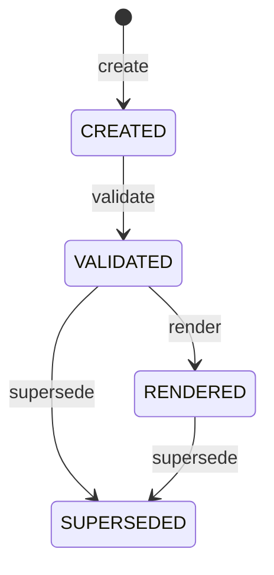

# Document（document.json）の一貫性とライフサイクルを守る集約：agg-document

## 概要

- Document(document.json)の一貫性とライフサイクルを表す集約。Spec家族系（DomainSpecSchema/PresentationSpecSchema）は生成→検証→描画→置換の「処理パイプライン」（lifecycle）を持つ。CodingSchema/SkillSchema系はDRAFT/ACTIVE/DEPRECATEDという分類ラベルを持つが、遷移を強制するcommand・guardは存在しない。

---

## 集約ルート

Document

### 外部参照（ID）

- Schema

---

## エンティティ

### Document（集約ルート）

構造化された成果物の一貫性単位

| 属性 | 型 |
|---|---|
| **documentId**（識別子） | DocumentId |
| documentType | DocumentType |
| schemaRef | SchemaRef |
| status | Status |
| specKind | DiscriminatorValue |
| codingKind | DiscriminatorValue |
| skillKind | DiscriminatorValue |
| agentKind | DiscriminatorValue |
| templateKind | DiscriminatorValue |
| subdomainRef | DocumentId |
| aggregateRef | DocumentId |
| skillRef | DocumentId |
| stack | 文字列配列 |
| createdAt | 日時文字列（ISO8601） |
| updatedAt | 日時文字列（ISO8601） |
| content | 構造化データ（schema 準拠） |
| tags | 文字列配列 |

---

## 値オブジェクト

### DocumentId

| 表す値 | 振る舞い |
|---|---|
| 一意な識別子 | 不変。kebab-case。value が等しければ等価。 |

| 属性 | 型 |
|---|---|
| value | string |

### DocumentType

| 表す値 | 振る舞い |
|---|---|
| Document が属するschema家族の種別（例: DomainSpec/PresentationSpec/Coding/Skill/Knowledge/Agent/Template） | 独立した業務情報ではなく、schemaRefが指すschema自身が宣言する固定値（schemaRefと1対1）。値が等しければ等価。 |

| 属性 | 型 |
|---|---|
| value | string |

### DiscriminatorValue

| 表す値 | 振る舞い |
|---|---|
| documentTypeに応じて名前が変わる分岐値（specKind/codingKind/skillKind/agentKind/templateKindのいずれか1つのみ出現する）。schemaのKindProfileが定義するenumの1つ。KnowledgeSchemaのように形が単一のdocumentTypeでは出現しない。 | documentType家族ごとに排他的（1つのDocumentにつき同時に複数出現しない）。値が等しければ等価。 |

| 属性 | 型 |
|---|---|
| value | string |

### SchemaRef

| 表す値 | 振る舞い |
|---|---|
| 適合する Schema への参照 | name と version の組。両方が等しければ等価。 |

| 属性 | 型 |
|---|---|
| name | string |
| version | string |

### Status

| 表す値 | 振る舞い |
|---|---|
| ライフサイクル状態 | Spec家族系（DomainSpecSchema/PresentationSpecSchema）: enum CREATED/VALIDATED/RENDERED/SUPERSEDED（lifecycle・遷移はguardで守る）。CodingSchema/SkillSchema/KnowledgeSchema/AgentSchema/TemplateSchema 系: enum DRAFT/ACTIVE/DEPRECATED（分類ラベル・遷移を強制するcommand・guardは無い）。documentType ごとにどちらか一方のみを持つ。値が等しければ等価。 |

| 属性 | 型 |
|---|---|
| value | string |

---

## 不変条件

| ルール | 守り方 | 根拠 |
|---|---|---|
| Spec家族（DomainSpecSchema/PresentationSpecSchema）のstatusはCREATED→VALIDATED→RENDERED→SUPERSEDEDの順にのみ進み、逆行・飛ばしをしない | guard | - 成果物の状態の一貫性を保つ |
| schemaRefは常に存在する | schema | - 型が無ければ検証も描画もできない |
| contentがschemaに適合しない限りVALIDATEDへ進めない | guard | - 不正な成果物を後段（render/deploy）に流さない |
| schemaがrenderを状態遷移コマンドとして宣言する場合、VALIDATED以降でなければrenderできない（宣言しないschema種別はstatusを問わない） | guard | - 未検証の成果物がdeploy先（CLAUDE.md/SKILL.md等の生きているファイル）へ反映されることを防ぐ |
| SUPERSEDEDは終端であり、以後どのコマンドも受け付けない | guard | - 置換後の変更を防ぐ |
| Documentのパス解決は、いかなるoperation・commandからも常にプロジェクトルート内に閉じ込められる（パストラバーサルを許さない） | guard | - ファイルアクセスというデータアクセス層の技術的関心事だが、Document集約が扱う全ての操作に横断的に適用される不変条件であり、特定usecaseの業務シナリオではなく集約の不変条件として一箇所で保証する |
| schemaRefを持たないDocumentを対象にした、schema解決を要する操作は、いかなるoperation・commandからも常にMISSING_SCHEMA_REFとして拒否される | guard | - 「schemaRefは常に存在する」は理想状態の不変条件だが、scaffold直後の未検証Document等、実際には欠けている状態が生じうる<br>- render/validateが個別に対応していた（重複）この防御的振る舞いを集約の不変条件として一箇所で保証する |

---

## ライフサイクル



### 遷移

| from | to | command | 条件 |
|---|---|---|---|
| [*] | CREATED | create |  |
| CREATED | VALIDATED | validate | schema に適合 |
| VALIDATED | RENDERED | render |  |
| VALIDATED | SUPERSEDED | supersede |  |
| RENDERED | SUPERSEDED | supersede |  |

---

## コマンド

### create

schemaRef と documentId から schema 準拠の骨格を生成する（schemaRef 常在の不変条件を満たす）。

| 前提 | 後 | 発行イベント |
|---|---|---|
| （新規） | CREATED | DocumentCreated |

| 引数 | 意味 |
|---|---|
| schemaRef | 適用する schema |
| documentId | 新しい識別子 |

### validate

content が schema に適合するか判定する（適合判定の不変条件を守る・副作用なし・判定結果の永続化はscaffold fillで別途行う）。

| 前提 | 後 | 発行イベント |
|---|---|---|
| CREATED | VALIDATED | DocumentValidated |

### render

x-render に従い成果物に描画し配置先へ反映する（schemaがrenderを状態遷移コマンドとして宣言する場合はVALIDATED前提の不変条件を守る。宣言しないschema種別はstatusを問わない）。

| 前提 | 後 | 発行イベント |
|---|---|---|
| VALIDATED | RENDERED | DocumentRendered, DocumentDeployed |

### supersede

後続版に置き換えて終端化する（終端の不変条件を確立する）。

| 前提 | 後 | 発行イベント |
|---|---|---|
| VALIDATED / RENDERED | SUPERSEDED | DocumentSuperseded |

| 引数 | 意味 |
|---|---|
| successorId | 後継 Document の識別子 |

---

## ドメインイベント

### DocumentValidated

#### 発行契機

validate 成功時

#### ペイロード

| 項目 | 意味 |
|---|---|
| documentId | 対象の識別子 |
| schemaRef | 適合した schema |

### DocumentRendered

#### 発行契機

render 成功時

#### ペイロード

| 項目 | 意味 |
|---|---|
| documentId | 対象の識別子 |
| outputs | 生成された成果物のパス一覧 |

### DocumentDeployed

#### 発行契機

render が deploy 先を持つ Document を描画した時

#### ペイロード

| 項目 | 意味 |
|---|---|
| documentId | 対象の識別子 |
| targets | 反映された各ツールの配置先 |

### DocumentSuperseded

#### 発行契機

supersede 成功時

#### ペイロード

| 項目 | 意味 |
|---|---|
| documentId | 対象の識別子 |
| successorId | 後継の識別子 |

---

## 不変条件シナリオ

### status は逆行できない

| 分類 | 観点 |
|---|---|
| 異常系 | 状態遷移：前進のみの不変条件が効く |

```gherkin
Scenario: status は逆行できない
  Given RENDERED 状態の Document
  When validate へ戻そうとする
  Then 状態遷移は拒否され、状態は RENDERED のままである
```

### 未検証では render できない

| 分類 | 観点 |
|---|---|
| 異常系 | 状態遷移：schemaがrenderをVALIDATED起点の遷移として宣言する場合、VALIDATED前提が効く |

```gherkin
Scenario: 未検証では render できない
  Given schemaがrenderをVALIDATED起点の遷移として宣言しているのに、CREATED状態のDocument
  When render する
  Then 拒否され、成果物は書き出されない
```

### SUPERSEDED は終端

| 分類 | 観点 |
|---|---|
| 異常系 | 状態遷移：終端状態は不変 |

```gherkin
Scenario: SUPERSEDED は終端
  Given SUPERSEDED 状態の Document
  When 任意のコマンドを実行する
  Then 拒否される
```

### パストラバーサルを含むパスは拒否される

| 分類 | 観点 |
|---|---|
| 異常系 | パス解決：'..'を含むパスはどのoperationでも拒否される |

```gherkin
Scenario: パストラバーサルを含むパスは拒否される
  Given '..' を含む対象パス
  When 任意の operation・command を実行する
  Then INVALID_PATH エラーが返り、プロジェクトルート外へはアクセスしない
```

### ディレクトリ横断はプロジェクトルート外を拒否する

| 分類 | 観点 |
|---|---|
| 異常系 | パス解決：index_scan_dir等のディレクトリ横断操作もルート外を拒否する |

```gherkin
Scenario: ディレクトリ横断はプロジェクトルート外を拒否する
  Given プロジェクトルート外を指すディレクトリパス
  When index_scan_dir を実行する
  Then INVALID_PATH エラーが返る
```

### schemaRefを持たないDocumentはMISSING_SCHEMA_REFとして拒否される

| 分類 | 観点 |
|---|---|
| 異常系 | パス解決：schema解決を要するoperation・commandはschemaRef欠如を同じ扱いにする |

```gherkin
Scenario: schemaRefを持たないDocumentはMISSING_SCHEMA_REFとして拒否される
  Given schemaRef を持たない Document
  When schema 解決を要する operation・command を実行する
  Then MISSING_SCHEMA_REF エラーが返る
```
