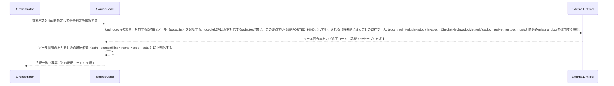

# uc-lint-docstring

---

## 概要

ソースコードの docstring が規約どおりの構造か（必須セクションの有無・引数名と実シグネチャの整合）を、kind ごとに確立された既存 lint ツールを呼び出して判定する。自前の照合ロジックは持たない。

---

## 名前

LintDocstring

---

## 主アクターと意図

- **主アクター**: Orchestrator（HarnessAgent）
- **意図**: 対象コードベースの docstring が規約どおりの構造か（必須セクションの有無・引数名と実シグネチャの整合）を確認したい

---

## 存在意義

docstringが実装のシグネチャと乖離したまま放置されると、AIがソースコード本体を読まずにdocstringだけを頼りに判断する他usecase（uc-scan-source-code等）の前提が崩れる。自前の照合ロジックを持たず既存lintツールに委ねているのは車輪の再発明を避ける判断だが、規約適合を機械的に確認する入口が無ければ、docstringの陳腐化がAIの誤判断として静かに伝播するリスクを防げない。

---

## 関与する外部

- kind ごとの既存 lint ツール（実体・調査確定済み）: google→pydoclint / tsdoc→eslint-plugin-jsdoc（check-param-names 系ルール）/ javadoc→Checkstyle JavadocMethod / godoc→revive（exported ルール・有無のみ）/ rustdoc→rustc 組み込み missing_docs lint（有無のみ）
- uc-scan-source-code（対象要素一覧・signatureParams の入力元。ツールの出力正規化に使う）

---

## 事前条件

- 対象コードベース（ディレクトリ）のパスが要望テキストで与えられている
- 対象言語に対応する DocstringSchema の kind が解決できる

---

## 基本フロー



---

## 事後条件

- 適合判定はkindごとに確立された既存lintツールが行う想定（自前の照合ロジックは持たない）: google→pydoclint（実装済み）/ tsdoc→eslint-plugin-jsdoc / javadoc→Checkstyle JavadocMethod / godoc→revive / rustdoc→rustc組み込みmissing_docs（これら4kindのadapterは未実装。将来追加時の設計として保持）
- ★現状の実装ではgoogle以外のkindを指定すると、要素ごとのdocstring有無判定を含め一切の部分結果を返さずUNSUPPORTED_KINDエラーとなる（godoc/rustdocの「docstring有無のみ判定」は将来adapterを実装した際の設計であり、現状の挙動ではない）
- 違反が無ければ空配列が返る（全要素が適合）
- 違反があれば、次のフィールドを持つオブジェクトの配列で返る: path・elementKind・name（違反した要素の特定）・code（違反コード。MISSING_DOC_COMMENT/ARGS_MISMATCH/MISSING_ARGS_SECTION/MISSING_RETURNS_SECTION/MISSING_RAISES_SECTIONのいずれか。ツール固有の診断はcodeに正規化して吸収する）・detail（ツールの元メッセージ。人が読むための補足）
- 1つの要素が複数の違反を同時に持つ場合は、要素ごとに複数のオブジェクトを返す（1違反=1オブジェクト）
- docstringの“意味”（要約行の語選びの適切さ等）は判定しない（機械判定できない範囲は対象外）
- docstringの有無判定（MISSING_DOC_COMMENT）はclass/functionの要素のみを対象とし、module要素（ファイル自体）は対象外とする（モジュールレベルのdocstringは慣習的に必須とされないため）
- 要約行のみの短いdocstringであっても、Args/Returns/Raisesセクションの要否は要約の長さに関わらず判定する（言語仕様で決まる構造上の要否は、書かれた分量に左右されない不変のルールであるため）
- 非公開要素（言語の命名規約上privateと判定できる要素。Pythonでは先頭が_の識別子）は、Args/Returns/Raisesセクションの要否判定の対象外とする（公開要素のみ必須というcoding-standard側の規約と一貫させる）

---

## 受け入れ基準

- When kindがgoogleのとき、システムは対応する既存lintツール（pydoclint）を起動し、その出力を正規化して返す shall。
- If kindがgoogle以外のとき、システムはUNSUPPORTED_KINDエラーを返す shall（対応するadapterが未実装のため。将来adapterを追加した際は、godoc/rustdocはdocstringの有無のみを判定しARGS_MISMATCH相当は判定しない設計とする）。
- When 既存lintツールが「引数の記載漏れ・余分な記載」を報告したとき、システムはこれをcode=ARGS_MISMATCHとして正規化する shall。
- When 要素のhasDocstringがfalseのとき、システムはcode=MISSING_DOC_COMMENTの違反として報告する shall。
- When 公開関数が引数を持つのにArgsセクションを欠いているとき、システムはcode=MISSING_ARGS_SECTIONの違反として報告する shall。
- When 公開関数が戻り値を持つのにReturnsセクションを欠いているとき、システムはcode=MISSING_RETURNS_SECTIONの違反として報告する shall。
- When 公開関数が例外を送出するのにRaisesセクションを欠いているとき、システムはcode=MISSING_RAISES_SECTIONの違反として報告する shall。
- While 非公開要素であるとき、システムはMISSING_ARGS_SECTION/MISSING_RETURNS_SECTION/MISSING_RAISES_SECTIONの判定対象から除外する shall。
- While 全要素が適合しているとき、システムは空配列を返す（正常系）shall。
- If 対象言語に対応するDocstringSchemaのkindが無い、またはkindに対応するadapterが未実装のとき、システムはUNSUPPORTED_KINDエラーを返す shall。
- If kindに対応する既存lintツールが実行環境に存在しないとき、システムはTOOL_NOT_AVAILABLEエラーを返す shall。

---

## 操作保証

- When 対象パスが存在しないとき、システムは INVALID_PATH エラーを返す shall（対象を特定し取得する解決プロセス自体の契約であり、複数のusecaseに共通する）。

---

## エラー

| コード | 条件 |
|---|---|
| `UNSUPPORTED_KIND` | 対象言語に対応する DocstringSchema の kind が無い |
| `TOOL_NOT_AVAILABLE` | kind に対応する既存 lint ツールが実行環境に存在しない |

---

## 受け入れシナリオ

### 全要素が規約に適合するとき違反なしと判定する

| 分類 | 観点 |
|---|---|
| 正常系 | 適合：違反ゼロは正常系（空配列） |

```gherkin
Scenario: 全要素が規約に適合するとき違反なしと判定する
  Given DocstringSchema の google kind に適合する docstring だけを持つコードベース
  When 適合判定を実行する
  Then 違反は空配列で返り、エラーにはならない
```

### docstring が無い公開要素を検出する

| 分類 | 観点 |
|---|---|
| 異常系 | 違反：MISSING_DOC_COMMENT |

```gherkin
Scenario: docstring が無い公開要素を検出する
  Given docstring を持たない公開関数を含むコードベース
  When 適合判定を実行する
  Then その要素について MISSING_DOC_COMMENT 違反が報告される
```

### Args の引数名がシグネチャと不一致な要素を検出する

| 分類 | 観点 |
|---|---|
| 異常系 | 違反：ARGS_MISMATCH（構造照合の核） |

```gherkin
Scenario: Args の引数名がシグネチャと不一致な要素を検出する
  Given Args セクションの引数名が実シグネチャと異なる関数を含むコードベース
  When 適合判定を実行する
  Then その要素について ARGS_MISMATCH 違反が報告される
```

### 要約行のみの短いdocstringでもArgsセクション欠落を検出する

| 分類 | 観点 |
|---|---|
| 異常系 | 違反：MISSING_ARGS_SECTION（短いdocstringが構造チェックを免れないことの確認） |

```gherkin
Scenario: 要約行のみの短いdocstringでもArgsセクション欠落を検出する
  Given 引数を持つ公開関数が、要約行のみでArgsセクションを持たない短いdocstringを持つコードベース
  When 適合判定を実行する
  Then その要素について MISSING_ARGS_SECTION 違反が報告される
```

### Returnsセクションの欠落を検出する

| 分類 | 観点 |
|---|---|
| 異常系 | 違反：MISSING_RETURNS_SECTION |

```gherkin
Scenario: Returnsセクションの欠落を検出する
  Given 戻り値を持つ公開関数が、Returnsセクションを持たないdocstringを持つコードベース
  When 適合判定を実行する
  Then その要素について MISSING_RETURNS_SECTION 違反が報告される
```

### Raisesセクションの欠落を検出する

| 分類 | 観点 |
|---|---|
| 異常系 | 違反：MISSING_RAISES_SECTION |

```gherkin
Scenario: Raisesセクションの欠落を検出する
  Given 例外を送出する公開関数が、Raisesセクションを持たないdocstringを持つコードベース
  When 適合判定を実行する
  Then その要素について MISSING_RAISES_SECTION 違反が報告される
```

### 非公開要素はセクション欠落判定の対象外とする

| 分類 | 観点 |
|---|---|
| 境界値 | 適用範囲：privateはcoding-standardの規約通り任意のまま |

```gherkin
Scenario: 非公開要素はセクション欠落判定の対象外とする
  Given 引数・戻り値・例外を持つがdocstringのセクションを欠く非公開関数を含むコードベース
  When 適合判定を実行する
  Then MISSING_ARGS_SECTION・MISSING_RETURNS_SECTION・MISSING_RAISES_SECTIONのいずれも報告されない
```

### 対応する kind が無い言語は UNSUPPORTED_KIND

| 分類 | 観点 |
|---|---|
| 異常系 | エラー：未対応言語・未実装adapterの扱い（DocstringSchemaのenumに無いkind、またはgoogle以外の未実装kindのどちらも同じUNSUPPORTED_KINDになる） |

```gherkin
Scenario: 対応する kind が無い言語は UNSUPPORTED_KIND
  Given DocstringSchemaに定義の無い言語、またはgoogle以外の未実装kindのコードベース
  When 適合判定を実行する
  Then UNSUPPORTED_KINDエラーが返る
```

### 対応するツールが実行環境に無いとき TOOL_NOT_AVAILABLE

| 分類 | 観点 |
|---|---|
| 異常系 | エラー：既存ツール不在の扱い |

```gherkin
Scenario: 対応するツールが実行環境に無いとき TOOL_NOT_AVAILABLE
  Given kind に対応する lint ツールがインストールされていない環境
  When 適合判定を実行する
  Then TOOL_NOT_AVAILABLE エラーが返る
```

---

## 操作保証シナリオ

### 存在しないパスはINVALID_PATH

| 分類 | 観点 |
|---|---|
| 異常系 | 解決契約：対象パスが実在しないとき、パスの解決に失敗しINVALID_PATHになる |

```gherkin
Scenario: 存在しないパスはINVALID_PATH
  Given 実在しない対象パス
  When 本usecaseを実行する
  Then INVALID_PATHエラーが返る
```
