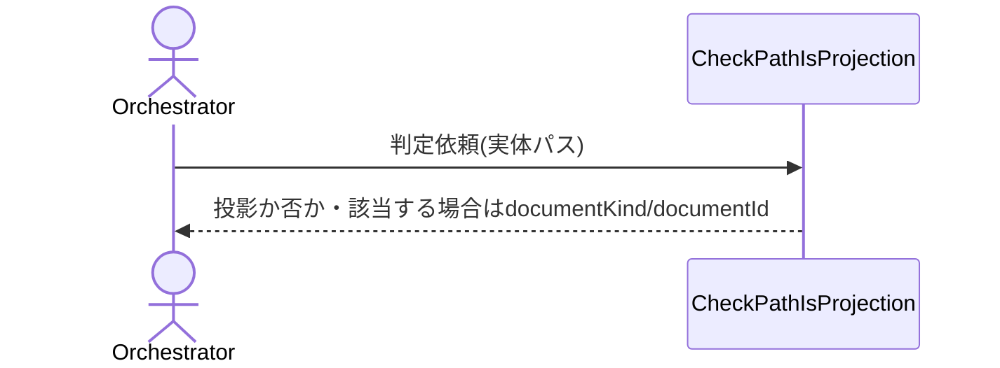

# uc-check-path-is-projection

## 概要

- document.jsonから機械的に生成された投影（render出力、例: SKILL.md・CLAUDE.md）を、原本を経由せず直接編集してしまう事故を防ぐため、対象ファイルの実体パスが投影であるかを機械的に判定する。

---

## 存在意義

- 投影は原本document.jsonからの機械的な導出結果であり、投影自体を直接書き換えると「投影＝原本からの導出結果である」という保証が壊れ、次のrenderで上書きされて変更が消失する、あるいは原本と投影が食い違ったまま気づかれない、という事故が実際に複数回起きている。この不変条件を機械的に強制する必要がある。

---

## 主アクターと意図

### 主アクター

Orchestrator

### 意図

Edit/Writeしようとしているファイルの実体パスが、document.json（原本）からの投影（render出力）かどうかを判定してもらう

---

## 基本フロー



---

## 事後条件

- 対象パスの実体が、いずれかのdocumentKindのcanonicalPathTemplateに一致する場合、isProjection=trueと該当するdocumentKind・documentIdが返る
- 一致しない場合、isProjection=falseが返る

---

## 受け入れ基準

- When 対象パスの実体がSkillのcanonicalPathTemplateに一致するとき、CheckPathIsProjectionはisProjection=trueと該当するdocumentIdを返さなければならない（shall）
- When 対象パスの実体がAgentのcanonicalPathTemplateに一致するとき、CheckPathIsProjectionはisProjection=trueと該当するdocumentIdを返さなければならない（shall）
- When 対象パスの実体がどのcanonicalPathTemplateにも一致しないとき、CheckPathIsProjectionはisProjection=falseを返さなければならない（shall）

---

## 操作保証

- When 同一の実体パスを渡したとき、CheckPathIsProjectionは呼び出し経路（直接呼び出し／CLI）によらず同一の判定結果を返さなければならない（shall）

---

## 受け入れシナリオ

### SkillのSKILL.mdの実体パスは投影と判定される

| 分類 | 観点 |
|---|---|
| 正常系 | 投影判定：Skillのcanonical出力先パターンに一致するか |

```gherkin
Given 実体パスが".waffle/skills/ddd-advisor/SKILL.md"である
When CheckPathIsProjectionを実行する
Then isProjection=trueが返り、documentKind="Skill"・documentId="ddd-advisor"が返る
```

### AgentのCLAUDE.md実体パスは投影と判定される

| 分類 | 観点 |
|---|---|
| 正常系 | 投影判定：Agentのcanonical出力先パターンに一致するか |

```gherkin
Given 実体パスが".waffle/agent/waffle.md"である
When CheckPathIsProjectionを実行する
Then isProjection=trueが返り、documentKind="Agent"・documentId="waffle"が返る
```

### 手書き参照ファイルの実体パスは投影と判定されない

| 分類 | 観点 |
|---|---|
| 境界値 | 適用範囲の境界：投影でも原本でもない手書きファイルを誤検出しないか |

```gherkin
Given 実体パスが".waffle/skills/ddd-advisor/references/knowledge/domain-model.md"である
When CheckPathIsProjectionを実行する
Then isProjection=falseが返る
```

### どのcanonicalPathTemplateにも一致しないパスは投影と判定されない

| 分類 | 観点 |
|---|---|
| 異常系 | 事前条件違反：未知の構造のパスを安全側（許可）に倒せるか |

```gherkin
Given 実体パスが"docs/README.md"である
When CheckPathIsProjectionを実行する
Then isProjection=falseが返る
```

---

## 操作保証シナリオ

### 直接呼び出しとCLI呼び出しで同じ判定結果になる

| 分類 | 観点 |
|---|---|
| 正常系 | 提供チャネルの一貫性：呼び出し経路によらず判定が変わらないか |

```gherkin
Given 実体パスが".waffle/skills/ddd-advisor/SKILL.md"である
When Pythonから直接CheckPathIsProjectionを呼び出す
Then isProjection=trueが返る
When 同じ入力をCLI経由（waffle check-path-is-projection）で呼び出す
Then 同じ判定結果が返る
```
