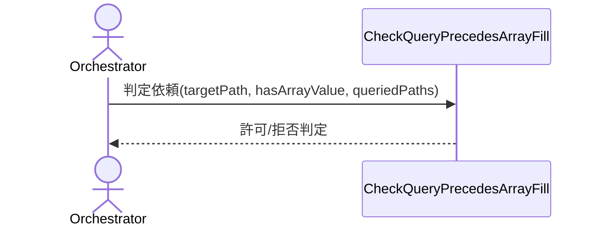

# uc-check-query-precedes-array-fill

## 概要

- 配列フィールドを含むdocument.jsonの書き込み（scaffold fill）は、既存の配列要素をqueryで確認せず上書きすると内容を消失させる事故が起きる。この操作順序制約（クエリ先行）を機械的に検証する。

---

## 存在意義

- queryを経ずに配列fillを行うと、既存の配列要素を無自覚に上書き・消失させる事故が起きる。CLAUDE.mdの運用ルール（配列はqueryで現在値取得→組み立て→fillで丸ごと置き換え）は文書化された手順にすぎず、AIエージェントがこれを毎回自発的に遵守する保証が無いため、機械的な強制が必要である。

---

## 主アクターと意図

### 主アクター

Orchestrator

### 意図

配列フィールドを含むscaffold fillを実行する前に、対象pathの現在値を先にqueryで確認済みかどうかを機械的に判定してもらう

---

## 基本フロー



---

## 事後条件

- hasArrayValueがtrueかつtargetPathがqueriedPathsに含まれない場合、拒否判定（理由付き）が返る
- 上記以外の場合、許可判定が返る

---

## 受け入れ基準

- When hasArrayValueがtrueかつtargetPathがqueriedPathsに含まれないとき、CheckQueryPrecedesArrayFillは拒否判定と理由を返さなければならない（shall）
- When hasArrayValueがtrueかつtargetPathがqueriedPathsに含まれるとき、CheckQueryPrecedesArrayFillは許可判定を返さなければならない（shall）
- When hasArrayValueがfalseのとき、CheckQueryPrecedesArrayFillはqueriedPathsの内容に関わらず許可判定を返さなければならない（shall）

---

## 操作保証

- When 同一の入力(targetPath, hasArrayValue, queriedPaths)を渡したとき、CheckQueryPrecedesArrayFillは呼び出し経路（直接呼び出し／CLI）によらず同一の判定結果を返さなければならない（shall）

---

## 受け入れシナリオ

### 配列値を含むfillで先行queryが無い場合は拒否される

| 分類 | 観点 |
|---|---|
| 異常系 | 事前条件違反：query先行の欠如を検出できるか |

```gherkin
Given targetPathが"X.json"であり、hasArrayValueがtrueである
And queriedPathsに"X.json"が含まれていない
When CheckQueryPrecedesArrayFillを実行する
Then 拒否判定が返り、理由に先行queryが必要である旨が含まれる
```

### 配列値を含むfillで先行queryがある場合は許可される

| 分類 | 観点 |
|---|---|
| 正常系 | 状態遷移：正しい手順を踏んだ場合に許可されるか |

```gherkin
Given targetPathが"X.json"であり、hasArrayValueがtrueである
And queriedPathsに"X.json"が含まれている
When CheckQueryPrecedesArrayFillを実行する
Then 許可判定が返る
```

### 配列値を含まないfillは先行queryの有無に関わらず許可される

| 分類 | 観点 |
|---|---|
| 境界値 | 適用範囲の境界：配列以外のfillはこの制約の対象外であることを確認 |

```gherkin
Given hasArrayValueがfalseである
And queriedPathsが空である
When CheckQueryPrecedesArrayFillを実行する
Then 許可判定が返る
```

---

## 操作保証シナリオ

### 直接呼び出しとCLI呼び出しで同じ判定結果になる

| 分類 | 観点 |
|---|---|
| 正常系 | 提供チャネルの一貫性：呼び出し経路によらず判定が変わらないか |

```gherkin
Given targetPathが"X.json"であり、hasArrayValueがtrueであり、queriedPathsに"X.json"が含まれていない
When Pythonから直接CheckQueryPrecedesArrayFillを呼び出す
Then 拒否判定が返る
When 同じ入力をCLI経由（waffle check-query-precedes-array-fill）で呼び出す
Then 同じ拒否判定が返る
```
