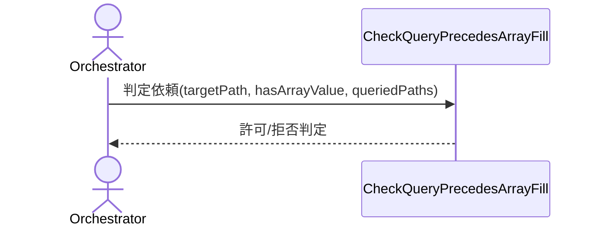

# uc-check-query-precedes-array-fill

## 概要

- 配列フィールドを含むdocument.jsonの書き込み（scaffold fill）は、既存の配列要素をqueryで確認せず上書きすると内容を消失させる事故が起きる。この操作順序制約（クエリ先行）を機械的に検証する。

---

## 存在意義

- queryを経ずに配列fillを行うと、既存の配列要素を無自覚に上書き・消失させる事故が起きる。CLAUDE.mdの運用ルール（配列はqueryで現在値取得→組み立て→fillで丸ごと置き換え）は文書化された手順にすぎず、AIエージェントがこれを毎回自発的に遵守する保証が無いため、機械的な強制が必要である。

---

## 主アクターと意図

### 主アクター

Orchestrator

### 意図

配列フィールドを含むscaffold fillを実行する前に、対象pathの現在値を先にqueryで確認済みかどうかを機械的に判定してもらう

---

## 入力

| 入力 | 説明 |
|---|---|
| `targetPath` | fill対象のdocument.jsonパス |
| `hasArrayValue` | 値に配列を含むか |
| `queriedPaths` | 同一セッション内で既にqueryされたpathのJSON配列。例: ["a.json"] |

---

## 基本フロー


```mermaid
sequenceDiagram
    actor Orchestrator
    Orchestrator->>CheckQueryPrecedesArrayFill: 判定依頼(targetPath, hasArrayValue, queriedPaths)
    CheckQueryPrecedesArrayFill-->>Orchestrator: 許可/拒否判定
```

---

## 事後条件

- hasArrayValueがtrueかつtargetPathがqueriedPathsに含まれない場合、拒否判定（理由付き）が返る
- 上記以外の場合、許可判定が返る

---

## 受け入れ基準

| 基準 |
|---|
| When 配列の値を含む書き込みで、対象の道が先行して読まれていないとき、システムは拒否判定と理由を返す shall。 |
| When 配列の値を含む書き込みで、対象の道が先行して読まれているとき、システムは許可判定を返す shall。 |
| While 配列の値を含まない書き込みのとき、システムは先行して読まれたかに関わらず許可判定を返す shall。 |
| When 拒否判定の理由を返すとき、システムは丸ごとの置き換えだけを手順として示さず、鍵を宣言した配列では要素操作を使うことも併せて示す shall（鍵を宣言した配列では丸ごとの置き換えが engine 側で拒まれるため、この判定より手前で拒否しながら engine が禁じた手順を勧めると、進む道が無くなる）。 |
| While 書き込みが要素操作として与えられたとき、システムは配列の値を含む書き込みとして扱わず、許可判定を返す shall（要素操作は既存の要素を読まずに済ませるための経路であり、先行して読ませることはその目的と正面から反するため）。 |

---

## 操作保証

| 保証 |
|---|
| When 同一の入力を渡したとき、システムは呼び出し経路（直接呼び出し／CLI）によらず同一の判定結果を返す shall。 |

---

## 受け入れシナリオ

### 配列値を含むfillで先行queryが無い場合は拒否される

| 分類 | 観点 |
|---|---|
| 異常系 | 事前条件違反：query先行の欠如を検出できるか |

```gherkin
Scenario: 配列値を含むfillで先行queryが無い場合は拒否される
Given targetPathが"X.json"であり、hasArrayValueがtrueである
And queriedPathsに"X.json"が含まれていない
When CheckQueryPrecedesArrayFillを実行する
Then 拒否判定が返り、理由に先行queryが必要である旨が含まれる
```

### 配列値を含むfillで先行queryがある場合は許可される

| 分類 | 観点 |
|---|---|
| 正常系 | 状態遷移：正しい手順を踏んだ場合に許可されるか |

```gherkin
Scenario: 配列値を含むfillで先行queryがある場合は許可される
Given targetPathが"X.json"であり、hasArrayValueがtrueである
And queriedPathsに"X.json"が含まれている
When CheckQueryPrecedesArrayFillを実行する
Then 許可判定が返る
```

### 配列値を含まないfillは先行queryの有無に関わらず許可される

| 分類 | 観点 |
|---|---|
| 境界値 | 適用範囲の境界：配列以外のfillはこの制約の対象外であることを確認 |

```gherkin
Scenario: 配列値を含まないfillは先行queryの有無に関わらず許可される
Given hasArrayValueがfalseである
And queriedPathsが空である
When CheckQueryPrecedesArrayFillを実行する
Then 許可判定が返る
```

### 拒否の理由は要素操作の道も示す

| 分類 | 観点 |
|---|---|
| 境界値 | 案内の整合：手前の判定が、engine の禁じた手順だけを勧めていないか |

```gherkin
Scenario: 拒否の理由は要素操作の道も示す
  Given 配列の値を含み、先行して読まれていない書き込み
  When 判定する
  Then 拒否判定とともに、丸ごとの置き換えと要素操作の両方の道が示される
```

### 要素操作は先行して読むことを求められない

| 分類 | 観点 |
|---|---|
| 正常系 | 案内の整合：要素操作の目的を、この判定が打ち消していないか |

```gherkin
Scenario: 要素操作は先行して読むことを求められない
  Given 先行して読まれていない、要素操作としての書き込み
  When 判定する
  Then 許可判定が返る
```

---

## 操作保証シナリオ

### 直接呼び出しとCLI呼び出しで同じ判定結果になる

| 分類 | 観点 |
|---|---|
| 正常系 | 提供チャネルの一貫性：呼び出し経路によらず判定が変わらないか |

```gherkin
Scenario: 直接呼び出しとCLI呼び出しで同じ判定結果になる
  Given targetPathが"X.json"であり、hasArrayValueがtrueであり、queriedPathsに"X.json"が含まれていない
  When Pythonから直接CheckQueryPrecedesArrayFillを呼び出す
  Then 拒否判定が返る
  When 同じ入力をCLI経由（waffle check-query-precedes-array-fill）で呼び出す
  Then 同じ拒否判定が返る
```
