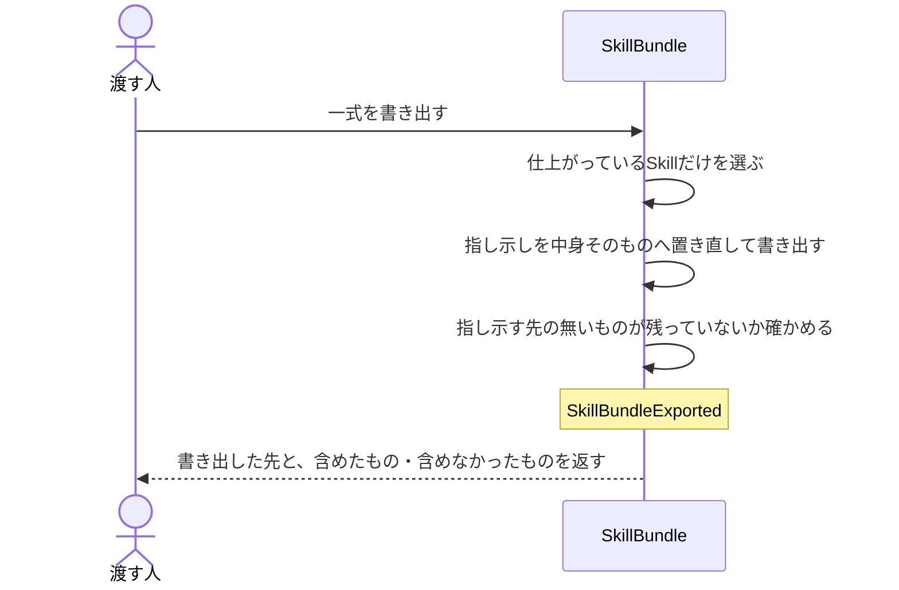

# Skillの一式を、道具立てのない相手へ持ち出せる形で書き出す：uc-export-skill-bundle

## 概要

- Skillの一式を、渡した先でそのまま使える形へ書き出す。渡した先はこちらの仕組みを持たないため、別の場所を指し示す形で置かれているものは、指し示すのをやめて中身そのものを置き直す。
- 何を含めるかは、それぞれのSkillが今どの段階にあるかで決まる。仕上がっていないものは含めない。

---

## 存在意義

- Skillの一式は、別の場所にある知識を指し示す形で組み立てられている。指し示しをそのまま複製すると、渡した先では指し示す先が無く、助言を担うSkillが根拠を1つも読めない状態で届く。しかもその壊れ方は静かで、根拠が無いとは言わずにそれらしい答えを返してしまう。
- 何を含めるかを人が毎回選ぶと、選び漏れと選び過ぎの両方が起きる。含める条件を決めておき、機械的に選ぶ。

---

## 主アクターと意図

### 主アクター

Skillの一式を他のプロジェクトへ渡そうとする人

### 意図

渡した相手が、こちらの道具立てを持たないまま、そのままSkillを使える形の一式を得る

---

## 事前条件

- 書き出しの対象になるSkillが1つ以上ある

---

## 入力

| 入力 | 説明 |
|---|---|
| `outputPath` | 一式を書き出す先の場所 |

---

## 基本フロー



---

## 事後条件

- 書き出した一式の中に、指し示す先の無いものが1つも残っていない
- 仕上がっていないSkillは一式に含まれない
- 受け取る側が自分で用意すべきものは、一式に含まれない
- 含めなかったものは、その理由とともに結果に現れる
- 書き出しは元の一式を変えない。何度行っても元の側は同じままである

---

## 受け入れ基準

| 基準 |
|---|
| When 書き出し先が与えられたとき、システムは仕上がっているSkillだけを選び、その一式を書き出す shall。 |
| When 別の場所を指し示す形で置かれているものがあるとき、システムは指し示しをやめて中身そのものを書き出す shall。 |
| When 受け取る側が自分で用意すべきものが一式の中にあるとき、システムはそれを書き出さない shall。 |
| If 書き出した一式に指し示す先の無いものが残ったとき、システムはBROKEN_REFERENCE_IN_BUNDLEを返し、その書き出しを成功として扱わない shall。 |
| When 仕上がっていないSkillを一式から外したとき、システムはその識別子と外した理由を結果に含める shall。 |
| If 書き出しの対象になるSkillが1つも無いとき、システムはEMPTY_BUNDLEを返し書き出さない shall。 |
| While 書き出しを繰り返すとき、システムは元の一式を一切変えない shall。 |
| While 同じ内容に対して書き出しを繰り返すとき、システムは常に同じ一式を書き出す shall（べき等性）。 |
| While 書き出しを行うとき、システムは元の一式を一切変えない shall（読み取りのみ）。 |

---

## エラー

| コード | 条件 |
|---|---|
| `BROKEN_REFERENCE_IN_BUNDLE` | - 書き出した一式の中に、指し示す先の無いものが残っている（渡した先で読めないものが混ざるため、書き出しの失敗として扱う） |
| `EMPTY_BUNDLE` | - 書き出しの対象になるSkillが1つも無い |

---

## 受け入れシナリオ

### 指し示しを中身そのものへ置き直して書き出す

| 分類 | 観点 |
|---|---|
| 正常系 | 計算整合: 別の場所を指す形のものが、中身を伴って書き出されるか |

```gherkin
Scenario: 指し示しを中身そのものへ置き直して書き出す
  Given 別の場所にある知識を指し示す形で組み立てられたSkill
  When 一式を書き出す
  Then 書き出した先には知識の中身そのものが置かれ、指し示す先の無いものは1つも残らない
```

### 仕上がっていないSkillは含めない

| 分類 | 観点 |
|---|---|
| 正常系 | 選別: 段階による絞り込みが効いているか |

```gherkin
Scenario: 仕上がっていないSkillは含めない
  Given 仕上がったSkillと、まだ仕上がっていないSkillが混在している
  When 一式を書き出す
  Then 仕上がったSkillだけが書き出され、仕上がっていないものは識別子と理由が結果に現れる
```

### 指し示す先の無いものが残れば失敗として扱う

| 分類 | 観点 |
|---|---|
| 異常系 | 事後条件: 壊れた一式を成功として返さないか |

```gherkin
Scenario: 指し示す先の無いものが残れば失敗として扱う
  Given 中身へ置き直せない指し示しを含むSkill
  When 一式を書き出す
  Then BROKEN_REFERENCE_IN_BUNDLEが返り、その書き出しは成功として扱われない
```

### 対象が1つも無ければ書き出さない

| 分類 | 観点 |
|---|---|
| 異常系 | 事前条件: 空の一式を作らないか |

```gherkin
Scenario: 対象が1つも無ければ書き出さない
  Given 仕上がったSkillが1つも無い
  When 一式を書き出す
  Then EMPTY_BUNDLEが返り、書き出しは行われない
```

### 受け取る側が自分で用意する決まりごとは含めない

| 分類 | 観点 |
|---|---|
| 正常系 | 選別: 渡した先が自分で持つべきものを持ち込まないか |

```gherkin
Scenario: 受け取る側が自分で用意する決まりごとは含めない
  Given 受け取る側が自分で用意すべき決まりごとを抱えたSkill
  When 一式を書き出す
  Then その決まりごとは書き出されず、Skillそのものは書き出される
```

### 同じ内容なら同じ一式を書き出す

| 分類 | 観点 |
|---|---|
| 正常系 | べき等性: 元が変わっていなければ、繰り返しても同じ一式になることを確認する |

```gherkin
Scenario: 同じ内容なら同じ一式を書き出す
  Given 元の一式が変わっていない
  When 書き出しを2回行う
  Then 2回とも同じものが同じ場所に並ぶ
```

### 書き出しても元は変わらない

| 分類 | 観点 |
|---|---|
| 正常系 | 読み取りのみ: 書き出しが元の一式へ副作用を持たないことを確認する |

```gherkin
Scenario: 書き出しても元は変わらない
  Given 元の一式
  When 書き出しを行う
  Then 元の一式は書き出す前と同じままである
```
