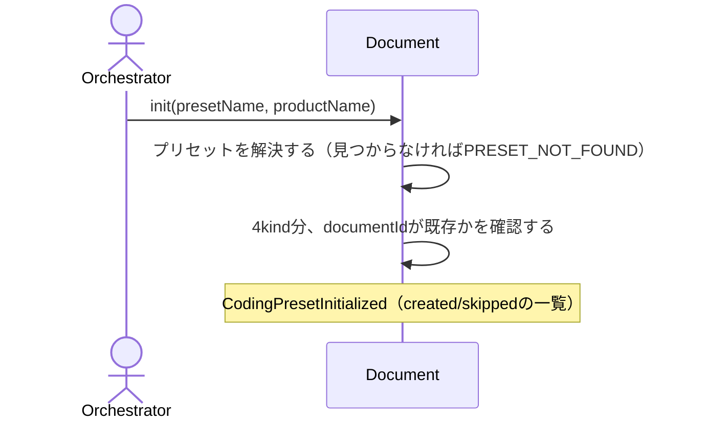

# CodingSchemaプリセットから4documentを一括生成する：uc-init-coding-preset

## 概要

- CodingSchemaのプリセット（種データ）から、プロダクト固有のtech-stack/architecture/coding-standard/test-standard4documentを一括生成するusecase。

---

## 存在意義

- プリセットは複数プロダクトが共有する種データであり、documentではなく静的な同梱データとして保持する（CodingSchema/v3が本来定める「1スタック=4 codingKind document」という単位でプリセットも束ねる）
- 生成される4documentはプロダクト固有の実規約であり、プリセットとは別の存在（documentIdはプロダクト名サフィックス、以後は自由に編集して育てる）

---

## 主アクターと意図

### 主アクター

Orchestrator

### 意図

新しいプロダクトの開発を始めるにあたり、実証済みのアーキテクチャ×言語の組み合わせ（プリセット）から、tech-stack/architecture/coding-standard/test-standardの4規約をそのまま使える状態で一括生成したい

---

## 基本フロー



---

## 事後条件

- 既存documentが無いkindについては、プリセットの内容をそのまま複製したdocumentがACTIVE状態で生成される
- 既にdocumentが存在するkindについては、何も変更せずskippedとして報告される

---

## 受け入れ基準

- 1回の呼び出しでtech-stack/architecture/coding-standard/test-standardの4documentが生成される
- 生成されたdocumentのtitleは「プリセットの説明句：documentId」の形式になる
- 既に存在するdocumentは上書きせずskipする（冪等）
- 存在しないプリセット名を指定するとPRESET_NOT_FOUNDエラーになる

---

## 操作保証

- When 同じpresetName・productNameでinitを複数回実行したとき、既に生成済みのdocumentはシステムによって変更されない shall（冪等性）。
- When 存在しないpresetNameが指定されたとき、システムはPRESET_NOT_FOUNDエラーを返す shall。

---

## エラー

| コード | 条件 |
|---|---|
| `MISSING_PARAM` | - presetName または productName が指定されていない |
| `PRESET_NOT_FOUND` | - 指定されたpresetNameに対応するプリセットが存在しない |

---

## 受け入れシナリオ

### プリセットから4documentを一括生成する

| 分類 | 観点 |
|---|---|
| 正常系 | 生成：新しいプロダクト名でinitすると4kind分のdocumentが生成される |

```gherkin
Scenario: プリセットから4documentを一括生成する
  Given python-hexagonalプリセット
  When 新しいプロダクト名でinitする
  Then tech-stack/architecture/coding-standard/test-standardの4documentが生成される
```

### タイトルにプロダクト固有のdocumentIdが付与される

| 分類 | 観点 |
|---|---|
| 正常系 | 生成：titleはプリセットの説明句とdocumentIdの組み合わせになる |

```gherkin
Scenario: タイトルにプロダクト固有のdocumentIdが付与される
  Given python-hexagonalプリセット
  When 新しいプロダクト名でinitする
  Then 各documentのtitleは「説明句：documentId」の形式になる
```

### 既に存在するdocumentは上書きせずskipする

| 分類 | 観点 |
|---|---|
| 境界値 | 冪等性：同じプロダクト名で再度initしても既存documentは変更されない |

```gherkin
Scenario: 既に存在するdocumentは上書きせずskipする
  Given 既にinit済みの4document
  When 同じプロダクト名で再度initする
  Then 何も上書きされずcreatedは空、skippedに4件とも含まれる
```

### 存在しないプリセット名はPRESET_NOT_FOUNDを返す

| 分類 | 観点 |
|---|---|
| 異常系 | エラー：未知のプリセット名を指定すると明確なエラーになる |

```gherkin
Scenario: 存在しないプリセット名はPRESET_NOT_FOUNDを返す
  Given 存在しないプリセット名
  When initする
  Then PRESET_NOT_FOUNDエラーになる
```

---

## 操作保証シナリオ

### 既に生成済みのdocumentは再initで変更されない

| 分類 | 観点 |
|---|---|
| 境界値 | べき等性：同じpresetName・productNameで複数回initしても既存documentは保持される |

```gherkin
Scenario: 既に生成済みのdocumentは再initで変更されない
  Given 既にinit済みの4document
  When 同じpresetName・productNameでinitを再実行する
  Then 既存の4documentは一切変更されない
```

### 存在しないプリセット名はPRESET_NOT_FOUND

| 分類 | 観点 |
|---|---|
| 異常系 | 解決契約：presetNameが解決できないとき、PRESET_NOT_FOUNDになる |

```gherkin
Scenario: 存在しないプリセット名はPRESET_NOT_FOUND
  Given 存在しないpresetName
  When initを実行する
  Then PRESET_NOT_FOUNDエラーが返る
```
