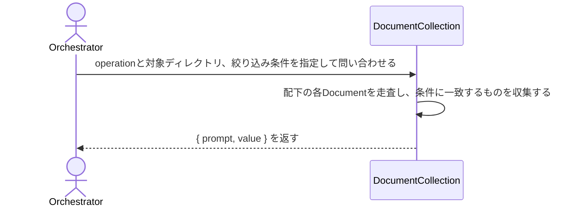

# 複数Documentを横断してパターン検索・属性絞り込みする：QueryDocumentCollection

## 概要

- AIが単一Document内では完結しない要求（複数Documentにまたがるパターン検索・属性による絞り込み）を、ディレクトリ単位で一括して満たす。

---

## 存在意義

- QueryDocumentの既存操作は単一document・単一block・単一配列フィールドに閉じた点操作であり、複数documentを横断してcontentの中身を検索したり、tags等の属性で絞り込んだりする経路が無い。この経路が無いと、AIは対象を探すためにディレクトリ配下の全documentを1件ずつindex_scanし読み比べる必要があり、探索コストが線形に膨らむ（ddd-advisorへの相談が約30分かかった実例が既にある）。
- 都度フルスキャンであり、永続インデックス・ミラーDB（LoomDB/SQLite等）は持たない。正典はdocument.json（git管理のプレーンJSON）のままとする設計合意に基づく。
- 複数document横断でindexとtagsを集約する操作（index_scan_documents）は、元はuc-query-document側のindex_scan_dirとして存在していたが、ddd-advisorから『同じ関心事（複数document横断）が2つのusecaseに分散している』というbounded-context違反の指摘があり、複数document横断という関心事を既に担う本usecase（grep_documents/filter_documents）側へ移動した。単一document側にはindex_scan（対象範囲が1ファイル）が残り、対象範囲（1ファイル vs 複数document）で責務を区別する。内部実装（indexを組み立てるロジック自体）はindex_scanと共有してよいが、公開されるoperation・usecaseとしての所属は本usecase側に置く。

---

## 主アクターと意図

### 主アクター

Orchestrator（HarnessAgent）

### 意図

対象ディレクトリ配下の複数Documentを横断して、パターンに一致する値、または属性条件に一致するDocumentを取得する

---

## 操作一覧

| 操作 | 概要 |
|---|---|
| `grep_documents` | ディレクトリ配下の各Documentのcontentを横断走査し、正規表現patternに一致した値をpath単位で収集して返す |
| `filter_documents` | ディレクトリ配下のDocumentのうち、指定メタフィールドkeyの値がvalueと一致するものだけを絞り込み、pathとmeta（fields指定時はfieldsの値のみ）を返す |
| `index_scan_documents` | ディレクトリ配下の各Documentのindexとtagsをまとめて返す |

---

## 事前条件

- 対象ディレクトリのパスが要望テキストで与えられている

---

## 基本フロー



---

## 事後条件

- 要求された条件に一致した結果がvalueとして返る（一致ゼロは正常系として空で返る）
- 全operationで、valueの読み方の指針がpromptに付く
- 都度フルスキャンで算出され、状態は保存されない（べき等・副作用なし）
- index_scan_documentsは各Documentのindexに加え、そのDocument自身のtagsも含めて返す

---

## 受け入れ基準

- When operationとディレクトリが与えられ、対象がschemaRefを持つDocumentの集合であるとき、システムは結果を{ prompt, value }形式で返す shall。
- When operationにgrep_documentsを指定したとき、システムは対象ディレクトリ配下の各Documentのcontentを走査し、patternに一致した値をpath単位で収集してvalueに返す shall。
- When operationにfilter_documentsを指定したとき、システムは対象ディレクトリ配下の各Documentのうちkeyの値がvalueと一致するものだけを絞り込み、そのpathとmeta（fields指定時はfieldsの値のみ）をvalueに返す shall。
- When operationにindex_scan_documentsを指定したとき、システムは対象ディレクトリ配下の各Documentについて、index_scan相当のblockTypeとpromptの索引、およびそのDocument自身のtagsを集約し、Document単位でvalueに返す shall。
- While 一致するDocumentが無いとき、システムは正常系として空のvalueを返す shall。
- If operationが未知のとき、システムはINVALID_OPERATIONエラーを返す shall。
- If 対象ディレクトリが存在しないとき、システムはINVALID_PATHエラーを返す shall。
- If grep_documentsの正規表現patternが不正なとき、システムはINVALID_PATTERNエラーを返す shall。

---

## 操作保証

- While 同一条件で複数回実行しても、システムは同じ結果を返す shall（副作用の無い読み取り専用操作であり、永続インデックスを持たないため常に対象ディレクトリの現在状態を反映する）。

---

## エラー

| コード | 条件 |
|---|---|
| `INVALID_OPERATION` | - operation が定義外 |
| `MISSING_PARAM` | - 必須パラメータが欠落 |
| `INVALID_PATH` | - 対象ディレクトリが存在しない |
| `INVALID_PATTERN` | - grep_documents の正規表現が不正 |

---

## 受け入れシナリオ

### grep_documentsはディレクトリ横断でpatternに一致する値を収集する

| 分類 | 観点 |
|---|---|
| 正常系 | 横断検索：複数Documentのcontentを跨いだパターン検索 |

```gherkin
Scenario: grep_documentsはディレクトリ横断でpatternに一致する値を収集する
  Given QueryDocumentCollection システム と対象ディレクトリ
  When operation grep_documents を pattern で実行する
  Then patternに一致した値がDocumentのpath単位でvalueとして返る
```

### filter_documentsはメタフィールドの一致でDocumentを絞り込む

| 分類 | 観点 |
|---|---|
| 正常系 | 横断フィルタ：複数Documentをkey/valueの一致で絞り込む |

```gherkin
Scenario: filter_documentsはメタフィールドの一致でDocumentを絞り込む
  Given QueryDocumentCollection システム と対象ディレクトリ
  When operation filter_documents を key tags, value repo:has-udd で実行する
  Then tagsにrepo:has-uddを含むDocumentのpathとmetaがvalueとして返る
```

### index_scan_documentsはディレクトリ横断でindexとtagsを集約する

| 分類 | 観点 |
|---|---|
| 正常系 | 横断集約：複数Documentのindexとtagsを1回で集約する |

```gherkin
Scenario: index_scan_documentsはディレクトリ横断でindexとtagsを集約する
  Given QueryDocumentCollection システム と対象ディレクトリ
  When operation index_scan_documents を実行する
  Then ディレクトリ配下の各Documentのindexとtagsがまとめてvalueとして返り、promptには各要素のpromptを参照する案内が入る
```

### 一致するDocumentが無くても正常系で空を返す

| 分類 | 観点 |
|---|---|
| 境界値 | 空一致：grep_documents/filter_documentsの一致ゼロは正常系（エラーにしない） |

```gherkin
Scenario: 一致するDocumentが無くても正常系で空を返す
  Given QueryDocumentCollection システム と対象ディレクトリ
  When 一致しないpatternでgrep_documentsを実行する
  Then valueは空であり、エラーにはならない
```

### 未知のoperationはエラーを返す

| 分類 | 観点 |
|---|---|
| 異常系 | エラー：未知operationはINVALID_OPERATION |

```gherkin
Scenario: 未知のoperationはエラーを返す
  Given QueryDocumentCollection システム と対象ディレクトリ
  When 未知の operation を実行する
  Then INVALID_OPERATION エラーが返る
```

### 存在しないディレクトリはエラーを返す

| 分類 | 観点 |
|---|---|
| 異常系 | エラー：対象ディレクトリが存在しないときはINVALID_PATH |

```gherkin
Scenario: 存在しないディレクトリはエラーを返す
  Given 実在しない対象ディレクトリ
  When 本usecaseを実行する
  Then INVALID_PATH エラーが返る
```

### 不正な正規表現はエラーを返す

| 分類 | 観点 |
|---|---|
| 異常系 | エラー：grep_documentsの正規表現が不正なときはINVALID_PATTERN |

```gherkin
Scenario: 不正な正規表現はエラーを返す
  Given QueryDocumentCollection システム と対象ディレクトリ
  When 不正な正規表現で grep_documents を実行する
  Then INVALID_PATTERN エラーが返る
```

---

## 操作保証シナリオ

### 同一条件での再実行はべき等である

| 分類 | 観点 |
|---|---|
| 正常系 | べき等性：同一のgrep_documents/filter_documentsを2回実行しても結果が一致する |

```gherkin
Scenario: 同一条件での再実行はべき等である
  Given QueryDocumentCollection システム と対象ディレクトリ
  When 同一のoperationとparamsを2回連続で実行する
  Then 2回の結果は完全に一致する
```

---

## 名前
