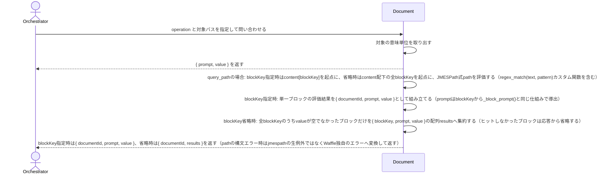

# Documentから必要な意味単位だけを取得する：QueryDocument

## 概要

- AI がファイルを直接読まずに、Document の必要な意味単位（ブロック・フィールド・条件一致・全階層）だけを取得する。

---

## 存在意義

- AIがDocument全文をファイルとして直接読むと、無関係なブロックまでコンテキストに含めてトークンを浪費し、document.jsonの内部構造（schemaの実装詳細）に直接依存したコードを書き始めてしまう。意味単位だけを取得する経路が無ければ、AIとdocument.jsonの間で保つべき疎結合（テキストベースの入出力）が崩れる。当初17種類の名前付きoperationのうち、get_block/get_field/get_items/get_item_field/get_items_slice/filter_items/filter_exists/get_by_id/get_nested_items/get_childrenの10操作は、いずれも『1ブロックの内側を起点に値を取り出す』という同じ責務のバリエーションであり、絞り込み・整形パターンが増えるたびにoperation名・CLI/MCPツール・実装コードが個別に増殖していた。ddd-advisor/tech-lead-advisorとの合意により、この10操作をJMESPath式1本で表現する新operation query_path へ統合した（式言語自体の表現力で吸収し、『値を返す全操作にpromptが付く』という既存の一貫性は、blockKeyスコープを必須にすることで維持している。統合後はこの10操作自体をspec・実装の両方から削除し、現在query_documentが持つ意味単位取得operationはscan/get_meta/index_scan/find_all/resolve_ref/query_pathの6種のみである）。find_all（深さ不定の再帰探索。JMESPath標準構文に対応する演算子が無い）とresolve_ref（ツリー検索ではなくWaffle固有の参照解決ロジックそのもの）は統合不可のため対象外とし、index_scan/get_meta/scanはschemaとの突き合わせという別責務のため対象外とする（この3つを一括りに『発見系』と呼ぶことの妥当性自体はddd-advisorから再検討の指摘があり、別スコープで扱う）。複数document横断検索を担うuc-query-document-collection（grep_documents/filter_documents/index_scan_documents）も、実装メカニズムを共有できることと責務が同じであることは別問題であるとddd-advisorへの再確認で判定され、統合対象に含めない（推奨: 内部実装だけ共有し、usecase・CLI・MCPツールとしての分離は維持する）。複数document横断でindexとtagsを集約する操作（旧index_scan_dir）は、ddd-advisorのbounded-context違反指摘により、単一document起点の本usecaseから複数document横断が本来の関心事であるuc-query-document-collection側へindex_scan_documentsとして移動した。

---

## 主アクターと意図

### 主アクター

Orchestrator（HarnessAgent）

### 意図

対象 Document から欲しい意味単位を取得し、読み方の指針とともに受け取る

---

## 操作一覧

| 操作 | 概要 |
|---|---|
| `scan` | ファイルの生テキストをそのまま返す |
| `get_meta` | documentId等のメタフィールドだけを返す |
| `index_scan` | 各ブロックのblockTypeとprompt（読み方指針）をschemaから動的算出して返す |
| `find_all` | 全階層に出現する指定フィールドの値を再帰収集して返す |
| `resolve_ref` | 参照フィールドfieldの値と、targetSchemaRefが宣言するx-source-targetテンプレートから、参照先Documentのpathを算出して返す（中身は取得しない） |

---

## 事前条件

- 対象 Document のパスが要望テキストで与えられている

---

## 基本フロー



---

## 事後条件

- 要求された意味単位が value として返る
- 全operationで、value の読み方の指針が prompt に付く（ブロック/配列取得時はx-prompt-query由来、それ以外は操作の性質に基づく固定文言）
- 対象ブロックがx-prompt-interpret（値の解釈指針・誤読しやすい点への注意）を宣言しているとき、promptとは別にcautionが付く（宣言が無いブロックではcautionキー自体が省略される）

---

## 受け入れ基準

- When operationと対象パスが与えられ、対象がschemaRefを持つDocumentであるとき、システムは結果を{ prompt, value }形式で返す shall。
- When ブロック/配列を取得したとき、promptに対象ブロックの読み方の指針（x-prompt-query由来）を含める shall。
- When get_meta/scan/index_scan/find_allを実行したとき、promptにその操作の性質に基づく固定の読み方の指針を含める shall（schemaから動的に導出できない場合もpromptを省略しない）。
- When 対象ブロックがx-prompt-interpretを宣言しているとき、システムはpromptとは別にcautionフィールドへ値の解釈指針を含める shall。
- While 対象ブロックがx-prompt-interpretを宣言していないとき、システムはcautionキー自体を省略する shall（必要なデータだけを返す）。
- If operationが未知のとき、システムはINVALID_OPERATIONエラーを返す shall。
- If 対象パスが存在しないとき、システムはINVALID_PATHエラーを返す shall。
- If 指定したblockKeyが存在しないとき、システムはNOT_FOUNDエラーを返す shall。
- If 対象がscan以外のoperationでschemaRefを持たないとき、システムは{ prompt, value }とは別形状の{ type: "raw", content }を返す shall（scan operationはschemaRefの有無によらず常に{ prompt: <固定文言>, value: <生テキスト> }を返す）。
- When operationにresolve_refを指定したとき、システムは対象Documentのfieldの値をdocumentId、対象Document自身が持つ他の参照フィールドをテンプレート変数として、targetSchemaRef（discriminatorを持つschemaの場合はtargetDiscriminatorで対象種別を指定する）のx-source-targetテンプレートに埋め込み、参照先Documentのpathを算出してvalueに返す shall（参照先Documentの中身は取得しない）。
- If resolve_refでテンプレート変数を解決できないとき、システムはMISSING_TEMPLATE_VARエラーを返す shall。
- When operationにquery_pathをblockKey指定で実行したとき、システムはdoc["content"][blockKey]を起点にJMESPath式pathを評価し、{ documentId, prompt, value }形式で返す shall（promptは_block_prompt()と同じ仕組みでblockKeyから導出する）。
- When operationにquery_pathをblockKey省略で実行したとき、システムはdoc["content"]配下の全blockKeyに同じ相対式pathを評価し、{ documentId, results: [{ blockKey, prompt, value }, ...] }形式で返す shall。
- While operationにquery_pathをblockKey省略で実行し、あるblockKeyの評価結果valueが空であるとき、システムはそのblockKeyをresultsから省略する shall（ヒットしなかったブロックについて沈黙する）。
- When query_pathのpath式内でregex_match(text, pattern)を使用したとき、システムはjmespath.functions.Functionsを継承したカスタム関数として、既存のfilter_pattern相当の正規表現マッチングを行う shall。
- If query_pathのpathがJMESPathとして構文エラーであるとき、システムはjmespathの生例外をそのまま返さず、Waffle独自のエラーコード・メッセージへ変換して返す shall。
- While query_pathを実行するとき、pathは常に1ブロックの内側を起点とした相対式として評価される shall（doc全体や複数blockTypeを跨ぐ横断検索が必要な場合は既存のfind_allを使う）。
- While operationにquery_pathをblockKey省略で実行し、あるblockKeyに対するpathの評価がJMESPathの評価時型エラー（式の形が対象ブロックの構造に合わない）になったとき、システムはそのblockKeyを結果から静かにスキップし、クエリ全体を失敗させない shall（構文エラーとは区別する。全blockKeyがスキップされresultsが空配列になるのも正常系とする）。
- If operationにquery_pathをblockKey指定で実行し、pathの評価がJMESPathの評価時型エラーになったとき、システムはINVALID_JMESPATH_EXPRESSIONエラーを返す shall（ユーザーが明示指定した単一ブロックに式が合わなかったことをそのまま伝える）。

---

## 操作保証

- When 対象パスが存在しないとき、システムは INVALID_PATH エラーを返す shall（対象を特定し取得する解決プロセス自体の契約であり、複数のusecaseに共通する）。
- When 対象のschemaRefを解決できないとき、システムは INVALID_SCHEMA_REF エラーを返す shall（schemaを特定し取得する解決プロセス自体の契約であり、複数のusecaseに共通する）。

---

## エラー

| コード | 条件 |
|---|---|
| `INVALID_OPERATION` | - operation が定義外 |
| `MISSING_PARAM` | - 必須パラメータが欠落 |
| `NOT_FOUND` | - 指定した blockKey に一致するブロックが存在しない |
| `INVALID_JMESPATH_EXPRESSION` | - query_path の expression が構文エラー、またはblockKey指定時に評価時型エラーになった |
| `MISSING_TEMPLATE_VAR` | - resolve_ref でテンプレート変数（contextRef等）を解決できない |

---

## 受け入れシナリオ

### 未知の operation はエラーを返す

| 分類 | 観点 |
|---|---|
| 異常系 | エラー：未知 operation は INVALID_OPERATION |

```gherkin
Scenario: 未知の operation はエラーを返す
  When 未知の operation を実行する
  Then INVALID_OPERATION エラーが返る
```

### scanは生テキストを返す

| 分類 | 観点 |
|---|---|
| 正常系 | ファイル単位：scanはファイルをそのまま読む(prompt=null) |

```gherkin
Scenario: scanは生テキストを返す
  Given query システム と対象 Document
  When operation scan を実行する
  Then value は生テキストであり、prompt にはこの値の読み方の指針が入る
```

### get_metaはメタ情報を返す

| 分類 | 観点 |
|---|---|
| 正常系 | ファイル単位：get_metaはdocumentId等のメタフィールドのみを返す |

```gherkin
Scenario: get_metaはメタ情報を返す
  Given query システム と対象 Document
  When operation get_meta を実行する
  Then value にはdocumentId等のメタフィールドのみが含まれ、prompt にはこの値の読み方の指針が入る
```

### index_scanはblockTypeとpromptをschemaから動的算出する

| 分類 | 観点 |
|---|---|
| 正常系 | ファイル単位：index_scanは_indexを保存せず読み取り時に動的算出する |

```gherkin
Scenario: index_scanはblockTypeとpromptをschemaから動的算出する
  Given query システム と対象 Document
  When operation index_scan を実行する
  Then 各blockのblockTypeとx-prompt-query由来のpromptが返り、トップレベルのpromptには各要素のpromptを参照する案内が入る
```

### find_allは全階層を再帰収集する

| 分類 | 観点 |
|---|---|
| 正常系 | 再帰：find_allはネスト構造の全階層からfieldNameの値を集める |

```gherkin
Scenario: find_allは全階層を再帰収集する
  Given query システム と対象 Document
  When operation find_all を fieldName で実行する
  Then 全階層に出現するfieldNameの値がvalueとして返り、prompt にはこの値の読み方の指針が入る
```

### schemaRefを持たないファイルはrawで返す

| 分類 | 観点 |
|---|---|
| 正常系 | フォールバック：schemaRefを持たない通常ファイルは{type,content}という別形状で生テキストを返す（scanは対象外） |

```gherkin
Scenario: schemaRefを持たないファイルはrawで返す
  Given schemaRefを持たない対象ファイル
  When scan以外の任意のoperationを実行する
  Then 戻り値は{ prompt, value }ではなく{ type: "raw", content: <生テキスト> }という別形状で返る
```

### resolve_refは参照先Documentのpathを算出する

| 分類 | 観点 |
|---|---|
| 正常系 | 参照解決：ref値とx-source-targetテンプレートから参照先pathを機械的に算出する |

```gherkin
Scenario: resolve_refは参照先Documentのpathを算出する
  Given query システム と、subdomainRefフィールドを持つ対象 Document
  When operation resolve_ref を field subdomainRef, targetSchemaRef DomainSpecSchema/v5, targetDiscriminator specKind=subdomain で実行する
  Then 参照先Documentのpathがvalueとして返る（中身は取得されない）
```

### resolve_refはテンプレート変数を解決できないときエラーを返す

| 分類 | 観点 |
|---|---|
| 異常系 | エラー：テンプレート変数が不足するときはMISSING_TEMPLATE_VAR |

```gherkin
Scenario: resolve_refはテンプレート変数を解決できないときエラーを返す
  Given 参照先テンプレートが要求する変数を持たない対象 Document
  When operation resolve_ref を実行する
  Then MISSING_TEMPLATE_VAR エラーが返る
```

### query_pathでblockKey指定時は単一ブロックの評価結果を返す

| 分類 | 観点 |
|---|---|
| 正常系 | 意味単位取得：query_pathはblockKey指定時に単一ブロック起点でJMESPath式を評価する |

```gherkin
Scenario: query_pathでblockKey指定時は単一ブロックの評価結果を返す
  Given query システム と対象 Document
  When operation query_path を blockKey summary, path "items[?length(@) > `0`]" で実行する
  Then value は指定ブロック内でのJMESPath評価結果であり、prompt に読み方の指針が付く
```

### query_pathでblockKey省略時はヒットしたブロックだけを配列で返す

| 分類 | 観点 |
|---|---|
| 正常系 | 意味単位取得：query_pathはblockKey省略時にcontent配下の全ブロックへ同じ式を評価し、ヒットしたものだけを返す |

```gherkin
Scenario: query_pathでblockKey省略時はヒットしたブロックだけを配列で返す
  Given query システム と対象 Document
  When operation query_path を blockKey を指定せず path "items[?priority=='high']" で実行する
  Then results にはヒットしたブロックだけが { blockKey, prompt, value } として含まれ、ヒットしなかったブロックは省略される
```

### query_pathはフィルタ条件を式内で表現できる

| 分類 | 観点 |
|---|---|
| 正常系 | 統合：query_pathはfilter_items相当の条件絞り込みをJMESPath式1本で表現する |

```gherkin
Scenario: query_pathはフィルタ条件を式内で表現できる
  Given query システム と対象 Document
  When operation query_path を blockKey, path "items[?required==`true`]" で実行する
  Then value には required な要素だけが含まれる
```

### query_pathは配列の範囲指定をスライス式で表現できる

| 分類 | 観点 |
|---|---|
| 境界値 | 統合：query_pathはget_items_slice相当の範囲切り出しをJMESPath式1本で表現する |

```gherkin
Scenario: query_pathは配列の範囲指定をスライス式で表現できる
  Given query システム と対象 Document
  When operation query_path を blockKey, path "items[2:5]" で実行する
  Then value にはその範囲の要素だけが含まれる
```

### query_pathは正規表現カスタム関数で絞り込める

| 分類 | 観点 |
|---|---|
| 正常系 | 統合：query_pathはfilter_pattern相当の正規表現絞り込みをregex_matchカスタム関数で表現する |

```gherkin
Scenario: query_pathは正規表現カスタム関数で絞り込める
  Given query システム と対象 Document
  When operation query_path を blockKey, path "items[?regex_match(name, 'foo.*')]" で実行する
  Then value には正規表現に一致する要素だけが含まれる
```

### query_pathの構文エラーはWaffle独自のエラーへ変換される

| 分類 | 観点 |
|---|---|
| 異常系 | エラー：query_pathの式が構文エラーのとき、jmespathの生例外ではなくWaffle独自の形式へ変換する |

```gherkin
Scenario: query_pathの構文エラーはWaffle独自のエラーへ変換される
  Given query システム と対象 Document
  When 構文的に不正なJMESPath式を path に指定して operation query_path を実行する
  Then jmespath の生例外ではなく、Waffle独自のエラーコード・メッセージが返る
```

### query_pathでblockKey省略時、式の形に合わないブロックは静かにスキップされる

| 分類 | 観点 |
|---|---|
| 境界値 | エラー区別：全ブロック評価時の評価時型エラーは構文エラーと区別し、そのブロックだけをヒットなしとして黙ってスキップする |

```gherkin
Scenario: query_pathでblockKey省略時、式の形に合わないブロックは静かにスキップされる
  Given query システム と、items配列を持つブロックと持たないブロックが混在する対象 Document
  When operation query_path を blockKey を指定せず path "items[?contains(rule, 'CLI')]" で実行する
  Then results には items を持つブロックの評価結果だけが含まれ、items を持たず評価時型エラーになったブロックはエラーにならず黙って省略される
```

### query_pathでblockKey指定時、式の評価時型エラーはエラーを返す

| 分類 | 観点 |
|---|---|
| 異常系 | エラー区別：blockKey明示指定時の評価時型エラーはスキップせずハードエラーとして伝える |

```gherkin
Scenario: query_pathでblockKey指定時、式の評価時型エラーはエラーを返す
  Given query システム と、items配列は持つがruleフィールドは持たない対象ブロック
  When operation query_path を blockKey で明示指定し、ruleフィールドを前提とした path "items[?contains(rule, 'CLI')]" で実行する
  Then エラーコード INVALID_JMESPATH_EXPRESSION が返る
```

---

## 操作保証シナリオ

### 存在しないパスはINVALID_PATH

| 分類 | 観点 |
|---|---|
| 異常系 | 解決契約：対象パスが実在しないとき、パスの解決に失敗しINVALID_PATHになる |

```gherkin
Scenario: 存在しないパスはINVALID_PATH
  Given 実在しない対象パス
  When 本usecaseを実行する
  Then INVALID_PATHエラーが返る
```

### 解決できないschemaRefはINVALID_SCHEMA_REF

| 分類 | 観点 |
|---|---|
| 異常系 | 解決契約：schemaRefを解決できないとき、schemaの解決に失敗しINVALID_SCHEMA_REFになる |

```gherkin
Scenario: 解決できないschemaRefはINVALID_SCHEMA_REF
  Given 解決できないschemaRef
  When 本usecaseを実行する
  Then INVALID_SCHEMA_REFエラーが返る
```
