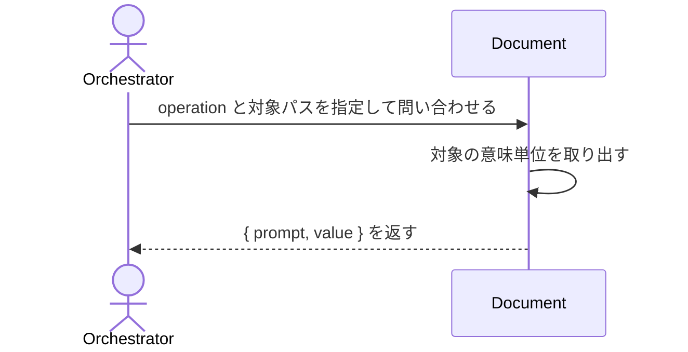

# Documentから必要な意味単位だけを取得する：QueryDocument

## 概要

- AI がファイルを直接読まずに、Document の必要な意味単位（ブロック・フィールド・条件一致・全階層）だけを取得する。

---

## 存在意義

- AIがDocument全文をファイルとして直接読むと、無関係なブロックまでコンテキストに含めてトークンを浪費し、document.jsonの内部構造（schemaの実装詳細）に直接依存したコードを書き始めてしまう。意味単位だけを取得する経路が無ければ、AIとdocument.jsonの間で保つべき疎結合（テキストベースの入出力）が崩れる。

---

## 主アクターと意図

### 主アクター

Orchestrator（HarnessAgent）

### 意図

対象 Document から欲しい意味単位を取得し、読み方の指針とともに受け取る

---

## 操作一覧

| 操作 | 概要 |
|---|---|
| `scan` | ファイルの生テキストをそのまま返す |
| `get_meta` | documentId等のメタフィールドだけを返す |
| `index_scan` | 各ブロックのblockTypeとprompt（読み方指針）をschemaから動的算出して返す |
| `index_scan_dir` | ディレクトリ配下の各Documentのindexとtagsをまとめて返す |
| `find_all` | 全階層に出現する指定フィールドの値を再帰収集して返す |
| `get_block` | 指定したブロックを丸ごと返す |
| `get_field` | ブロック内の指定した1フィールドの値を返す |
| `get_items` | ブロック内の配列フィールドをそのまま返す |
| `get_item_field` | 配列内の各要素から指定フィールドの値だけを取り出して返す |
| `get_items_slice` | 配列の指定範囲（start〜end）だけを切り出して返す |
| `filter_items` | 配列要素のうち、指定キーが指定値と一致するものだけを絞り込んで返す |
| `filter_exists` | 配列要素のうち、指定フィールドを持つものだけを絞り込んで返す |
| `filter_pattern` | 配列要素のうち、指定フィールドが正規表現に一致するものだけを絞り込んで返す |
| `get_by_id` | 配列内から指定した識別子フィールドの値が一致する単一要素を返す |
| `get_nested_items` | 配列内の各要素が持つ入れ子配列を1段展開して集約する |
| `get_children` | 識別子で特定した要素が持つchildren配列を返す |
| `resolve_ref` | 参照フィールドfieldの値と、targetSchemaRefが宣言するx-source-targetテンプレートから、参照先Documentのpathを算出して返す（中身は取得しない） |

---

## 事前条件

- 対象 Document（またはディレクトリ）のパスが要望テキストで与えられている

---

## 基本フロー



---

## 事後条件

- 要求された意味単位が value として返る
- 全operationで、value の読み方の指針が prompt に付く（ブロック/配列取得時はx-prompt-query由来、それ以外は操作の性質に基づく固定文言）
- 対象ブロックがx-prompt-interpret（値の解釈指針・誤読しやすい点への注意）を宣言しているとき、promptとは別にcautionが付く（宣言が無いブロックではcautionキー自体が省略される）
- index_scan_dirは各Documentのindexに加え、そのDocument自身のtagsも含めて返す

---

## 受け入れ基準

- When operationと対象パスが与えられ、対象がschemaRefを持つDocumentであるとき、システムは結果を{ prompt, value }形式で返す shall。
- When ブロック/配列を取得したとき、promptに対象ブロックの読み方の指針（x-prompt-query由来）を含める shall。
- When get_meta/scan/index_scan/index_scan_dir/find_allを実行したとき、promptにその操作の性質に基づく固定の読み方の指針を含める shall（schemaから動的に導出できない場合もpromptを省略しない）。
- When 対象ブロックがx-prompt-interpretを宣言しているとき、システムはpromptとは別にcautionフィールドへ値の解釈指針を含める shall。
- While 対象ブロックがx-prompt-interpretを宣言していないとき、システムはcautionキー自体を省略する shall（必要なデータだけを返す）。
- While フィルタ条件に一致する要素が無いとき、システムは正常系として空配列value: []を返す shall。
- If operationが未知のとき、システムはINVALID_OPERATIONエラーを返す shall。
- If 対象パスが存在しないとき、システムはINVALID_PATHエラーを返す shall。
- If 指定したblockKey/idValueが存在しないとき、システムはNOT_FOUNDエラーを返す shall。
- If フィルタの正規表現パターンが不正なとき、システムはINVALID_PATTERNエラーを返す shall。
- If 対象がscan以外のoperationでschemaRefを持たないとき、システムは{ prompt, value }とは別形状の{ type: "raw", content }を返す shall（scan operationはschemaRefの有無によらず常に{ prompt: <固定文言>, value: <生テキスト> }を返す）。
- When operationにresolve_refを指定したとき、システムは対象Documentのfieldの値をdocumentId、対象Document自身が持つ他の参照フィールドをテンプレート変数として、targetSchemaRef（discriminatorを持つschemaの場合はtargetDiscriminatorで対象種別を指定する）のx-source-targetテンプレートに埋め込み、参照先Documentのpathを算出してvalueに返す shall（参照先Documentの中身は取得しない）。
- If resolve_refでテンプレート変数を解決できないとき、システムはMISSING_TEMPLATE_VARエラーを返す shall。

---

## 操作保証

- When 対象パスが存在しないとき、システムは INVALID_PATH エラーを返す shall（対象を特定し取得する解決プロセス自体の契約であり、複数のusecaseに共通する）。
- When 対象のschemaRefを解決できないとき、システムは INVALID_SCHEMA_REF エラーを返す shall（schemaを特定し取得する解決プロセス自体の契約であり、複数のusecaseに共通する）。

---

## エラー

| コード | 条件 |
|---|---|
| `INVALID_OPERATION` | - operation が定義外 |
| `MISSING_PARAM` | - 必須パラメータが欠落 |
| `NOT_FOUND` | - 指定した blockKey/idValue に一致する要素が存在しない |
| `INVALID_PATTERN` | - filter_pattern の正規表現が不正 |
| `MISSING_TEMPLATE_VAR` | - resolve_ref でテンプレート変数（contextRef等）を解決できない |

---

## 受け入れシナリオ

### ブロックを丸ごと取得する

| 分類 | 観点 |
|---|---|
| 正常系 | 意味単位取得：ブロック取得で読み方の指針が付く |

```gherkin
Scenario: ブロックを丸ごと取得する
  Given query システム と対象 Document
  When operation get_block を blockKey interface で実行する
  Then value は対象ブロックであり、prompt に読み方の指針が付く
```

### 条件に一致する配列要素だけを絞り込む

| 分類 | 観点 |
|---|---|
| 正常系 | 意味単位取得：フィルタで条件一致だけを返す |

```gherkin
Scenario: 条件に一致する配列要素だけを絞り込む
  Given query システム と対象 Document
  When operation filter_items で required=true を指定する
  Then value には required な要素だけが含まれる
```

### 一致が無くても正常系で空配列を返す

| 分類 | 観点 |
|---|---|
| 境界値 | 空一致：一致ゼロは正常系（エラーにしない） |

```gherkin
Scenario: 一致が無くても正常系で空配列を返す
  When 一致しないフィルタ条件で filter_items を実行する
  Then value は空配列で、エラーにはならない
```

### 未知の operation はエラーを返す

| 分類 | 観点 |
|---|---|
| 異常系 | エラー：未知 operation は INVALID_OPERATION |

```gherkin
Scenario: 未知の operation はエラーを返す
  When 未知の operation を実行する
  Then INVALID_OPERATION エラーが返る
```

### 必須パラメータの欠落はエラーを返す

| 分類 | 観点 |
|---|---|
| 異常系 | エラー：必須パラメータ欠落は MISSING_PARAM |

```gherkin
Scenario: 必須パラメータの欠落はエラーを返す
  When blockKey を指定せずに get_block を実行する
  Then MISSING_PARAM エラーが返る
```

### 存在しないblockKeyはエラーを返す

| 分類 | 観点 |
|---|---|
| 異常系 | エラー：指定した blockKey が存在しないときは NOT_FOUND |

```gherkin
Scenario: 存在しないblockKeyはエラーを返す
  When 存在しない blockKey を指定して get_block を実行する
  Then NOT_FOUND エラーが返る
```

### 不正な正規表現はエラーを返す

| 分類 | 観点 |
|---|---|
| 異常系 | エラー：filter_pattern の正規表現が不正なときは INVALID_PATTERN |

```gherkin
Scenario: 不正な正規表現はエラーを返す
  When 不正な正規表現で filter_pattern を実行する
  Then INVALID_PATTERN エラーが返る
```

### scanは生テキストを返す

| 分類 | 観点 |
|---|---|
| 正常系 | ファイル単位：scanはファイルをそのまま読む(prompt=null) |

```gherkin
Scenario: scanは生テキストを返す
  Given query システム と対象 Document
  When operation scan を実行する
  Then value は生テキストであり、prompt にはこの値の読み方の指針が入る
```

### get_metaはメタ情報を返す

| 分類 | 観点 |
|---|---|
| 正常系 | ファイル単位：get_metaはdocumentId等のメタフィールドのみを返す |

```gherkin
Scenario: get_metaはメタ情報を返す
  Given query システム と対象 Document
  When operation get_meta を実行する
  Then value にはdocumentId等のメタフィールドのみが含まれ、prompt にはこの値の読み方の指針が入る
```

### index_scanはblockTypeとpromptをschemaから動的算出する

| 分類 | 観点 |
|---|---|
| 正常系 | ファイル単位：index_scanは_indexを保存せず読み取り時に動的算出する |

```gherkin
Scenario: index_scanはblockTypeとpromptをschemaから動的算出する
  Given query システム と対象 Document
  When operation index_scan を実行する
  Then 各blockのblockTypeとx-prompt-query由来のpromptが返り、トップレベルのpromptには各要素のpromptを参照する案内が入る
```

### index_scan_dirはディレクトリ横断でindexとtagsを集約する

| 分類 | 観点 |
|---|---|
| 正常系 | ファイル単位：index_scan_dirは複数Documentのindexとtagsを1回で集約する |

```gherkin
Scenario: index_scan_dirはディレクトリ横断でindexとtagsを集約する
  Given query システム と対象ディレクトリ
  When operation index_scan_dir を実行する
  Then ディレクトリ配下の各Documentのindexとtagsがまとめて返り、トップレベルのpromptには各要素のpromptを参照する案内が入る
```

### get_fieldはblockの1フィールドを返す

| 分類 | 観点 |
|---|---|
| 正常系 | ブロック単位：get_fieldは指定フィールドのみを取り出す |

```gherkin
Scenario: get_fieldはblockの1フィールドを返す
  Given query システム と対象 Document
  When operation get_field を blockKey, field で実行する
  Then value は指定フィールドの値である
```

### get_by_idは単一オブジェクトを返す

| 分類 | 観点 |
|---|---|
| 正常系 | 配列操作：get_by_idはidが一意である前提でリストでなく単一要素を返す(filter_itemsとの役割分離) |

```gherkin
Scenario: get_by_idは単一オブジェクトを返す
  Given query システム と対象 Document
  When operation get_by_id を idField, idValue で実行する
  Then 一致した単一の要素がvalueとして返る（配列ではない）
```

### find_allは全階層を再帰収集する

| 分類 | 観点 |
|---|---|
| 正常系 | 再帰：find_allはネスト構造の全階層からfieldNameの値を集める |

```gherkin
Scenario: find_allは全階層を再帰収集する
  Given query システム と対象 Document
  When operation find_all を fieldName で実行する
  Then 全階層に出現するfieldNameの値がvalueとして返り、prompt にはこの値の読み方の指針が入る
```

### schemaRefを持たないファイルはrawで返す

| 分類 | 観点 |
|---|---|
| 正常系 | フォールバック：schemaRefを持たない通常ファイルは{type,content}という別形状で生テキストを返す（scanは対象外） |

```gherkin
Scenario: schemaRefを持たないファイルはrawで返す
  Given schemaRefを持たない対象ファイル
  When scan以外の任意のoperationを実行する
  Then 戻り値は{ prompt, value }ではなく{ type: "raw", content: <生テキスト> }という別形状で返る
```

### get_itemsは配列フィールドをそのまま返す

| 分類 | 観点 |
|---|---|
| 正常系 | 取得：配列フィールドをそのまま返す |

```gherkin
Scenario: get_itemsは配列フィールドをそのまま返す
  Given query システム と対象 Document
  When operation get_items を実行する
  Then value は対象の配列フィールドそのものである
```

### get_item_fieldは配列要素から指定フィールドだけを取り出す

| 分類 | 観点 |
|---|---|
| 正常系 | 取得：配列の各要素から1フィールドだけを取り出す |

```gherkin
Scenario: get_item_fieldは配列要素から指定フィールドだけを取り出す
  Given query システム と対象 Document
  When operation get_item_field を実行する
  Then 各要素の指定フィールドの値だけがvalueとして返る
```

### get_items_sliceは配列の指定範囲だけを返す

| 分類 | 観点 |
|---|---|
| 境界値 | 取得：配列の指定範囲だけを切り出す |

```gherkin
Scenario: get_items_sliceは配列の指定範囲だけを返す
  Given query システム と対象 Document
  When operation get_items_slice を実行する
  Then その範囲の要素だけがvalueとして返る
```

### filter_existsは指定フィールドを持つ要素だけを絞り込む

| 分類 | 観点 |
|---|---|
| 正常系 | 絞り込み：指定フィールドの有無で絞り込む |

```gherkin
Scenario: filter_existsは指定フィールドを持つ要素だけを絞り込む
  Given query システム と対象 Document
  When operation filter_exists を実行する
  Then 指定フィールドを持つ要素だけがvalueに含まれる
```

### get_nested_itemsは各要素の入れ子配列を1段展開して集約する

| 分類 | 観点 |
|---|---|
| 正常系 | 取得：入れ子配列の1段展開と集約 |

```gherkin
Scenario: get_nested_itemsは各要素の入れ子配列を1段展開して集約する
  Given query システム と、配列要素それぞれが入れ子配列を持つ対象 Document
  When operation get_nested_items を実行する
  Then 全要素の入れ子配列を1段展開して集約したものがvalueとして返る
```

### get_childrenは識別子で特定した要素のchildren配列を返す

| 分類 | 観点 |
|---|---|
| 正常系 | 取得：識別子で特定した要素のchildren配列を返す |

```gherkin
Scenario: get_childrenは識別子で特定した要素のchildren配列を返す
  Given query システム と、children配列を持つ要素を含む対象 Document
  When operation get_children を実行する
  Then 識別子で特定した要素のchildren配列がvalueとして返る
```

### 解釈指針を宣言したブロックはcautionを持つ

| 分類 | 観点 |
|---|---|
| 正常系 | 解釈指針：x-prompt-interpretを宣言したブロックはvalueとは別にcautionを返す |

```gherkin
Scenario: 解釈指針を宣言したブロックはcautionを持つ
  Given x-prompt-interpret（値の解釈指針）を宣言したブロック
  When operation get_block を実行する
  Then valueの読み方の指針とは別に、誤読を防ぐcautionが返る
```

### 解釈指針を宣言していないブロックはcautionを持たない

| 分類 | 観点 |
|---|---|
| 境界値 | 省略規則：x-prompt-interpretを宣言していないブロックはcautionキー自体を持たない |

```gherkin
Scenario: 解釈指針を宣言していないブロックはcautionを持たない
  Given x-prompt-interpretを宣言していないブロック
  When operation get_block を実行する
  Then cautionキー自体が省略される（値が無いフィールドは持たせない）
```

### resolve_refは参照先Documentのpathを算出する

| 分類 | 観点 |
|---|---|
| 正常系 | 参照解決：ref値とx-source-targetテンプレートから参照先pathを機械的に算出する |

```gherkin
Scenario: resolve_refは参照先Documentのpathを算出する
  Given query システム と、subdomainRefフィールドを持つ対象 Document
  When operation resolve_ref を field subdomainRef, targetSchemaRef DomainSpecSchema/v5, targetDiscriminator specKind=subdomain で実行する
  Then 参照先Documentのpathがvalueとして返る（中身は取得されない）
```

### resolve_refはテンプレート変数を解決できないときエラーを返す

| 分類 | 観点 |
|---|---|
| 異常系 | エラー：テンプレート変数が不足するときはMISSING_TEMPLATE_VAR |

```gherkin
Scenario: resolve_refはテンプレート変数を解決できないときエラーを返す
  Given 参照先テンプレートが要求する変数を持たない対象 Document
  When operation resolve_ref を実行する
  Then MISSING_TEMPLATE_VAR エラーが返る
```

---

## 操作保証シナリオ

### 存在しないパスはINVALID_PATH

| 分類 | 観点 |
|---|---|
| 異常系 | 解決契約：対象パスが実在しないとき、パスの解決に失敗しINVALID_PATHになる |

```gherkin
Scenario: 存在しないパスはINVALID_PATH
  Given 実在しない対象パス
  When 本usecaseを実行する
  Then INVALID_PATHエラーが返る
```

### 解決できないschemaRefはINVALID_SCHEMA_REF

| 分類 | 観点 |
|---|---|
| 異常系 | 解決契約：schemaRefを解決できないとき、schemaの解決に失敗しINVALID_SCHEMA_REFになる |

```gherkin
Scenario: 解決できないschemaRefはINVALID_SCHEMA_REF
  Given 解決できないschemaRef
  When 本usecaseを実行する
  Then INVALID_SCHEMA_REFエラーが返る
```
