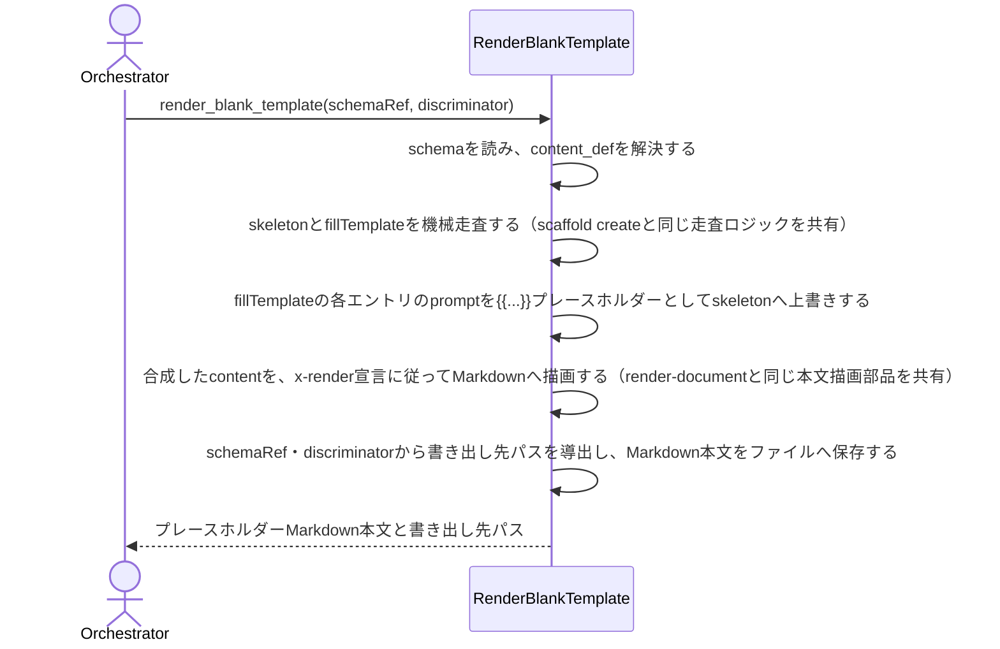

# スキーマが宣言する値の記入指示をプレースホルダーとして描画する：RenderBlankTemplate

## 概要

- schemaRef（と必要ならdiscriminator）から、値を一切埋めていない状態のcontent構造を、各フィールドの記入指示（x-prompt-write）をプレースホルダーとして埋め込んだMarkdownとして描画する。

---

## 存在意義

- document.jsonをいきなり手で埋めるには、schemaのx-prompt-writeという記入指示がJSON構造の奥に埋もれていて事前に見通せない。この描画経路が無ければ、埋めるべき項目と記入指示を確認するために毎回scaffold createの返り値やschema自体を読む必要があり、人間が下書きを作る場面での見通しが悪い。

---

## 主アクターと意図

### 主アクター

Orchestrator（HarnessAgent）または人間の執筆者

### 意図

対象schemaの空欄テンプレートを、記入すべき内容の説明つきで得る

---

## 事前条件

- 対象のschemaRefが実在する
- schemaのcontentがdiscriminator（specKind等）で分岐する場合、discriminatorが指定されている

---

## 基本フロー



---

## 事後条件

- 返り値はcontent・pathの2フィールドを持つ: content（対象schemaのcontent構造を各値フィールドがx-prompt-write本文を{{...}}として埋め込んだ状態でMarkdown化したもの）・path（実際に書き出したファイルの相対パス）
- 書き出し先のパスは、schemaRefとdiscriminatorから機械的に導出する: .waffle/templates/blank/{schemaName}/{version}/{discriminatorValue}.md（discriminatorを持たないschemaは .waffle/templates/blank/{schemaName}/{version}.md）
- 同じschemaRef・discriminatorに対して再実行すると、書き出し先の既存ファイルを新しい描画結果で上書きする（冪等）
- document.jsonはどこにも作成・保存しない（書き出すのはcontentのプレースホルダーMarkdownのみ）
- 省略可能なブロック・フィールドも含め、schemaが宣言する記入対象を全て埋める（実際のdocumentでは値が無ければ省略される任意ブロックも、テンプレートでは記入指示を示すため省略しない）
- enumを持つフィールドは、プレースホルダー本文に選択肢を併記する
- 配列でelement（構造化された要素）を持つフィールドは、要素1件分のプレースホルダーオブジェクトを持つ配列として描画する

---

## 受け入れ基準

- When schemaRefが実在するとき、システムはそのschemaのcontent構造をプレースホルダー化したMarkdownを返す shall。
- When フィールドがx-prompt-writeを宣言しているとき、システムはそのフィールドの値を「{{x-prompt-write本文}}」という形式のプレースホルダー文字列に置き換える shall。
- When フィールドがenumを持つとき、システムはプレースホルダー文字列に選択肢を併記する shall。
- When 配列フィールドが構造化された要素（オブジェクト）を持つとき、システムは要素1件分のプレースホルダーオブジェクトを含む配列として描画する shall。
- When 描画が成功したとき、システムはschemaRef・discriminatorから導出したパスへMarkdown本文をファイルとして書き出す shall。
- When 書き出し先に既にファイルが存在するとき、システムはその内容を新しい描画結果で上書きする shall。
- If schemaRefが実在しないとき、システムはINVALID_SCHEMA_REFエラーを返す shall。
- If schemaのcontentがdiscriminatorで分岐し、discriminatorが指定されていないとき、システムはMISSING_DISCRIMINATORエラーを返す shall。
- If schemaのcontentがdiscriminatorで分岐し、指定されたdiscriminator値が候補enumに存在しないとき、システムはINVALID_DISCRIMINATORエラーを返す shall。
- While 対象schemaの全ての記入対象フィールドについてプレースホルダー化が完了しているとき、システムはdocument.jsonへの書き込みを一切行わない shall。

---

## 操作保証

- While 同じschemaRef・discriminatorで繰り返し呼び出すとき、システムは常に同じプレースホルダーMarkdownを返す shall（べき等性）。

---

## エラー

| コード | 条件 |
|---|---|
| `INVALID_SCHEMA_REF` | - 指定されたschemaRefが実在しない |
| `MISSING_DISCRIMINATOR` | - schemaのcontentがdiscriminatorで分岐するが、対応するdiscriminator値が指定されていない |
| `INVALID_DISCRIMINATOR` | - schemaのcontentがdiscriminatorで分岐するが、指定されたdiscriminator値が候補enumに存在しない |
| `WRITE_ERROR` | - 書き出し先パスへのファイル書き込みに失敗する（権限不足等） |

---

## 受け入れシナリオ

### スキーマの値フィールドをプレースホルダー化したMarkdownを返す

| 分類 | 観点 |
|---|---|
| 正常系 | 計算整合: x-prompt-writeがプレースホルダーとして描画されるか |

```gherkin
Scenario: スキーマの値フィールドをプレースホルダー化したMarkdownを返す
  Given x-prompt-writeを宣言する値フィールドを持つschema
  When そのschemaRefでブランクテンプレート描画を実行する
  Then 返り値のMarkdownには、各値フィールドの位置にx-prompt-write本文を含む{{...}}形式のプレースホルダーが描画されている
```

### 存在しないschemaRefはINVALID_SCHEMA_REF

| 分類 | 観点 |
|---|---|
| 異常系 | 事前条件違反: 存在しないschemaRefの拒否 |

```gherkin
Scenario: 存在しないschemaRefはINVALID_SCHEMA_REF
  Given 実在しないschemaRef
  When ブランクテンプレート描画を実行する
  Then INVALID_SCHEMA_REFエラーが返る
```

### discriminator未指定はMISSING_DISCRIMINATOR

| 分類 | 観点 |
|---|---|
| 異常系 | 事前条件違反: discriminator分岐の未指定の拒否 |

```gherkin
Scenario: discriminatorが必要なschemaで未指定のときMISSING_DISCRIMINATOR
  Given contentがdiscriminatorで分岐するschema
  When discriminatorを指定せずにブランクテンプレート描画を実行する
  Then MISSING_DISCRIMINATORエラーが返る
```

### enumフィールドは選択肢を併記する

| 分類 | 観点 |
|---|---|
| 境界値 | 計算整合: enumの選択肢がプレースホルダーに含まれるか |

```gherkin
Scenario: enumフィールドは選択肢を併記する
  Given enumを宣言する値フィールドを持つschema
  When そのschemaRefでブランクテンプレート描画を実行する
  Then プレースホルダー文字列に選択肢一覧が含まれている
```

### 構造化配列要素は1件分のプレースホルダーとして描画する

| 分類 | 観点 |
|---|---|
| 境界値 | 計算整合: element宣言を持つ配列の描画 |

```gherkin
Scenario: 構造化配列要素は1件分のプレースホルダーとして描画する
  Given 配列フィールドが構造化された要素(オブジェクト)を宣言するschema
  When そのschemaRefでブランクテンプレート描画を実行する
  Then 要素1件分のプレースホルダーオブジェクトを含む配列として描画される
```

### schemaRefとdiscriminatorから導出したパスへファイルを書き出す

| 分類 | 観点 |
|---|---|
| 正常系 | 状態遷移: 描画結果がファイルとして永続化されるか |

```gherkin
Scenario: schemaRefとdiscriminatorから導出したパスへファイルを書き出す
  Given discriminatorを持つschema
  When そのschemaRefでブランクテンプレート描画を実行する
  Then .waffle/templates/blank/{schemaName}/{version}/{discriminatorValue}.md にプレースホルダーMarkdownがファイルとして書き出されている
```

### 既存ファイルを新しい描画結果で上書きする

| 分類 | 観点 |
|---|---|
| 境界値 | べき等性: 再実行時に既存ファイルが正しく更新されるか |

```gherkin
Scenario: 既存ファイルを新しい描画結果で上書きする
  Given 書き出し先に既に別内容のファイルが存在する
  When 同じschemaRef・discriminatorでブランクテンプレート描画を実行する
  Then 書き出し先のファイルが新しい描画結果で上書きされている
```

### 不正なdiscriminator値はINVALID_DISCRIMINATOR

| 分類 | 観点 |
|---|---|
| 異常系 | 事前条件違反: enumに無いdiscriminator値の拒否 |

```gherkin
Scenario: 不正なdiscriminator値はINVALID_DISCRIMINATOR
  Given 分岐のあるschemaのenumに存在しないdiscriminator値
  When ブランクテンプレート描画を実行する
  Then INVALID_DISCRIMINATORエラーが返る
```

---

## 操作保証シナリオ

### 同じ入力なら同じ結果を返す

| 分類 | 観点 |
|---|---|
| 正常系 | べき等性: 副作用が無く同じ入力からは同じ出力になることを確認する |

```gherkin
Scenario: 同じ入力なら同じ結果を返す
  Given 同一のschemaRef・discriminator
  When ブランクテンプレート描画を2回実行する
  Then 2回とも同じMarkdown文字列が返る
```
