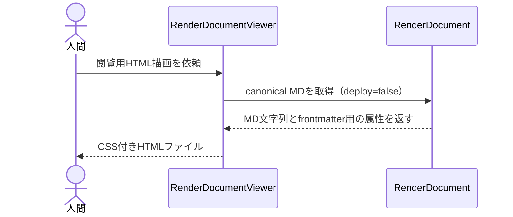

# MD正本をCSS付きHTMLで閲覧できる汎用viewerへ描画する：RenderDocumentViewer

## 概要

- 対象Documentのcanonical MD（RenderDocumentの出力）を、CSSの効いた自己完結HTMLへ変換し、読み取り専用の投影として書き出す

---

## 存在意義

- sd-document-managementの中核分類根拠（AIに構造を推論させず決定的にDocumentを生成・読取・描画する）と同じ差別化原理の延長として、この中核サブドメインに置く（ddd-advisor確認済み）
- MD正本（RenderDocument、コマンド実行モデル）とHTML投影（読み取り専用）はCQRS原則で分離し、1usecaseのformats分岐に混在させない（ddd-advisor助言による論点訂正）
- evidence-based-scope: 実証済みの拡張である。uc-render-handoff-templateという同型の「読み取り専用投影usecase」パターンが既に1件稼働しており、2件目の対象（全schema横断のMD→HTML変換）へ適用するだけで、新規に一般化するものではない（tech-lead-advisor確認済み）

---

## 主アクターと意図

### 主アクター

人間（document.jsonの内容を確認したい読み手）

### 意図

specやknowledge等のdocument.jsonの内容を、認知負荷の低い見やすいHTMLとして確認したい

---

## 事前条件

- 対象Documentが検証済み（VALIDATED以降のstatus）であり、canonical MDへrender可能である

---

## 基本フロー



---

## 事後条件

- Document集約自身の状態・内容は変更しない（読み取り専用の投影、RenderDocumentのstatus遷移・deploy処理を一切トリガーしない）
- MD正本をHTMLへ変換した自己完結ファイルが指定した出力先パスへ生成される

---

## 受け入れ基準

- When 検証済みのDocumentが与えられたとき、システムはそのcanonical MDをCSS付きの自己完結HTMLへ変換し、指定した出力先へ書き込む shall。
- When frontmatter（tags/documentType/schemaRef/updatedAt等）を持つDocumentが与えられたとき、システムはそれらをHTMLヘッダに表示する shall。
- When MD本文にmermaidコードフェンスが含まれるとき、システムはそれを<pre class="mermaid">要素として出力しブラウザ側でのレンダリングに委ねる shall。
- システムはHTML描画の過程でDocument集約自身の状態を変更してはならない must not。

---

## エラー

| コード | 条件 |
|---|---|
| `RENDER_FAILED` | - 対象DocumentがRenderDocumentでMDへ描画できない（schemaRef不正・未検証等、RenderDocument自体のエラー） |

---

## 受け入れシナリオ

### 検証済みDocumentをHTMLへ描画する

| 分類 | 観点 |
|---|---|
| 正常系 | canonical MDが正しくCSS付きHTMLへ変換され、frontmatterがヘッダに反映されることを確認する |

```gherkin
Scenario: 検証済みDocumentをHTMLへ描画する
  Given 検証済み（VALIDATED以降）のDocument
  When RenderDocumentViewerを実行する
  Then CSS付きの自己完結HTMLファイルが生成され、tags等のfrontmatterがヘッダに表示される
```

### mermaidコードフェンスをpre要素として出力する

| 分類 | 観点 |
|---|---|
| 正常系 | MD本文中のmermaid記法が、Waffle自身で図をレンダリングせずそのままブラウザ側へ委譲する形で出力されることを確認する |

```gherkin
Scenario: mermaidコードフェンスをpre要素として出力する
  Given 基本フローにmermaidのsequenceDiagramを含むDocument
  When RenderDocumentViewerを実行する
  Then <pre class="mermaid">要素としてmermaid記法がそのまま出力される
```

### RenderDocument自体が失敗する場合はRENDER_FAILEDを返す

| 分類 | 観点 |
|---|---|
| 異常系 | MD正本側の描画に失敗する対象は、HTML変換にも進まずエラーを返すことを確認する |

```gherkin
Scenario: RenderDocument自体が失敗する場合はRENDER_FAILEDを返す
  Given RenderDocumentでMDへ描画できないDocument（未検証等）
  When RenderDocumentViewerを実行する
  Then RENDER_FAILEDエラーが返りHTMLは生成されない
```

### HTML描画はDocument集約自身の状態を変更しない

| 分類 | 観点 |
|---|---|
| 正常系 | 読み取り専用の投影として、RenderDocumentのstatus遷移・deploy処理を一切トリガーしないことを確認する |

```gherkin
Scenario: HTML描画はDocument集約自身の状態を変更しない
  Given 検証済みのDocument
  When RenderDocumentViewerを実行する
  Then 対象Documentのstatus・canonical MD・deploy先はいずれも変更されない
```

### content.descriptionがOKF frontmatterのdescriptionとしてヘッダに出る

| 分類 | 観点 |
|---|---|
| 正常系 | schemaが持つdescriptionブロック（OKF frontmatter対応、brainstorm-md-html-viewer-and-okf.md論点2）のtextが、HTMLヘッダのdescriptionとして出力されることを確認する |

```gherkin
Scenario: content.descriptionがOKF frontmatterのdescriptionとしてヘッダに出る
  Given content.description.textを持つDocument
  When RenderDocumentViewerを実行する
  Then そのtextがHTMLヘッダのdescriptionとして出力される
```

### content.descriptionがitems配列の場合も結合してヘッダに出る

| 分類 | 観点 |
|---|---|
| 正常系 | schemaによってdescriptionブロックの形（text文字列 or items配列）が異なる（DomainSpecSchema等）ため、items配列の場合も結合して同じヘッダに反映されることを確認する |

```gherkin
Scenario: content.descriptionがitems配列の場合も結合してヘッダに出る
  Given content.description.items（配列）を持つDocument
  When RenderDocumentViewerを実行する
  Then その要素を結合したテキストがHTMLヘッダのdescriptionとして出力される
```
