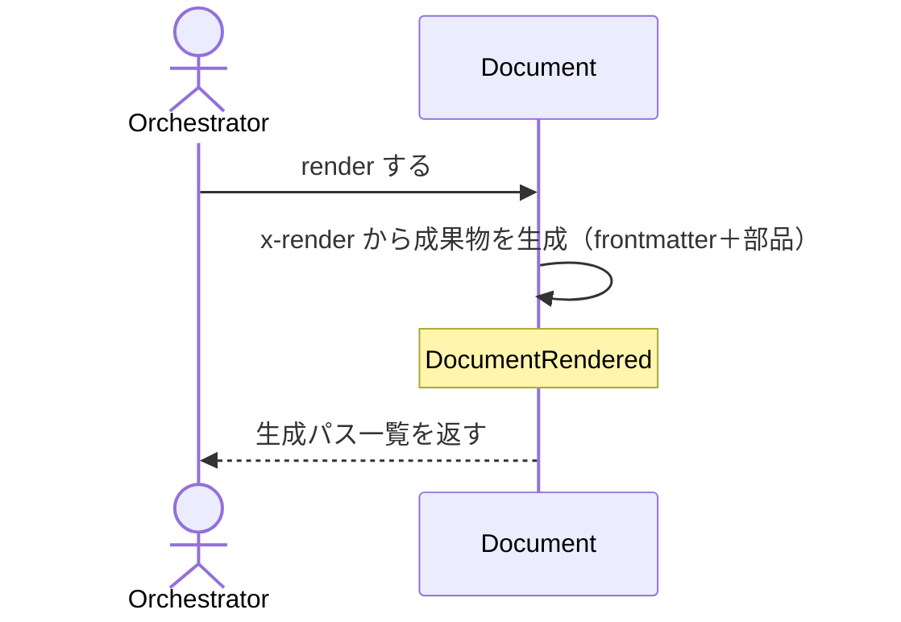

# Documentを人間可読な成果物へ描画する：RenderDocument

## 概要

- 検証済みの Document を schema の x-render に従って人間可読な成果物（SKILL.md / HTML）に描画し、配置先へ反映する。

---

## 存在意義

- spec/skillはJSON（document.json）として構造化されているが、人間がレビュー・意思決定する場面ではMarkdown等の可読な成果物が要る。この描画経路が無ければ、人間はJSONを直接読むか、Documentの内容を別途手作業でMarkdown化する必要が生じ、正本（document.json）と可読な成果物が容易に乖離する。

---

## 主アクターと意図

### 主アクター

Orchestrator（HarnessAgent）

### 意図

対象 Document を成果物に描画し、canonical と deploy 先へ反映する

---

## 事前条件

- 対象 Document が存在し、schemaRef を持つ

---

## 基本フロー



---

## 事後条件

- Document が RENDERED 状態になる
- DocumentRendered が発行される
- 成果物が canonical に書かれ、deploy 先へ verbatim コピーされる
- deploy 先は固定の配列だけでなく、discriminator（specKind等）ごとに異なる配列としても宣言できる（canonicalのpath選択と同じ仕組み）
- deploy 先の解決は .waffle/config.json の toolMappings が対象documentTypeに対応するマッピングを持つ場合、そちらを優先する。toolMappings 側のマッピングも、discriminatorの値ごとに異なるマッピング（kindごとの{pathTemplate, mode}等の組）として入れ子に宣言できる（documentType単位の分岐に加え、discriminatorという同一documentType内のさらに細かい軸でも分岐できる、canonicalのpath選択・schema側deployのdiscriminator分岐と同型の仕組み）
- パステンプレートの変数は、documentId等の既定変数に加え、schemaがx-render-target.pathVarsでcontentのドットパスを宣言すれば、そのcontent値も変数として使える（x-frontmatterと同型の宣言的解決）
- pathVarsもpath/deployと同様、discriminatorごとに異なる宣言（kindごとの{変数名: ドットパス}の組）としても書ける（discriminatorの分岐によってcontentの形が変わり、参照できるドットパスも変わるため）
- x-frontmatterも同様に、discriminatorの値ごとに異なるフィールド宣言（kindごとの{フィールド名: ドットパス}の組）として書ける（discriminatorによってcontentの形が変わり、frontmatterに出すべきフィールド自体も変わるため。frontmatterを持たないdiscriminator値は宣言しなければ生成されない）
- x-frontmatterが指すドットパスがDocumentの実データに存在しない、または値が空（空文字・空配列・null）である場合、そのfrontmatterフィールドは省略する（フィールドの省略＝上書きしない、という意味をpart_renderer全体の空値省略規約と一貫させる）

---

## 受け入れ基準

- When 対象 Document が与えられたとき、システムは x-render に従い成果物を生成する shall。
- When deploy が有効なとき、システムは canonical と deploy 先の両方へ書き込む shall。
- When deploy 先が discriminator ごとの配列として宣言されているとき、システムは対象 Document の discriminator 値に対応する配列だけへ書き込む shall。
- When 対象documentTypeに対応するtoolMappingsのマッピングが、discriminatorの値ごとの入れ子（kindごとの{pathTemplate, mode}等の組）として宣言されているとき、システムは対象Documentのdiscriminator値に対応するマッピングだけを使ってdeploy先を解決する shall。
- When schemaがx-render-target.pathVarsでcontentのドットパスを宣言しているとき、システムはそのcontent値をパステンプレートの変数として使う shall。
- When pathVarsがdiscriminatorごとの宣言（kindごとの変数マップ）であるとき、システムは対象Documentのdiscriminator値に対応する変数マップだけを解決する shall。
- When x-frontmatterがdiscriminatorごとの宣言（kindごとのフィールドマップ）であるとき、システムは対象Documentのdiscriminator値に対応するフィールドマップだけからfrontmatterを生成する shall。
- When x-frontmatterが指すドットパスがDocumentの実データに存在しない、または値が空であるとき、システムはそのフィールドをfrontmatterから省略する shall。
- If schemaRef が無いとき、システムは MISSING_SCHEMA_REF を返し描画しない shall。
- When table部品の列定義がbulletを宣言し、対象フィールドの値が配列であるとき、システムは各要素を改行区切り（<br>）の箇条書きとしてセル内に描画する shall。
- While table部品の列定義がbulletとjoin/sepの両方を宣言しているとき、システムはbulletを優先し、join/sepによる連結は行わない shall。
- If list/table/section/sequence/statediagram/architecture/flowchartのいずれかの部品が、対応するcontent値として配列以外の値を受け取ったとき、システムはMALFORMED_CONTENTエラーを返し描画しない shall。
- While pathVarsが参照するcontentのドットパスを対象Documentが持たないとき、システムはその変数を使うdeploy先だけをスキップし、canonicalへの書き込みは継続する shall。
- When x-frontmatterが指すドットパスの解決値がtext・itemsのいずれかを持つブロック形状のdictであるとき、システムはtextがあればそれを使い、無ければitemsを半角スペース区切りで結合した文字列をfrontmatter値として使う shall。

---

## 操作保証

- When 同じ Document を複数回 render したとき、システムは常に同一の成果物を生成する shall（決定的：入力が同じなら出力も同じ）。
- When x-render が RenderMetaSchema の各部品種別（paragraph/list/table/keyvalue/code/section/kvtable/sequence/statediagram/architecture/flowchart）を宣言したとき、システムはその種別ごとの整形規則に従って決定的に描画する shall。
- When 対象パスが存在しないとき、システムは INVALID_PATH エラーを返す shall（対象を特定し取得する解決プロセス自体の契約であり、複数のusecaseに共通する）。
- When 対象のschemaRefを解決できないとき、システムは INVALID_SCHEMA_REF エラーを返す shall（schemaを特定し取得する解決プロセス自体の契約であり、複数のusecaseに共通する）。
- When ブロックのx-renderが宣言する部品が全て空データで描画結果が空になったとき、システムはそのブロックの見出しごと省略する shall（タイトルだけが残る空セクションを防ぐ）。
- When ブロック定義がx-render-hiddenを宣言しているとき、システムはそのブロックを本文に一切描画しない shall（frontmatter等の値供給のみに使う非表示ブロックを表現できる）。
- When schemaがrenderを状態遷移コマンドとして宣言しているのに、Documentのstatusがその前提を満たさないとき、システムは INVALID_TRANSITION エラーを返す shall（宣言しないschema種別はstatusを問わない）。
- When レベル1（H1）の見出しブロックの直後に別のブロックが続くとき、システムはその間に区切り線（---）を挿入しない shall（多くのビューアがH1自体に下線を描画するため、直後の---は二重線に見えてしまう）。

---

## エラー

| コード | 条件 |
|---|---|
| `MALFORMED_CONTENT` | - list/table/section/sequence/statediagram/architecture/flowchartのいずれかの部品が、対応するcontent値として配列以外の値を受け取った |

---

## 受け入れシナリオ

### 検証済み Document を成果物に描画する

| 分類 | 観点 |
|---|---|
| 正常系 | 描画：x-render に従い成果物と生成パスを返す |

```gherkin
Scenario: 検証済み Document を成果物に描画する
  Given 描画対象の Document
  When render する
  Then 成果物が生成され、生成パス一覧が返る
```

### schemaRef を持たない Document は描画しない

| 分類 | 観点 |
|---|---|
| 異常系 | エラー：schemaRef 欠如は MISSING_SCHEMA_REF |

```gherkin
Scenario: schemaRef を持たない Document は描画しない
  Given schemaRef の無い Document
  When render する
  Then MISSING_SCHEMA_REF エラーが返る
```

### deploy すると canonical と deploy 先の両方に書く

| 分類 | 観点 |
|---|---|
| 正常系 | 受け入れ基準：deploy が有効なとき canonical と deploy 先の両方へ書き込む |

```gherkin
Scenario: deploy すると canonical と deploy 先の両方に書く
  Given deploy 先を持つ Document
  When deploy を有効にして render する
  Then canonical と deploy 先の両方に成果物が書かれる
```

### SkillSchemaをMarkdownにレンダリングする

| 分類 | 観点 |
|---|---|
| 正常系 | schema種別横断：SkillSchemaのDocumentが見出し・パラメータ表・呼び出し例まで正しく描画される |

```gherkin
Scenario: SkillSchemaをMarkdownにレンダリングする
  Given SkillSchemaのDocument
  When renderする
  Then 見出し・目的・相談種別テーブル・実行手順・参照knowledgeが全て出力に含まれる
```

### frontmatterはx_frontmatterのドットパスを解決して生成する

| 分類 | 観点 |
|---|---|
| 正常系 | frontmatter：schemaのx-frontmatter宣言(フィールド→ドットパス)を解決してYAML frontmatterを生成する |

```gherkin
Scenario: frontmatterはx_frontmatterのドットパスを解決して生成する
  Given x-frontmatterを宣言するSchemaのDocument
  When renderする
  Then 出力冒頭にname/description等を含むYAML frontmatterが生成される
```

### CodingSchemaはMarkdownとして描画できる

| 分類 | 観点 |
|---|---|
| 正常系 | schema種別横断：CodingSchemaのDocumentも同一engineで描画できる(schema固有ロジックを持たない汎用性) |

```gherkin
Scenario: CodingSchemaはMarkdownとして描画できる
  Given CodingSchemaのDocument
  When renderする
  Then Markdown形式で見出しを含む出力が生成される
```

### usecase_Specは基本フローをシーケンス図に受け入れシナリオをMarkdownに出す

| 分類 | 観点 |
|---|---|
| 正常系 | schema種別横断：usecase Specは MainFlow をMermaidシーケンス図に、TestScenariosをMarkdownに出す |

```gherkin
Scenario: usecase_Specは基本フローをシーケンス図に受け入れシナリオをMarkdownに出す
  Given usecase SpecのDocument
  When renderする
  Then 出力にmermaidのsequenceDiagramとテストシナリオ節が含まれる
```

### aggregate_Specは集約の構造とライフサイクルをMarkdownに出す

| 分類 | 観点 |
|---|---|
| 正常系 | schema種別横断：aggregate Specはコマンド・ドメインイベント・ライフサイクルをMermaidのstateDiagramと表で出す |

```gherkin
Scenario: aggregate_Specは集約の構造とライフサイクルをMarkdownに出す
  Given aggregate SpecのDocument
  When renderする
  Then 出力にコマンド節・ドメインイベント名・mermaidのstateDiagram-v2が含まれる
```

### 不正なJSONはINVALID_JSON

| 分類 | 観点 |
|---|---|
| 異常系 | エラー：対象ファイルがJSONとして解釈できないときはINVALID_JSON |

```gherkin
Scenario: 不正なJSONはINVALID_JSON
  Given 不正なJSONの対象ファイル
  When renderする
  Then INVALID_JSONエラーが返る
```

### discriminatorごとに異なるdeploy先へ書き分ける

| 分類 | 観点 |
|---|---|
| 正常系 | 受け入れ基準：deploy先がdiscriminatorごとの配列で宣言されているとき対応する配列だけへ書く |

```gherkin
Scenario: discriminatorごとに異なるdeploy先へ書き分ける
  Given deploy先がdiscriminatorの値ごとに異なる配列として宣言されたschemaのDocument
  When deployを有効にしてrenderする
  Then そのDocumentのdiscriminator値に対応する配列のdeploy先だけに書かれる
```

### toolMappingsがdiscriminatorごとに入れ子で宣言されているときは対応するマッピングだけを使う

| 分類 | 観点 |
|---|---|
| 正常系 | 受け入れ基準：toolMappingsが対象documentType内でdiscriminatorの値ごとに異なるマッピング（kindごとの{pathTemplate, mode}の組）として宣言されているとき、対象Documentのdiscriminator値に対応するマッピングだけからdeploy先を解決する |

```gherkin
Scenario: toolMappingsがdiscriminatorごとに入れ子で宣言されているときは対応するマッピングだけを使う
  Given .waffle/config.jsonのtoolMappingsが対象documentTypeについてdiscriminatorの値ごとの入れ子マッピングを持つDocument
  When deployを有効にしてrenderする
  Then そのDocumentのdiscriminator値に対応するマッピングのdeploy先だけに書かれる
```

### pathVarsで宣言したcontent値をパステンプレートの変数として使う

| 分類 | 観点 |
|---|---|
| 正常系 | 受け入れ基準：x-render-target.pathVarsが宣言するcontentドットパスの値がパステンプレートに反映される |

```gherkin
Scenario: pathVarsで宣言したcontent値をパステンプレートの変数として使う
  Given x-render-target.pathVarsでcontentのドットパスを宣言したschemaのDocument
  When renderする
  Then そのcontent値がパステンプレートの変数として解決され、対応するパスに書かれる
```

### discriminatorごとに異なるpathVarsを解決する

| 分類 | 観点 |
|---|---|
| 正常系 | 受け入れ基準：discriminatorの分岐によって参照できるcontentドットパスが変わるため、pathVars自体もdiscriminatorごとに宣言できる |

```gherkin
Scenario: discriminatorごとに異なるpathVarsを解決する
  Given discriminatorの値ごとに異なるpathVars宣言（kindごとの変数マップ）を持つschemaのDocument
  When renderする
  Then そのDocumentのdiscriminator値に対応する変数マップだけが解決され、パステンプレートに反映される
```

### discriminatorごとに異なるx_frontmatterを生成する

| 分類 | 観点 |
|---|---|
| 正常系 | 受け入れ基準：discriminatorの分岐によってfrontmatterに出すべきフィールド自体が変わる（frontmatter無しの分岐も許容） |

```gherkin
Scenario: discriminatorごとに異なるx_frontmatterを生成する
  Given discriminatorの値ごとに異なるx-frontmatter宣言（kindごとのフィールドマップ）を持つschemaのDocument
  When renderする
  Then そのDocumentのdiscriminator値に対応するフィールドマップだけからfrontmatterが生成される
```

### 存在しないx_frontmatterのドットパスは省略する

| 分類 | 観点 |
|---|---|
| 境界値 | 受け入れ基準：任意ブロック省略時にfrontmatterフィールドを空値で埋めず省略する（上書き指定の意味を保つ） |

```gherkin
Scenario: 存在しないx_frontmatterのドットパスは省略する
  Given x-frontmatterが宣言するドットパスに対応するcontentブロックを持たない、または値が空であるDocument
  When renderする
  Then そのフィールドはfrontmatterから省略される
```

### 配列値の列をbullet指定でセル内改行の箇条書きにする

| 分類 | 観点 |
|---|---|
| 正常系 | table描画：列定義のbulletがtrueで対象フィールドの値が配列のとき、各要素を<br>区切りの箇条書きとしてセル内に描画する |

```gherkin
Scenario: 配列値の列をbullet指定でセル内改行の箇条書きにする
  Given bullet:trueを宣言する列を持つtable部品と、その対象フィールドが複数要素の配列であるDocument
  When renderする
  Then そのセルは各要素が<br>で区切られた箇条書きとして描画される
```

### bulletとjoin_sepが同時指定されたときbulletを優先する

| 分類 | 観点 |
|---|---|
| 境界値 | table描画：列定義がbulletとjoin/sepの両方を宣言しているとき、bulletが優先されjoin/sepによる1行連結は行われない |

```gherkin
Scenario: bulletとjoin_sepが同時指定されたときbulletを優先する
  Given bulletとjoin/sepの両方を宣言する列を持つtable部品
  When renderする
  Then join/sepによる1行連結ではなくbulletによる箇条書きが描画される
```

### 配列を期待する部品が配列でない値を受け取るとMALFORMED_CONTENTを返す

| 分類 | 観点 |
|---|---|
| 異常系 | 描画：list/table/section等の配列を期待する部品が、fill後にvalidateを経ずに残った非配列値を受け取ったとき、意味不明な出力ではなく明確なエラーを返す |

```gherkin
Scenario: 配列を期待する部品が配列でない値を受け取るとMALFORMED_CONTENTを返す
  Given listを宣言する部品に対応するcontent値が配列でなく文字列であるDocument
  When renderする
  Then MALFORMED_CONTENTエラーが返り、成果物は書き出されない
```

### pathVarsが解決できないdeploy先はスキップしcanonicalへは書く

| 分類 | 観点 |
|---|---|
| 境界値 | 描画：pathVarsが参照するcontentのフィールドを持たないDocumentでも、そのpathVarを使わないcanonicalへの書き込みは妨げず、解決できないdeploy先だけをスキップする |

```gherkin
Scenario: pathVarsが解決できないdeploy先はスキップしcanonicalへは書く
  Given x-render-target.pathVarsが参照するcontentのドットパスを持たないDocument
  When renderする
  Then canonicalへは書かれるが、解決できないdeploy先はクラッシュせずスキップされる
```

### 配列のpathVarはtoolMappings経由のdeploy先へfan-outする

| 分類 | 観点 |
|---|---|
| 正常系 | deploy: x-render-target.pathVarsで宣言した値が配列（例: 複数advisorへのskillRefs）のとき、.waffle/config.jsonのtoolMappings経由のdeploy先は要素ごとに1つずつ生成される |

```gherkin
Scenario: 配列のpathVarはtoolMappings経由のdeploy先へfan-outする
  Given x-render-target.pathVarsで宣言した値が配列であるDocumentと、その変数を参照するtoolMappingsのpathTemplate
  When deployを有効にしてrenderする
  Then 配列の要素ごとに1つずつsymlinkのdeploy先が作られる
```

### x_frontmatterが指すブロックがitemsを持つときスペース区切りで結合する

| 分類 | 観点 |
|---|---|
| 正常系 | x-frontmatterが指す値がtext/itemsを持つブロック形状のdictのとき、itemsが空スペース区切りの1文字列へ正規化されることを確認する |

```gherkin
Given x-frontmatterがtext/itemsを持つブロック形状のdictを指すDocument
When RenderDocumentを実行する
Then itemsを半角スペースで結合した1つの文字列がfrontmatter値になる
```

### DomainSpecSchemaのusecase_Specはfrontmatterでid_type_title_description_tagsを持つ

| 分類 | 観点 |
|---|---|
| 正常系 | document-graph Skillの契約（id/type/title/description/tags）に沿ったfrontmatterがDomainSpecSchemaのusecaseから出力されることを確認する |

```gherkin
Given usecase specKindのDomainSpecSchema Document
When RenderDocumentを実行する
Then id/type/title/descriptionを含むfrontmatterが出力される
```

---

## 操作保証シナリオ

### 同じDocumentを2回renderしても同一の成果物になる

| 分類 | 観点 |
|---|---|
| 境界値 | 決定性：入力が変わらなければ出力も変わらない |

```gherkin
Scenario: 同じDocumentを2回renderしても同一の成果物になる
  Given 変更されていないDocument
  When 同じDocumentを2回renderする
  Then 1回目と2回目の成果物は同一である
```

### x_render宣言どおりに決定的に描画する

| 分類 | 観点 |
|---|---|
| 正常系 | 描画：x-renderがtable部品を宣言したとき、その宣言どおりの構造でMarkdownテーブルとして整形される |

```gherkin
Scenario: x-render宣言どおりに決定的に描画する
  Given interfaceブロック(x-render宣言=table)を持つDocument
  When renderする
  Then schemaのx-render宣言どおりに整形されたMarkdownテーブルが出力に含まれる
```

### 存在しないパスはINVALID_PATH

| 分類 | 観点 |
|---|---|
| 異常系 | 解決契約：対象パスが実在しないとき、パスの解決に失敗しINVALID_PATHになる |

```gherkin
Scenario: 存在しないパスはINVALID_PATH
  Given 実在しない対象パス
  When 本usecaseを実行する
  Then INVALID_PATHエラーが返る
```

### 解決できないschemaRefはINVALID_SCHEMA_REF

| 分類 | 観点 |
|---|---|
| 異常系 | 解決契約：schemaRefを解決できないとき、schemaの解決に失敗しINVALID_SCHEMA_REFになる |

```gherkin
Scenario: 解決できないschemaRefはINVALID_SCHEMA_REF
  Given 解決できないschemaRef
  When 本usecaseを実行する
  Then INVALID_SCHEMA_REFエラーが返る
```

### データが空の任意ブロックは見出しごと省略する

| 分類 | 観点 |
|---|---|
| 正常系 | 省略規則: x-renderが部品を宣言していても対応データが全て空なら描画結果は空になり、ブロックの見出しごと出力から消える |

```gherkin
Scenario: データが空の任意ブロックは見出しごと省略する
  Given x-renderに部品が宣言されたブロックを含むが値が全て空であるDocument
  When render する
  Then そのブロックの見出しを含むセクション全体が出力から省略される
```

### x_render_hiddenを宣言したブロックは本文に描画しない

| 分類 | 観点 |
|---|---|
| 正常系 | 非表示ブロック: frontmatter等の値供給のみに使うブロックはx-render-hiddenで本文描画から除外できる |

```gherkin
Scenario: x-render-hiddenを宣言したブロックは本文に描画しない
  Given x-render-hidden:trueを宣言したブロックを含むDocument
  When render する
  Then そのブロックの見出し・本文が出力に一切含まれない
```

### 未検証ではrenderできない

| 分類 | 観点 |
|---|---|
| 異常系 | 状態遷移：schemaがrenderをVALIDATED起点の遷移として宣言する場合、VALIDATED前提が効く |

```gherkin
Scenario: 未検証ではrenderできない
  Given schemaがrenderをVALIDATED起点の遷移として宣言しているのに、CREATED状態のDocument
  When renderする
  Then INVALID_TRANSITIONエラーが返り、成果物は書き出されない
```

### H1見出し直後に区切り線を入れない

| 分類 | 観点 |
|---|---|
| 境界値 | 区切り線抑制：レベル1(H1)の見出しブロック直後は区切り線(---)を入れない（多くのビューアがH1自体に下線を描画するため二重線に見えるのを防ぐ） |

```gherkin
Scenario: H1見出し直後に区切り線を入れない
  Given x-render-level=1のTitleブロックの直後にx-render-level=2のブロックが続くDocument
  When render する
  Then H1見出しと最初のH2見出しの間に区切り線(---)が入らない
```
