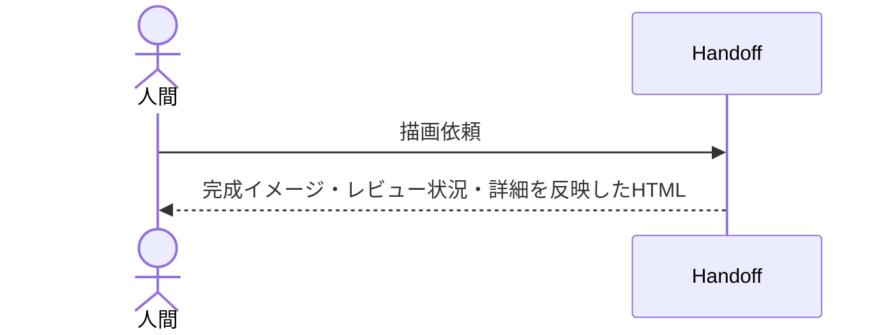

# Handoff document.jsonを固定HTMLテンプレートへ描画する：RenderHandoffTemplate

## 概要

- Handoff document.jsonの内容を、確定済みの固定HTMLテンプレート（完成イメージ・レビュー状況・詳細タブ）へ描画し、人間が読める成果物として書き出す

---

## 存在意義

- sd-document-managementの中核分類根拠は宣言的x-render機構による機械描画だが、Handoff HTML出力はこの語彙で表現できない固定デザインのため、evidence-based-scopeの例外として、Handoff専用の薄いusecaseで実現する（2件目の実例が出るまで汎用フレームワーク化しない）

---

## 主アクターと意図

### 主アクター

人間（レビュアー）

### 意図

Handoffの完成イメージ・レビュー状況・詳細を、認知負荷の低いHTMLとして確認したい

---

## 事前条件

- 対象DocumentのschemaRefがHandoffSchemaである

---

## 基本フロー



---

## 事後条件

- Handoff集約自身の状態・内容は変更しない（読み取り専用の投影）
- 固定テンプレートへ値を差し込んだHTMLファイルが.waffle/handoff/{documentId}.htmlへ生成される

---

## 受け入れ基準

- If 対象DocumentのschemaRefがHandoffSchemaでないとき、システムはエラーを返し描画しない shall。
- If completionImageブロックが無いとき、システムはMISSING_COMPLETION_IMAGEエラーを返し描画しない shall。
- When designViewpoints/implementationViewpointsが与えられたとき、システムはadvisor名＋件数のペアをレビュー状況セクションに出力する shall。
- When 対象HandoffとcompletionImageが与えられたとき、システムは固定テンプレートへ値を差し込んだHTMLを.waffle/handoff/{documentId}.htmlへ書き込む shall。
- When 対象Handoffが与えられたとき、システムはdocument-graph Skillの契約に沿ったid/type/title/description/tagsをHTMLのheadに<meta>タグとして出力する shall。

---

## エラー

| コード | 条件 |
|---|---|
| `WRONG_SCHEMA_REF` | - 対象DocumentのschemaRefがHandoffSchema以外である |
| `MISSING_COMPLETION_IMAGE` | - completionImageブロックが存在しない |

---

## 受け入れシナリオ

### completionImageを含むHandoffを描画する

| 分類 | 観点 |
|---|---|
| 正常系 | 固定テンプレートへ値が正しく差し込まれ、HTMLファイルが生成されることを確認する |

```gherkin
Given completionImage・designViewpoints・implementationViewpoints・constraints・title・specRefを持つ検証済みのHandoff
When RenderHandoffTemplateを実行する
Then .waffle/handoff/{documentId}.htmlが生成される
```

### HandoffSchema以外を描画しようとする

| 分類 | 観点 |
|---|---|
| 異常系 | 事前条件（schemaRef）違反を検出できることを確認する |

```gherkin
Given schemaRefがHandoffSchema以外のDocument
When RenderHandoffTemplateを実行する
Then WRONG_SCHEMA_REFエラーが返り描画されない
```

### completionImageが無いHandoffを描画しようとする

| 分類 | 観点 |
|---|---|
| 異常系 | 必須の構造化データが欠けている場合を検出できることを確認する |

```gherkin
Given completionImageブロックを持たないHandoff
When RenderHandoffTemplateを実行する
Then MISSING_COMPLETION_IMAGEエラーが返り描画されない
```

### advisor名と件数のペアがレビュー状況に出力される

| 分類 | 観点 |
|---|---|
| 正常系 | designViewpoints/implementationViewpointsのadvisor別集計が正しく出力に反映されることを確認する |

```gherkin
Given designViewpoints/implementationViewpointsが与えられたHandoff
When RenderHandoffTemplateを実行する
Then advisor名＋件数のペアがレビュー状況セクションに出力される
```

### HandoffSchemaの新しいバージョンも描画できる

| 分類 | 観点 |
|---|---|
| 正常系 | schemaRefの検証がバージョン完全一致ではなくHandoffSchema/プレフィックスであることを確認する（実データがHandoffSchema/v2へ移行済みで、旧v1完全一致では全件が描画失敗していた回帰の再発防止） |

```gherkin
Given schemaRefがHandoffSchema/v2のHandoff
When RenderHandoffTemplateを実行する
Then 正常にHTMLが生成される
```

### 契約準拠のmetaタグが出力される

| 分類 | 観点 |
|---|---|
| 正常系 | document-graph Skillが読める契約（id/type/title/description/tags）がHTMLのheadにmetaタグとして正しく出力されることを確認する |

```gherkin
Given completionImage・title・specRef・tags・descriptionを持つ検証済みのHandoff
When RenderHandoffTemplateを実行する
Then 生成されたHTMLのheadにid/type/title/description/tagsの<meta>タグが出力される
```
