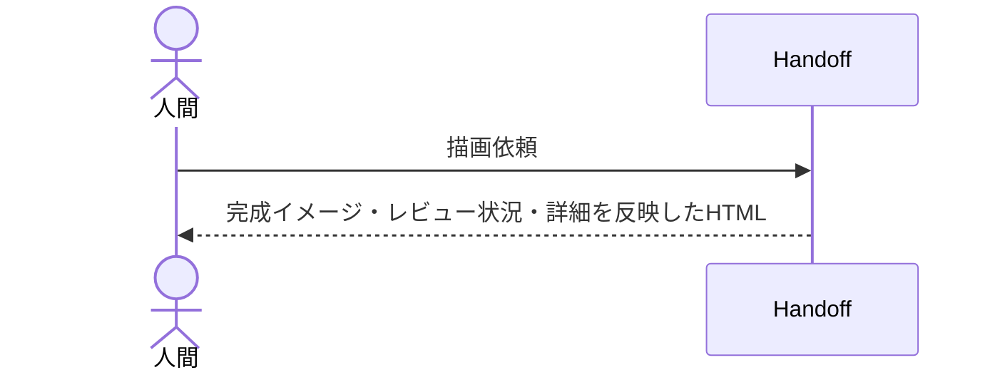

# Handoff document.jsonを固定HTMLテンプレートへ描画する：RenderHandoffTemplate

## 概要

- Handoff document.jsonの内容を、確定済みの固定HTMLテンプレート（完成イメージ・レビュー状況・詳細タブ）へ描画し、人間が読める成果物として書き出す

---

## 存在意義

- sd-document-managementの中核分類根拠は宣言的x-render機構による機械描画だが、Handoff HTML出力はこの語彙で表現できない固定デザインのため、evidence-based-scopeの例外として、Handoff専用の薄いusecaseで実現する（2件目の実例が出るまで汎用フレームワーク化しない）

---

## 主アクターと意図

### 主アクター

人間（レビュアー）

### 意図

Handoffの完成イメージ・レビュー状況・詳細を、認知負荷の低いHTMLとして確認したい

---

## 事前条件

- 対象DocumentのschemaRefがHandoffSchemaである

---

## 入力

| 入力 | 説明 |
|---|---|
| `path` | 引き継ぎ文書の置き場所 |
| `outputPath` | 引き継ぎの成果物を書き出す先 |

---

## 基本フロー


```mermaid
sequenceDiagram
    actor 人間
    人間->>Handoff: 描画依頼
    Handoff-->>人間: 完成イメージ・レビュー状況・詳細を反映したHTML
```

---

## 事後条件

- Handoff集約自身の状態・内容は変更しない（読み取り専用の投影）
- 固定テンプレートへ値を差し込んだHTMLファイルが.waffle/handoff/{documentId}.htmlへ生成される
- reviewStatus（requiredAdvisors/findings/completionImageConfirmedBy）が与えられている場合、その値はそのまま表示され、レンダリング処理内で新たな合否判定は行われない

---

## 受け入れ基準

- If 対象DocumentのschemaRefがHandoffSchemaでないとき、システムはエラーを返し描画しない shall。
- If completionImageブロックが無いとき、システムはMISSING_COMPLETION_IMAGEエラーを返し描画しない shall。
- When designViewpoints/implementationViewpointsが与えられたとき、システムはadvisor名＋件数のペアをレビュー状況セクションに出力する shall。
- When 対象HandoffとcompletionImageが与えられたとき、システムは固定テンプレートへ値を差し込んだHTMLを.waffle/handoff/{documentId}.htmlへ書き込む shall。
- When 対象Handoffが与えられたとき、システムはdocument-graph Skillの契約に沿ったid/type/title/description/tagsをHTMLのheadに<meta>タグとして出力する shall。
- When reviewStatus（requiredAdvisors/findings/completionImageConfirmedBy）が与えられたとき、システムはその値をそのまま表示し、実装に進めてよいかどうかの判定を新たに算出しない shall。

---

## エラー

| コード | 条件 |
|---|---|
| `WRONG_SCHEMA_REF` | - 対象DocumentのschemaRefがHandoffSchema以外である |
| `MISSING_COMPLETION_IMAGE` | - completionImageブロックが存在しない |

---

## 受け入れシナリオ

### completionImageを含むHandoffを描画する

| 分類 | 観点 |
|---|---|
| 正常系 | 固定テンプレートへ値が正しく差し込まれ、HTMLファイルが生成されることを確認する |

```gherkin
Scenario: completionImageを含むHandoffを描画する
Given completionImage・designViewpoints・implementationViewpoints・constraints・title・specRefを持つ検証済みのHandoff
When RenderHandoffTemplateを実行する
Then .waffle/handoff/{documentId}.htmlが生成される
```

### HandoffSchema以外を描画しようとする

| 分類 | 観点 |
|---|---|
| 異常系 | 事前条件（schemaRef）違反を検出できることを確認する |

```gherkin
Scenario: HandoffSchema以外を描画しようとする
Given schemaRefがHandoffSchema以外のDocument
When RenderHandoffTemplateを実行する
Then WRONG_SCHEMA_REFエラーが返り描画されない
```

### completionImageが無いHandoffを描画しようとする

| 分類 | 観点 |
|---|---|
| 異常系 | 必須の構造化データが欠けている場合を検出できることを確認する |

```gherkin
Scenario: completionImageが無いHandoffを描画しようとする
Given completionImageブロックを持たないHandoff
When RenderHandoffTemplateを実行する
Then MISSING_COMPLETION_IMAGEエラーが返り描画されない
```

### advisor名と件数のペアがレビュー状況に出力される

| 分類 | 観点 |
|---|---|
| 正常系 | designViewpoints/implementationViewpointsのadvisor別集計が正しく出力に反映されることを確認する |

```gherkin
Scenario: advisor名と件数のペアがレビュー状況に出力される
Given designViewpoints/implementationViewpointsが与えられたHandoff
When RenderHandoffTemplateを実行する
Then advisor名＋件数のペアがレビュー状況セクションに出力される
```

### HandoffSchemaの新しいバージョンも描画できる

| 分類 | 観点 |
|---|---|
| 正常系 | schemaRefの検証がバージョン完全一致ではなくHandoffSchema/プレフィックスであることを確認する（実データがHandoffSchema/v2へ移行済みで、旧v1完全一致では全件が描画失敗していた回帰の再発防止） |

```gherkin
Scenario: HandoffSchemaの新しいバージョンも描画できる
Given schemaRefがHandoffSchema/v2のHandoff
When RenderHandoffTemplateを実行する
Then 正常にHTMLが生成される
```

### 契約準拠のmetaタグが出力される

| 分類 | 観点 |
|---|---|
| 正常系 | document-graph Skillが読める契約（id/type/title/description/tags）がHTMLのheadにmetaタグとして正しく出力されることを確認する |

```gherkin
Scenario: 契約準拠のmetaタグが出力される
Given completionImage・title・specRef・tags・descriptionを持つ検証済みのHandoff
When RenderHandoffTemplateを実行する
Then 生成されたHTMLのheadにid/type/title/description/tagsの<meta>タグが出力される
```

### reviewStatusの値をそのまま表示し新たな判定を行わない

| 分類 | 観点 |
|---|---|
| 正常系 | render側が既存contentの値を集計・表示するだけで、合否判定そのものを新たに計算していないことを確認する（UI層に業務ルール判定ロジックを持たせないというアーキテクチャ制約の検証） |

```gherkin
Scenario: reviewStatusの値をそのまま表示し新たな判定を行わない
Given requiredAdvisors・findings（resolutionStatusを含む）・completionImageConfirmedByを持つ検証済みのHandoff
When RenderHandoffTemplateを実行する
Then 生成されたHTMLにfindingsの件数・resolutionStatusの値がそのまま表示される
And レンダリング処理内で「実装に進めてよいか」を新たに算出するロジックは実行されない
```

### expectedScopeを含むHandoffを描画すると対象範囲の見込みタブに出力される

| 分類 | 観点 |
|---|---|
| 正常系 | 任意ブロックが与えられたとき、その内容がそのまま描画されることを確認する |

```gherkin
Scenario: expectedScopeを含むHandoffを描画すると対象範囲の見込みタブに出力される
Given expectedScopeブロック（path/reasonの配列）を持つHandoff
When RenderHandoffTemplateを実行する
Then 「対象範囲の見込み」タブに対象パスと理由がそのまま出力される
```

### expectedScopeが無いHandoffも描画できる

| 分類 | 観点 |
|---|---|
| 境界値 | 任意ブロックの不在で描画そのものが失敗しないことを確認する |

```gherkin
Scenario: expectedScopeが無いHandoffも描画できる
Given expectedScopeブロックを持たない（任意ブロックのため省略可能な）Handoff
When RenderHandoffTemplateを実行する
Then エラーにならず、対象範囲の見込みタブは空状態で描画される
```

### reviewStatusが無いHandoffも描画できる

| 分類 | 観点 |
|---|---|
| 境界値 | 任意ブロックの不在で描画そのものが失敗しないことを確認する |

```gherkin
Scenario: reviewStatusが無いHandoffも描画できる
Given reviewStatusブロックを持たない（任意ブロックのため省略可能な）Handoff
When RenderHandoffTemplateを実行する
Then エラーにならず、未解決事項は0件のまま描画される
```
