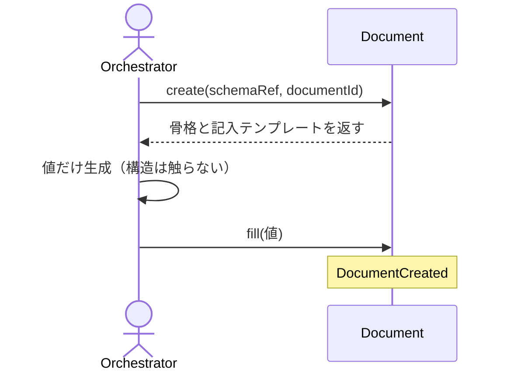

# Documentの骨格生成と値の書き込み：ScaffoldDocument

## 概要

- schema から Document の骨格を機械生成し（create）、AI が生成した値を宣言済みフィールドにのみ機械的に書き込む（fill）。AI は構造を触らない。

---

## 存在意義

- AIがdocument.jsonの構造（キー名・ネスト・schemaの規約）を毎回自由に組み立てると、schemaが保証すべき構造の一貫性が壊れ、validateに通らない文書が量産される。AIが触れる範囲を「値だけ」に限定する仕組みが無ければ、AIによる構造改変を防ぐ手立てがなく、waffleが狙うAI過剰生成対策（構造保護）が成立しない。

---

## 主アクターと意図

### 主アクター

Orchestrator（HarnessAgent）

### 意図

新しい Document を schema 通りに起こし、値だけを安全に埋める

---

## 事前条件

- 生成対象の schema と documentId が与えられている
- 分岐のある schema では discriminator が与えられている
- clear_fieldの場合: 対象のdocumentPath・削除する値フィールドのpathが与えられている
- 要素操作の場合: 対象のdocumentPathが与えられ、その document が適合の検証を通っている（鍵を宣言した配列に鍵の重複が無いことは、要素操作より先に検証が担保する）

---

## 入力

| 入力 | 説明 |
|---|---|
| `operation` | documentに対して行う書き込みの種類 |
| `schemaRef` | 骨格を作るときに従うschemaを指す参照 |
| `documentId` | 作るdocumentを一意に指す識別子 |
| `discriminator` | key=value 形式（例: skillKind=engine） |
| `contextRef` | 所属する bounded-context の documentId（ネストしたx-source-targetが要求する場合） |
| `subdomainRef` | usecase が属する subdomain の documentId |
| `fieldPath` | clear_fieldで取り除く値フィールドまでのドットパス |
| `values` | fill する値の JSON オブジェクト |
| `documentPath` | 既にあるdocumentの置き場所。値の書き込み・欄の除去・版の移行の対象になる |
| `elementOps` | 要素操作の並び。1回の呼び出しで複数を受け取り、全か無かで適用される。各操作は「種類（足す／欄を直す／取り下げる）・対象の配列の道・鍵の値・書き込む中身」を持つ。values とは別の引数であり、配列を丸ごと渡す経路とは混ざらない |

---

## 基本フロー



---

## 事後条件

- Document が schema の初期 status（enum 先頭）で生成される
- 宣言済みの値フィールドにのみ値が書き込まれる
- 構造（const / discriminator）は AI に変更されない
- clear_fieldは宣言済みの値フィールドのうち、必須ではないフィールドのみ削除できる（必須フィールドの削除は拒否する）

---

## 受け入れ基準

| 基準 |
|---|
| When schemaRef と documentId が与えられたとき、システムは schema に適合する骨格を生成する shall（status=schema の enum 先頭）。 |
| When fill で値が与えられたとき、システムは宣言済み値フィールドにのみ書き込む shall。 |
| If 構造を変える値や const / discriminator が与えられたとき、システムは拒否し skipped に記録する shall。 |
| If 分岐のある schema で discriminator が無いとき、システムは MISSING_DISCRIMINATOR を返し候補を案内する shall。 |
| If 分岐のある schema で discriminator の値が候補enumに存在しないとき、システムは INVALID_DISCRIMINATOR を返し候補を案内する shall。 |
| When clear_fieldでdocumentPath・fieldPathが与えられたとき、システムはその値フィールドをdocumentから削除する shall。 |
| While 削除対象のフィールドが既に存在しないとき、clear_fieldは無変更で成功する shall。 |
| If clear_fieldの削除対象が必須フィールドであるとき、システムはREQUIRED_FIELDエラーを返し削除を拒否する shall。 |
| When migrate_schemaでdocumentPath・schemaRef（移行先）が与えられたとき、システムはDocumentのschemaRefをその値へ書き換える shall。 |
| While Documentのschemaが既に目的のschemaRefであり、かつその版が宣言しないブロックを持たないとき、migrate_schemaは無変更で成功する shall（宣言外のブロックが残っている場合は、版が同じでも取り除く——素通しにすると、版だけ書き換わって宣言外のブロックが残ったDocumentが、二度目の運搬でも直らないまま固定される）。 |
| If migrate_schemaの移行先schemaRefが解決できないとき、システムはINVALID_SCHEMA_REFエラーを返し書き換えを拒否する shall。 |
| When createで版を含まないschemaRefが与えられたとき、システムはその名前の最新の版へ解決して骨格を生成する shall（指示や手順に版を書かせないため。書かれた版はschemaが上がった瞬間から古い版を指す）。 |
| If createで最新でない版のschemaRefが明示されたとき、システムはOUTDATED_SCHEMA_REFエラーを返し骨格を生成しない shall（最新以外の版で新しいdocumentを作る用途を持たないため）。 |
| While migrate_schemaに移行先のschemaRefが与えられたとき、システムはその版が最新かどうかを問わず書き換える shall（既存documentを段階的に運ぶ操作であり、createの制限をここへ持ち込むと移行の道が塞がるため）。 |
| When 書き込みを終えたとき、システムは実際に書き込んだ欄だけを written に、書き込まなかった欄を skipped に記録する shall（書き込み結果を偽らない）。 |
| When create が骨格を生成したとき、システムは schema が宣言する置き場所へ骨格を書き出し、create に渡された参照パラメータを document 本体にも書き込む shall。 |
| When create が骨格を生成したとき、システムは記入対象の道とその執筆ガイダンスを fillTemplate として返す shall（content の外にあるトップレベルの欄も含む）。 |
| When まだ存在しないブロックの中の欄へ書き込むとき、システムはそのブロックの種別も一緒に作り、書き込んだ結果が schema に適合する状態にする shall。 |
| When 鍵を宣言した配列へ add_element で要素が与えられたとき、システムは既存の要素を一度も読み込ませることなく、その要素を加える shall（読み出して組み立て直す手順を挟まないことが、この操作の目的そのもの）。 |
| When 鍵を宣言した配列へ retire_element で鍵が与えられたとき、システムは宣言された参照をたどってその鍵が指されていないことを確かめてから、取り下げを適用する shall。 |
| If retire_element の対象の鍵が、宣言された参照のいずれかからまだ指されているとき、システムは STILL_REFERENCED を返し、指している場所を示して取り除かない shall。 |
| If 要素操作が、指定された鍵を持つ要素が無いために適用できなかったとき、システムは UNKNOWN_ELEMENT_KEY を返す shall。 |
| If 鍵を宣言した配列に対して fill で配列全体が与えられたとき、システムは WHOLESALE_REPLACE_NOT_ALLOWED を返し、使うべき要素操作を案内して書き込まない shall。 |
| If 複数の要素操作のうち1つでも受け付けられないとき、システムはどの操作も適用せず、Document へ何も保存しない shall（配列の中で起きる失敗だけでなく、順序配列の拒否・丸ごと置き換えの拒否・宣言の誤りなど、配列の外で起きる失敗も含む）。 |
| When 要素を加えるとき、システムは schema がその要素に宣言する固定値を集めて渡し、書き込んだ結果が schema に適合する状態にする shall。 |
| If 順序そのものが意味を持つと宣言された配列へ要素操作が与えられたとき、システムは ELEMENT_OPS_NOT_APPLICABLE を返し、その配列は丸ごと置き換えて書き換えるものだと案内する shall。 |
| While 配列が鍵も順序も宣言していないとき、システムは従来どおり fill による丸ごとの置き換えを受け付ける shall。 |
| If 同じ配列に順序の宣言と鍵の宣言が両方あるとき、システムは ELEMENT_OPS_NOT_APPLICABLE を返し、宣言そのものが誤っていることを示す shall（どちらが優先かを実装が黙って決めないため）。 |
| When 記入対象の道と執筆ガイダンスを返すとき、システムは配列については鍵の宣言・参照関係の宣言・順序の宣言も併せて返す shall（書き手に渡る指示に現れない宣言は、書き手にとって存在しないため）。 |
| When 要素操作がすべて受け付けられたとき、システムは書き換えた配列を Document へ保存し、その配列の道を written に記録する shall。 |
| When 対象パスが存在しないとき、システムは INVALID_PATH エラーを返す shall（対象を特定し取得する解決プロセス自体の契約であり、複数のusecaseに共通する）。 |
| When 対象のschemaRefを解決できないとき、システムは INVALID_SCHEMA_REF エラーを返す shall（schemaを特定し取得する解決プロセス自体の契約であり、複数のusecaseに共通する）。 |
| When 同じ documentId で create を複数回実行したとき、システムの生成する構造（schema由来の骨格の形）は常にべき等である shall。 |
| While document.json が既に存在するとき、create を再実行しても、fill で書き込まれた既存の values は保持され、破壊されない shall（values 自体の再現性はシステムの管轄外・呼び出し側の責務）。 |
| When 要素操作が与えられたとき、システムは常に Document 全体を対象として読み書きし、要素だけを切り離して指させない shall。 |
| When 移行先の版が宣言しないブロックをDocumentが持ち、そのブロックが空であるとき、システムはそのブロックを取り除いてから版を書き換える shall（残したまま版だけ書き換えると、どの操作からも触れず消せないブロックが残り、Documentは以後どの版でも適合しなくなる）。ここでいう空とは、ブロックの器を除いた残りに値が無いことをいう——器とはそのブロックが何であるかを示す名前と見出しであり、書き手が入れた内容ではない。 |
| If 移行先の版が宣言しないブロックをDocumentが持ち、そのブロックの器を除いた残りに値があるとき、システムはMIGRATION_WOULD_DISCARD_CONTENTエラーを返し、版を書き換えない shall（黙って捨てると、どこにも移していない内容が消える。運び先を決めるのは呼び出し側の仕事であり、この操作が代わりに決めてよいことではない）。 |
| When 版の書き換えにあたってブロックを取り除いたとき、システムは取り除いたブロックの名前を結果に含める shall（何が消えたかが結果に出ないと、消えたこと自体が後から確かめられない）。 |
| If 版の書き換えを拒否したとき、システムはDocumentを一切変更しない shall（途中まで書き換えた状態で止まると、宣言した版と中身が食い違ったDocumentが残る）。 |

---

## エラー

| コード | 条件 |
|---|---|
| `MISSING_DISCRIMINATOR` | - 分岐のあるschemaでdiscriminatorが未指定（候補enumを案内） |
| `INVALID_DISCRIMINATOR` | - 分岐のあるschemaでdiscriminatorの値がenumに存在しない（候補enumを案内） |
| `REQUIRED_FIELD` | - clear_fieldの削除対象がschemaの必須フィールドである |
| `INVALID_SCHEMA_REF` | - migrate_schemaの移行先schemaRefが解決できない |
| `OUTDATED_SCHEMA_REF` | - createで指定されたschemaRefの版が、そのschemaの最新ではない |
| `UNKNOWN_ELEMENT_KEY` | - 要素操作が指した鍵を持つ要素が、対象の配列に存在しない |
| `STILL_REFERENCED` | - 取り下げようとした要素の鍵が、宣言された参照からまだ指されている |
| `WHOLESALE_REPLACE_NOT_ALLOWED` | - 鍵を宣言した配列に対して、values で配列全体が与えられた |
| `ELEMENT_OPS_NOT_APPLICABLE` | - 順序そのものが意味を持つと宣言された配列に対して、要素操作が与えられた<br>- 同じ配列に順序の宣言と鍵の宣言が両方あるとき（宣言そのものの誤りであり、鍵を見に行く前にこれを返す） |
| `INVALID_PATH` | - 対象パスが存在しないとき |
| `MIGRATION_WOULD_DISCARD_CONTENT` | - 移行先の版が宣言しないブロックに、中身が残っている |

---

## 受け入れシナリオ

### 生成した骨格は自分の schema で valid

| 分類 | 観点 |
|---|---|
| 正常系 | 骨格生成：生成骨格は schema 適合・status は初期値 |

```gherkin
Scenario: 生成した骨格は自分の schema で valid
  Given advisor 種別の Document（discriminator 指定済み）
  When create する
  Then 骨格は schema に適合し、status は schema の初期値である
```

### 構造を変える値は拒否される

| 分類 | 観点 |
|---|---|
| 異常系 | 構造保護：const フィールドへの書き込みは skipped |

```gherkin
Scenario: 構造を変える値は拒否される
  Given 作成済みの Document
  When const フィールドへ値を書き込もうとする
  Then 書き込まれず skipped に記録される
```

### 宣言済みの値フィールドに書き込まれる

| 分類 | 観点 |
|---|---|
| 正常系 | fill：宣言済み値フィールドへの書き込みは written に記録される |

```gherkin
Scenario: 宣言済みの値フィールドに書き込まれる
  Given 作成済みの Document
  When 宣言済みの値フィールドへ値を書き込む
  Then written に記録され、ファイルに反映される
```

### discriminator が無いと候補を案内する

| 分類 | 観点 |
|---|---|
| 異常系 | エラー：分岐のある schema で discriminator 未指定は MISSING_DISCRIMINATOR |

```gherkin
Scenario: discriminator が無いと候補を案内する
  Given 分岐のある schema
  When discriminator を指定せずに create する
  Then MISSING_DISCRIMINATOR エラーが候補つきで返る
```

### createはadvisor_skillの骨格を生成する

| 分類 | 観点 |
|---|---|
| 正常系 | 骨格生成：discriminator(skillKind=advisor)からschema分岐に沿った骨格が組まれる |

```gherkin
Scenario: createはadvisor_skillの骨格を生成する
  Given schemaRef, documentId, discriminator(skillKind=advisor)
  When createを実行する
  Then documentType/schemaRef/skillKind/statusが正しく設定され、content配下にresponseTypes/knowledgeRefsがある骨格が生成される
```

### createはx_source_targetに骨格を書き出す

| 分類 | 観点 |
|---|---|
| 正常系 | 永続化：createはschema宣言のx-source-targetへ骨格ファイルを書き出す |

```gherkin
Scenario: createはx_source_targetに骨格を書き出す
  Given schemaRef, documentId, discriminator
  When createを実行する
  Then schemaのx-source-target宣言どおりのパスにファイルが書き出される
```

### fillTemplateは値フィールドのpathとprompt_x_prompt_writeを持つ

| 分類 | 観点 |
|---|---|
| 正常系 | fillTemplate：createが返すfillTemplateは値フィールドのpath×x-prompt-writeの一覧である |

```gherkin
Scenario: fillTemplateは値フィールドのpathとprompt_x_prompt_writeを持つ
  Given schemaRef, documentId, discriminator
  When createを実行する
  Then fillTemplateには値フィールドのpathとx-prompt-write由来のpromptを持つエントリが含まれる
```

### customはadvisorと構成が異なる

| 分類 | 観点 |
|---|---|
| 正常系 | discriminator分岐：skillKind=customはadvisorと異なるcontent構造(processingTarget)を持つ |

```gherkin
Scenario: customはadvisorと構成が異なる
  Given discriminator(skillKind=custom)
  When createを実行する
  Then advisorとは異なりcontent配下にprocessingTargetを持つ骨格が生成される
```

### 宣言済みの値フィールドを削除する

| 分類 | 観点 |
|---|---|
| 正常系 | clear_field：必須ではない値フィールドをdocumentから削除する |

```gherkin
Scenario: 宣言済みの値フィールドを削除する
  Given 値が書き込み済みの、必須ではないフィールドのpath
  When clear_fieldを実行する
  Then そのフィールドがdocumentから削除される
```

### 既に存在しないフィールドのclear_fieldは無変更で成功する

| 分類 | 観点 |
|---|---|
| 境界値 | clear_field：冪等性 |

```gherkin
Scenario: 既に存在しないフィールドのclear_fieldは無変更で成功する
  Given 既に削除済みのフィールドpath
  When clear_fieldを再実行する
  Then 対象は無変更のまま成功する
```

### 必須フィールドのclear_fieldはREQUIRED_FIELDとして拒否される

| 分類 | 観点 |
|---|---|
| 異常系 | clear_field：構造保護：必須フィールドの削除を拒否する |

```gherkin
Scenario: 必須フィールドのclear_fieldはREQUIRED_FIELDとして拒否される
  Given schemaのrequiredに指定されているフィールドのpath
  When clear_fieldを実行する
  Then REQUIRED_FIELDエラーが返り削除されない
```

### 不正なdiscriminator値はINVALID_DISCRIMINATOR

| 分類 | 観点 |
|---|---|
| 異常系 | 事前条件違反: enumに無いdiscriminator値の拒否 |

```gherkin
Scenario: 不正なdiscriminator値はINVALID_DISCRIMINATOR
  Given 分岐のあるschemaのenumに存在しないdiscriminator値
  When createを実行する
  Then INVALID_DISCRIMINATORエラーが返る
```

### migrate_schemaはschemaRefを新版へ書き換える

| 分類 | 観点 |
|---|---|
| 正常系 | migrate_schema: 既に解決可能な別のschema版へDocumentのschemaRefを書き換える |

```gherkin
Scenario: migrate_schemaはschemaRefを新版へ書き換える
  Given 別版のschemaRefを指す既存Document
  When migrate_schemaを実行する
  Then Documentのstatusはそのschema版へ書き換わる
```

### migrate_schemaは同じ版への書き換えに対して冪等である

| 分類 | 観点 |
|---|---|
| 境界値 | migrate_schema: 冪等性 |

```gherkin
Scenario: migrate_schemaは同じ版への書き換えに対して冪等である
  Given 既に目的のschemaRefになっているDocument
  When 同じschemaRefでmigrate_schemaを再実行する
  Then 対象は無変更のまま成功する
```

### migrate_schemaは解決できないschemaRefをINVALID_SCHEMA_REFとして拒否する

| 分類 | 観点 |
|---|---|
| 異常系 | migrate_schema: 対象取り違えの防止 |

```gherkin
Scenario: migrate_schemaは解決できないschemaRefをINVALID_SCHEMA_REFとして拒否する
  Given 解決できない移行先schemaRef
  When migrate_schemaを実行する
  Then INVALID_SCHEMA_REFエラーが返り、Documentは変更されない
```

### constフィールドは現行schemaの宣言値と完全一致する場合のみ再同期できる

| 分類 | 観点 |
|---|---|
| 境界値 | 計算整合: 完全一致のときだけ許すことで、構造保護を保ったまま再同期できる |

```gherkin
Scenario: constフィールドは現行schemaの宣言値と完全一致する場合のみ再同期できる
Given 作成済みのDocument
When constフィールドへ、現行schemaが宣言するconst値と完全に一致する値を書き込む
Then 書き込みが許可される
And 完全に一致しない値への上書きは引き続き拒否される
```

### createに渡した参照パラメータはdocument本体にも書き込まれる

| 分類 | 観点 |
|---|---|
| 正常系 | 計算整合: 参照パラメータがパス計算にしか使われないと、作られたdocumentが自分の所属を持たない |

```gherkin
Scenario: createに渡した参照パラメータはdocument本体にも書き込まれる
Given schemaが宣言する任意のトップレベルフィールド（subdomainRef等）に対応する参照パラメータ
When createを実行する
Then そのパラメータはパス計算だけでなくdocument本体にも書き込まれる
```

### fillTemplateにはcontent外のトップレベルのx-prompt-writeフィールドも含まれる

| 分類 | 観点 |
|---|---|
| 正常系 | 境界: 値フィールドはcontentの中だけにあるとは限らない |

```gherkin
Scenario: fillTemplateにはcontent外のトップレベルのx-prompt-writeフィールドも含まれる
Given content外にx-prompt-writeを持つトップレベルフィールド（skillRef）を宣言するschema
When createを実行する
Then fillTemplateにcontent以外のパス（skillRef）のエントリが含まれる
```

### fillはcontent外のトップレベルのx-prompt-writeフィールドにも書き込める

| 分類 | 観点 |
|---|---|
| 正常系 | 境界: 案内した経路へ実際に書き込めなければ、案内が嘘になる |

```gherkin
Scenario: fillはcontent外のトップレベルのx-prompt-writeフィールドにも書き込める
Given 作成済みのDocument
When content外のトップレベルフィールド（skillRef）へ値を書き込む
Then writtenに記録され、ファイルに反映される
```

### fillはdocumentIdとdiscriminatorキーへの書き込みを拒否する

| 分類 | 観点 |
|---|---|
| 異常系 | 事前条件: 識別子と構造分岐が書き換わると、documentの同一性と置き場所が壊れる |

```gherkin
Scenario: fillはdocumentIdとdiscriminatorキーへの書き込みを拒否する
Given 作成済みのDocument
When documentId・discriminatorキー（templateKind）へ値を書き込もうとする
Then 書き込まれずskippedに記録される
```

### schema版が変わった後に新設された任意ブロックも既存documentへ書き込める

| 分類 | 観点 |
|---|---|
| 境界値 | 状態遷移: 既存documentがschemaの新版へ追従していない状態でも書き込めること |

```gherkin
Scenario: schema版が変わった後に新設された任意ブロックも既存documentへ書き込める
Given schemaが宣言する任意ブロックのキー自体を持たない既存Document
When そのブロック配下の宣言済み値フィールドへfillする
Then writtenに記録され、ファイルに反映される
```

### 書き込み単位でない欄を指すと何も書き込まない

| 分類 | 観点 |
|---|---|
| 異常系 | 結果の誠実さ：書けない指定を受けたら、書けた分も含めて何も変えない |

```gherkin
Scenario: 書き込み単位でない欄を指すと何も書き込まない
  Given 作成済みの Document
  When 書き込み単位でない欄と、書き込める欄を同時に指定する
  Then 拒否され、書き込める欄も含めて Document は変わらない
  And 指定すべき欄の候補が示される
```

### 宣言に無い欄を指すと何も書き込まない

| 分類 | 観点 |
|---|---|
| 異常系 | 結果の誠実さ：存在しない欄への指定を成功として返さない |

```gherkin
Scenario: 宣言に無い欄を指すと何も書き込まない
  Given 作成済みの Document
  When 宣言に無い欄を指定する
  Then 拒否され、Document は変わらない
```

### ブロックがまだ無い欄へ書くと種別も一緒に作られる

| 分類 | 観点 |
|---|---|
| 正常系 | 構造の完全性：後から新設されたブロックへ書いても、それ単体で適合する |

```gherkin
Scenario: ブロックがまだ無い欄へ書くと種別も一緒に作られる
  Given ブロックがまだ無い Document
  When そのブロック配下の欄へ値を書き込む
  Then ブロックの種別も一緒に作られ、Document は schema に適合する
```

### 版を省けば最新の版で作られる

| 分類 | 観点 |
|---|---|
| 正常系 | 指示に版を書かせない：書かれた版は必ず腐る |

```gherkin
Scenario: 版を省けば最新の版で作られる
  Given 複数の版を持つschemaの名前
  And その名前に版を付けずに指定する
  When 骨格の生成を求める
  Then 最新の版で骨格が作られる
```

### 古い版を明示したら作らせない

| 分類 | 観点 |
|---|---|
| 異常系 | 誤りの検出：古い版のdocumentを作ってから気づく事態を防ぐ |

```gherkin
Scenario: 古い版を明示したら作らせない
  Given 複数の版を持つschemaのうち、最新ではない版
  When その版を明示して骨格の生成を求める
  Then OUTDATED_SCHEMA_REFとして拒まれる
  And 骨格は作られない
```

### 必須ブロックの中にある必須でない欄は削除できる

| 分類 | 観点 |
|---|---|
| 境界値 | 境界: 必須かどうかは欄そのもので決まる。入れ物が必須であることを、中身が必須であることと取り違えない |

```gherkin
Scenario: 必須ブロックの中にある必須でない欄は削除できる
  Given schemaのrequiredに指定されているブロックのpath
  And そのブロックの中にある、requiredに指定されていない欄のpath
  When その欄に対してclear_fieldを実行する
  Then その欄がdocumentから削除される
  And REQUIRED_FIELDエラーにならない
```

### 要素を1件足すのに既存を読み込ませない

| 分類 | 観点 |
|---|---|
| 正常系 | 要素の同一性：足す操作が、配列全体を経由せずに済むか |

```gherkin
Scenario: 要素を1件足すのに既存を読み込ませない
  Given 受け入れ基準を3件持つ Document
  When 基準を1件 add_element で加える
  Then 配列は4件になり、既存の3件はそのまま残る
```

### 参照が残っていない要素は取り下げられる

| 分類 | 観点 |
|---|---|
| 正常系 | 取り下げの前提：参照が外れていれば通るか |

```gherkin
Scenario: 参照が残っていない要素は取り下げられる
  Given どのシナリオからも指されていない受け入れ基準
  When その鍵を指して retire_element する
  Then その要素が配列から取り除かれる
```

### 参照が残っている要素は取り下げられない

| 分類 | 観点 |
|---|---|
| 異常系 | 取り下げの前提：宣言された参照関係から可否が導かれるか |

```gherkin
Scenario: 参照が残っている要素は取り下げられない
  Given あるシナリオの satisfies から指されている受け入れ基準
  When その鍵を指して retire_element する
  Then PRECONDITION_NOT_MET が返り、参照しているシナリオが示され、要素は残る
```

### 存在しない鍵を指すと失敗する

| 分類 | 観点 |
|---|---|
| 異常系 | 要素の同一性：指し間違いを、黙って足すことで埋めないか |

```gherkin
Scenario: 存在しない鍵を指すと失敗する
  Given その鍵を持つ要素が無い配列
  When その鍵を指して edit_element する
  Then UNKNOWN_ELEMENT_KEY が返り、要素は増えない
```

### 鍵を宣言した配列は丸ごと置き換えられない

| 分類 | 観点 |
|---|---|
| 異常系 | 取りこぼしの遮断：取りこぼす手順そのものへ入れないか |

```gherkin
Scenario: 鍵を宣言した配列は丸ごと置き換えられない
  Given 鍵を宣言した受け入れ基準の配列
  When fill でその配列へ要素の並びを丸ごと渡す
  Then WHOLESALE_REPLACE_NOT_ALLOWED が返り、使うべき要素操作が案内され、何も書き込まれない
```

### 1つでも受け付けられない要素操作があれば何も適用しない

| 分類 | 観点 |
|---|---|
| 異常系 | 原子性：途中まで適用された状態を残さないか |

```gherkin
Scenario: 1つでも受け付けられない要素操作があれば何も適用しない
  Given 3件の要素操作のうち1件が存在しない鍵を指している
  When 3件をまとめて適用する
  Then どの操作も適用されず、配列は操作前のまま
```

### 要素を足すと固定値も補われる

| 分類 | 観点 |
|---|---|
| 正常系 | 適合の保持：書き込みが成功と報告されて不適合が残ることを防げるか |

```gherkin
Scenario: 要素を足すと固定値も補われる
  Given 要素に固定値の欄を宣言している配列
  When 固定値の欄を含めずに要素を add_element で加える
  Then 固定値が補われ、書き込んだ結果が schema に適合する
```

### 順序が意味を持つ配列に要素操作は使えない

| 分類 | 観点 |
|---|---|
| 異常系 | 並びの扱い：並び全体が1つの値である配列を、要素へ分解させないか |

```gherkin
Scenario: 順序が意味を持つ配列に要素操作は使えない
  Given 順序そのものが意味を持つと宣言された手順の配列
  When その配列へ add_element する
  Then ELEMENT_OPS_NOT_APPLICABLE が返り、丸ごと置き換えて書き換えるものだと案内される
```

### 何も宣言していない配列は今までどおり書き換えられる

| 分類 | 観点 |
|---|---|
| 境界値 | 並びの扱い：宣言していない配列の書き換え方を変えていないか |

```gherkin
Scenario: 何も宣言していない配列は今までどおり書き換えられる
  Given 鍵も順序も宣言していない配列
  When fill でその配列へ並びを丸ごと渡す
  Then 従来どおり書き込まれる
```

### 順序が意味を持つ配列からは取り下げもできない

| 分類 | 観点 |
|---|---|
| 異常系 | 並びの扱い：3つの要素操作すべてが等しく塞がれているか |

```gherkin
Scenario: 順序が意味を持つ配列からは取り下げもできない
  Given 順序そのものが意味を持つと宣言された手順の配列
  When その配列へ retire_element する
  Then ELEMENT_OPS_NOT_APPLICABLE が返り、丸ごと置き換えて書き換えるものだと案内される
```

### 順序と鍵を両方宣言した配列は宣言の誤りとして返る

| 分類 | 観点 |
|---|---|
| 異常系 | 宣言の整合：実装が優先順位を黙って決めないか |

```gherkin
Scenario: 順序と鍵を両方宣言した配列は宣言の誤りとして返る
  Given 順序の宣言と鍵の宣言を両方持つ配列
  When その配列へ add_element する
  Then ELEMENT_OPS_NOT_APPLICABLE が返り、宣言そのものの誤りとして示される
```

### 記入指示に鍵の宣言が現れる

| 分類 | 観点 |
|---|---|
| 正常系 | 宣言の到達：宣言が engine の内側だけで使われていないか |

```gherkin
Scenario: 記入指示に鍵の宣言が現れる
  Given 鍵と参照関係を宣言した配列を持つ schema
  When 骨格を生成して記入指示を受け取る
  Then その配列の記入指示に、鍵の欄と参照関係の宣言が現れている
```

### 受け付けられた要素操作は Document に残る

| 分類 | 観点 |
|---|---|
| 正常系 | 保存：書き換えた配列が、実際に Document へ書き戻されるか |

```gherkin
Scenario: 受け付けられた要素操作は Document に残る
  Given 鍵を宣言した配列を持つ Document
  When 要素を1件 add_element する
  Then 再び読み込んでもその要素が残っており、written にその配列の道が記録されている
```

### 対象パスが存在しないときのときINVALID_PATH

| 分類 | 観点 |
|---|---|
| 異常系 | エラー：対象パスが存在しないとき |

```gherkin
Scenario: 対象パスが存在しないときのときINVALID_PATH
  Given 対象パスが存在しないとき状況
  When 本ユースケースを実行する
  Then INVALID_PATH エラーが返る
```

### 対象のschemaRefを解決できないときのときINVALID_SCHEMA_REF

| 分類 | 観点 |
|---|---|
| 異常系 | エラー：対象のschemaRefを解決できないとき |

```gherkin
Scenario: 対象のschemaRefを解決できないときのときINVALID_SCHEMA_REF
  Given 対象のschemaRefを解決できないとき状況
  When 本ユースケースを実行する
  Then INVALID_SCHEMA_REF エラーが返る
```

### 同じdocumentIdでのcreateは骨格の形を変えない

| 分類 | 観点 |
|---|---|
| 境界値 | べき等性：create を繰り返しても骨格の形が変わらないこと |

```gherkin
Scenario: 同じdocumentIdでのcreateは骨格の形を変えない
  Given create 済みの documentId
  When 同じ documentId で create を再実行する
  Then 生成される骨格の形は1回目と同一である
```

### 既存documentへの再createはvaluesを破壊しない

| 分類 | 観点 |
|---|---|
| 境界値 | べき等性：fill済みのvaluesはcreateの再実行で保持される |

```gherkin
Scenario: 既存documentへの再createはvaluesを破壊しない
  Given create済みかつfillで値を書き込み済みのdocumentId
  When 同じdocumentIdでcreateを再実行する
  Then fillで書き込んだvaluesは保持されたままである
```

### 要素操作でも読み書きの対象は Document 全体である

| 分類 | 観点 |
|---|---|
| 境界値 | 集約の単位：要素だけを切り離して指させないこと |

```gherkin
Scenario: 要素操作でも読み書きの対象は Document 全体である
  Given 鍵を宣言した配列を持つ Document
  When 要素を1件 add_element する
  Then 読み書きの対象は Document 全体であり、配列や要素だけを指す経路は外部へ現れない
```

### 移行先が持たない空のブロックは取り除かれる

| 分類 | 観点 |
|---|---|
| 正常系 | 運搬の完了：運んだ先で適合する状態になっているか |

```gherkin
Scenario: 移行先が持たない空のブロックは取り除かれる
  Given 移行先の版が宣言しないブロックを空で持つDocument
  When 移行先の版へ運ぶ
  Then そのブロックが取り除かれ、Documentは移行先の版に適合する
```

### 中身の残るブロックを捨てる運搬は拒否される

| 分類 | 観点 |
|---|---|
| 異常系 | 内容の保全：運び先の決まっていない内容が消えていないか |

```gherkin
Scenario: 中身の残るブロックを捨てる運搬は拒否される
  Given 移行先の版が宣言しないブロックに中身を持つDocument
  When 移行先の版へ運ぶ
  Then MIGRATION_WOULD_DISCARD_CONTENT が返り、Documentは元のままである
```

### 取り除いたブロックの名前が結果に出る

| 分類 | 観点 |
|---|---|
| 正常系 | 運搬の可視性：何が消えたかを後から確かめられるか |

```gherkin
Scenario: 取り除いたブロックの名前が結果に出る
  Given 移行先の版が宣言しない空のブロックを持つDocument
  When 移行先の版へ運ぶ
  Then 結果に取り除いたブロックの名前が含まれる
```

### 拒否したときDocumentは元のままである

| 分類 | 観点 |
|---|---|
| 異常系 | 全か無か：途中まで書き換えた状態が残っていないか |

```gherkin
Scenario: 拒否したときDocumentは元のままである
  Given 移行先の版が宣言しないブロックに中身を持つDocument
  When 移行先の版へ運ぶ
  Then 宣言している版も中身も、運ぶ前と一字一句同じである
```

### 同じ版でも宣言外のブロックは取り除かれる

| 分類 | 観点 |
|---|---|
| 正常系 | 収束：二度目の運搬で直るか |

```gherkin
Scenario: 同じ版でも宣言外のブロックは取り除かれる
  Given 既に移行先の版を宣言しながら、その版が宣言しない空のブロックを持つDocument
  When 同じ版へもう一度運ぶ
  Then そのブロックが取り除かれ、Documentは移行先の版に適合する
```
