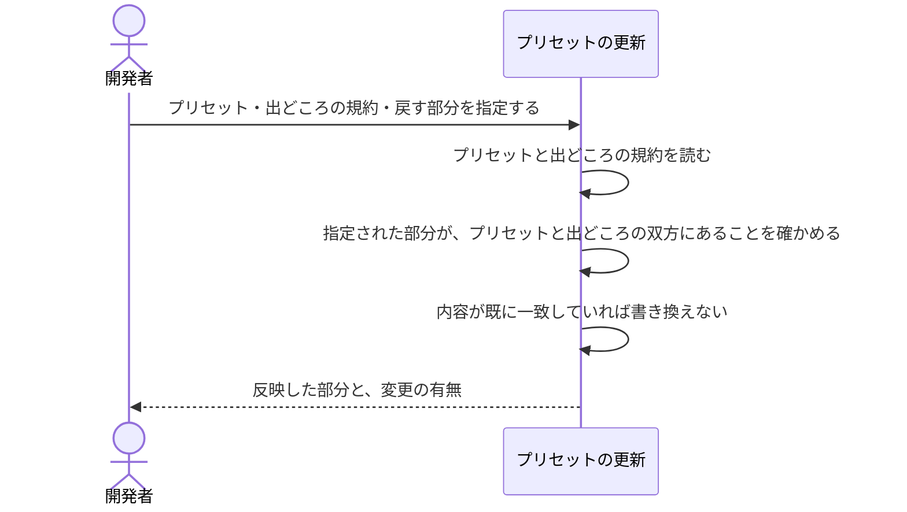

# 実践で確かめた規約を次の出発点へ戻す：uc-update-coding-preset

## 概要

- 実際のプロダクトで確かめた規約のうち、指定された部分だけを、次に作るプロダクトの出発点となるプリセットへ反映する。
- 何を戻すかの指定を必須とし、丸ごとの写しは行わない。プロダクト固有の判断をプリセットへ紛れ込ませないため、汎用かどうかの判断は人が持つ。
- 戻す単位はブロックだけでなく、ブロックの中の欄まで指定できる。汎用の欄と、そのプロダクト固有の欄が同じブロックに同居することがあるため——例えば構成の宣言は、概念ごとの粒度（汎用）と合成ルートの実際の道（固有）を一緒に持つ。

---

## 存在意義

- 出発点となるプリセットは一度書かれたきり、実践から更新される経路が無い。プリセットから作ったプロダクトで規約の誤りを見つけて直しても、プリセットは誤ったまま残り、以後そこから作られるすべてのプロダクトへ同じ誤りが配られ続ける。
- プリセットを手で直す運用にすると、直したことが記録に残らず、次も手で直すことになる。出発点を育てる行為そのものを、製品の操作として持つ必要がある。
- 一方で、プロダクト固有の判断（そのプロダクトが受け持つ範囲・特定の入口に固有の取り決め）をプリセットへ戻すと、無関係なプロダクトへ余計な制約が配られる。何が汎用かの判断は人が持ち、機械は反映だけを担う。

---

## 主アクターと意図

### 主アクター

開発者

### 意図

実際のプロダクトで確かめた規約を、次に作るプロダクトの出発点へ反映したい

---

## 事前条件

- 反映先のプリセットが存在する
- 出どころとなるプロダクトの規約が存在する

---

## 基本フロー



---

## 事後条件

- 指定された部分の内容が、プリセットとプロダクトで一致している
- 指定されなかった部分は、プリセットの元の内容のまま残っている
- プロダクトの規約は変更されていない（プリセットへの一方向の反映）

---

## 受け入れ基準

- When 戻す部分が指定されたとき、プリセットの更新は その部分だけをプリセットへ反映する shall
- When 戻す部分が指定されなかったとき、プリセットの更新は 反映を行わず拒否する shall
- If 指定された部分をプリセットが持たないならば、プリセットの更新は 反映を行わず拒否する shall
- If 指定された部分をプロダクトの規約が持たないならば、プリセットの更新は 反映を行わず拒否する shall
- When 指定された部分の内容がプリセットとプロダクトで既に一致しているとき、プリセットの更新は プリセットを書き換えず、変更が無かったことを示す shall
- While 反映を行う間、プリセットの更新は プロダクトの規約を変更しない shall
- When 反映が行われたとき、プリセットの更新は 反映した部分ごとに反映前と反映後の内容を返す shall
- When 確認だけが求められたとき、プリセットの更新は 変わる内容を返し、プリセットを書き換えない shall
- When 戻す部分としてブロックの中の欄が指定されたとき、プリセットの更新は そのブロックの他の欄を変えずに、指定された欄だけを反映する shall
- If 指定された欄をプリセットまたはプロダクトの規約が持たないならば、プリセットの更新は 反映を行わず拒否する shall

---

## 操作保証

- When 指定されたプリセットが存在しないとき、システムは PRESET_NOT_FOUND エラーを返す shall（プリセットを特定し取得する解決プロセス自体の契約であり、複数のusecaseに共通する）。
- When 出どころとして指定された規約が存在しないとき、システムは INVALID_PATH エラーを返す shall（同上）。

---

## エラー

| コード | 条件 |
|---|---|
| `MISSING_PARAM` | - プリセット・出どころの規約・戻す部分のいずれかが指定されていない |
| `PRESET_NOT_FOUND` | - 指定されたプリセットが存在しない |
| `INVALID_PATH` | - 出どころとして指定された規約が存在しない |
| `UNKNOWN_BLOCK` | - 指定された部分をプリセットが持たない<br>- 指定された部分を出どころの規約が持たない<br>- 指定された欄をプリセットが持たない<br>- 指定された欄を出どころの規約が持たない |

---

## 受け入れシナリオ

### 指定した部分がプリセットへ反映される

| 分類 | 観点 |
|---|---|
| 正常系 | 反映：実践で確かめた規約を、次のプロダクトの出発点へ戻せる |

```gherkin
Scenario: 指定した部分がプリセットへ反映される
  Given プリセットから作られ、その後に規約を直したプロダクト
  When 直した部分を指定してプリセットへ戻す
  Then プリセットのその部分が、プロダクトの内容と一致する
```

### 指定しなかった部分は変わらない

| 分類 | 観点 |
|---|---|
| 正常系 | 反映：プロダクト固有の判断がプリセットへ紛れ込まない |

```gherkin
Scenario: 指定しなかった部分は変わらない
  Given プリセットから作られ、その後に複数の箇所を直したプロダクト
  When そのうち1つだけを指定してプリセットへ戻す
  Then 指定しなかった部分はプリセットの元の内容のまま残る
```

### 戻す部分を指定しないと拒否される

| 分類 | 観点 |
|---|---|
| 異常系 | 事前条件：丸ごとの写しを既定にしない |

```gherkin
Scenario: 戻す部分を指定しないと拒否される
  Given プリセットから作られたプロダクト
  When 戻す部分を指定せずにプリセットへ戻そうとする
  Then 拒否される
```

### プリセットが持たない部分は戻せない

| 分類 | 観点 |
|---|---|
| 異常系 | 境界：プロダクト固有の項目をプリセットの語彙へ持ち込まない |

```gherkin
Scenario: プリセットが持たない部分は戻せない
  Given プリセットが持たない項目を持つプロダクトの規約
  When その項目を指定してプリセットへ戻そうとする
  Then 拒否され、プリセットは変わらない
```

### プロダクトが持たない部分は戻せない

| 分類 | 観点 |
|---|---|
| 異常系 | 事前条件：出どころの無い反映を成功として返さない |

```gherkin
Scenario: プロダクトが持たない部分は戻せない
  Given 指定した部分を持たないプロダクトの規約
  When その部分を指定してプリセットへ戻そうとする
  Then 拒否され、プリセットは変わらない
```

### 同じ内容を戻してもプリセットは変わらない

| 分類 | 観点 |
|---|---|
| 境界値 | 冪等：既に一致している反映を変更として扱わない |

```gherkin
Scenario: 同じ内容を戻してもプリセットは変わらない
  Given プリセットとプロダクトで内容が既に一致している部分
  When その部分を指定してプリセットへ戻す
  Then プリセットは変更されず、変更が無かったことが分かる
```

### 反映した部分の内容が返る

| 分類 | 観点 |
|---|---|
| 正常系 | 判断材料：何が汎用かを人が判断できる状態にする |

```gherkin
Scenario: 反映した部分の内容が返る
  Given プリセットから作られ、その後に規約を直したプロダクト
  When 直した部分を指定してプリセットへ戻す
  Then 反映した部分について、反映前の内容と反映後の内容が返る
```

### 確認だけを求めるとプリセットは変わらない

| 分類 | 観点 |
|---|---|
| 正常系 | 判断材料：書き換える前に、何が変わるかを見られる |

```gherkin
Scenario: 確認だけを求めるとプリセットは変わらない
  Given プリセットから作られ、その後に規約を直したプロダクト
  When 確認だけを求めて、直した部分を指定する
  Then 変わる内容が返り、プリセットは変更されない
```

### ブロックの中の欄だけを戻す

| 分類 | 観点 |
|---|---|
| 正常系 | 意図の達成：汎用の欄だけを戻し、固有の欄は置き去りにする |

```gherkin
Scenario: ブロックの中の欄だけを戻す
  Given 汎用の欄と、そのプロダクト固有の欄を同居させているブロック
  When その汎用の欄だけを指定して反映を求める
  Then プリセットのその欄だけが変わる
  And 同じブロックの他の欄は変わっていない
```

### 無い欄は指定できない

| 分類 | 観点 |
|---|---|
| 異常系 | 誤りの検出：綴り違いを黙って通さない |

```gherkin
Scenario: 無い欄は指定できない
  Given プリセットが持たない欄の名前
  When その欄を指定して反映を求める
  Then UNKNOWN_BLOCK として拒まれる
  And プリセットは書き換えられていない
```

---

## 操作保証シナリオ

### 存在しないプリセットはPRESET_NOT_FOUND

| 分類 | 観点 |
|---|---|
| 異常系 | エラー：プリセットの不在 |

```gherkin
Scenario: 存在しないプリセットはPRESET_NOT_FOUND
  When 存在しないプリセットを指定して反映する
  Then PRESET_NOT_FOUNDエラーが返る
```

### 存在しない規約はINVALID_PATH

| 分類 | 観点 |
|---|---|
| 異常系 | エラー：出どころとなる規約の不在 |

```gherkin
Scenario: 存在しない規約はINVALID_PATH
  When 存在しない規約を出どころに指定して反映する
  Then INVALID_PATHエラーが返る
```
